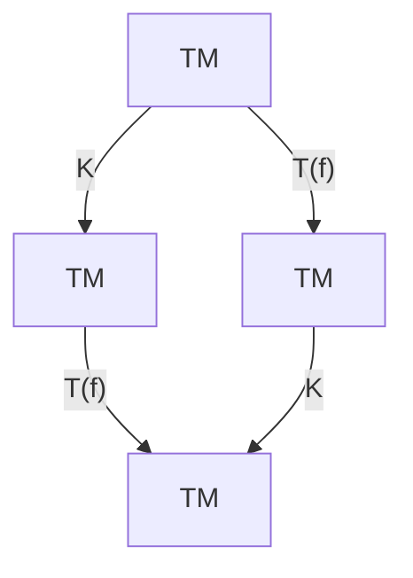
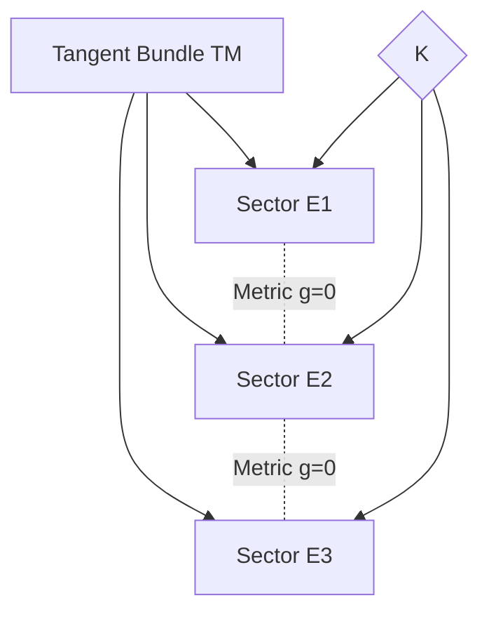
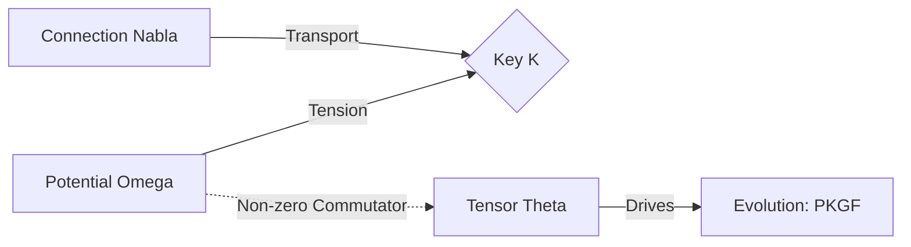
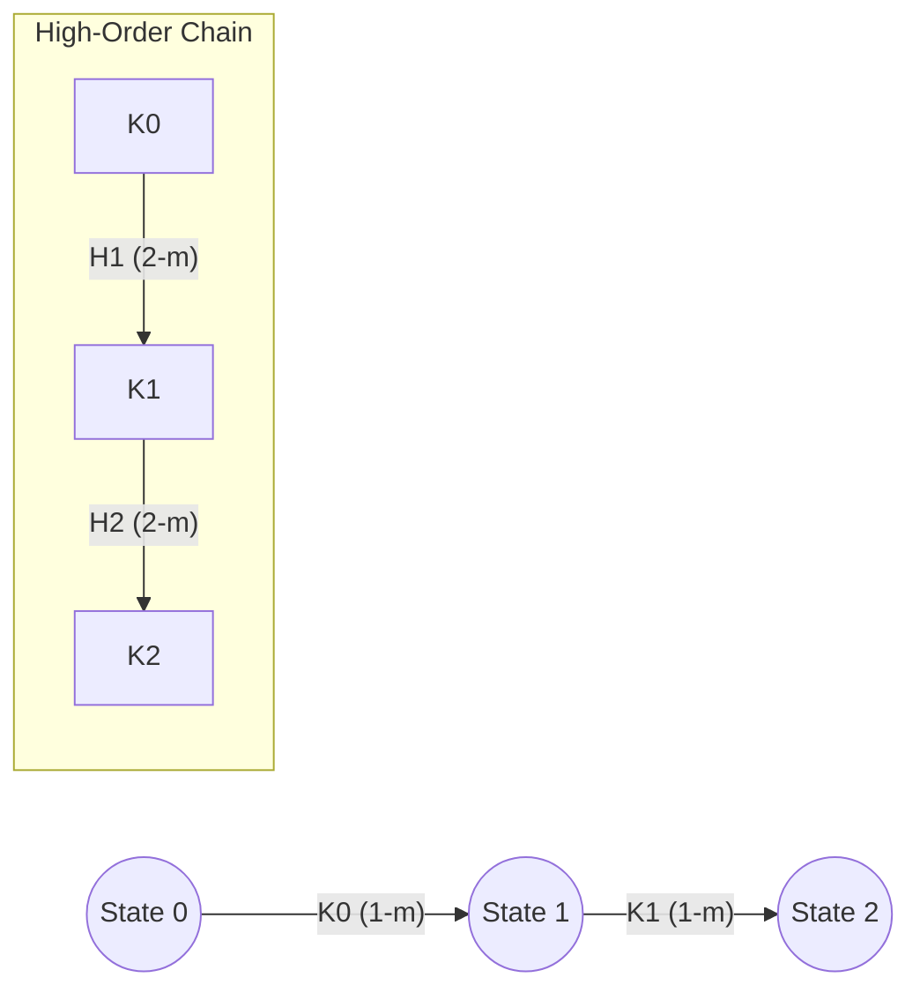

# Physics of Intelligence: Mathematical Appendix A — Structural Foundations of PKGF

---

# Appendix A: Categorical and Geometric Foundations of PKGF

This appendix provides a unified formulation of the mathematical foundations supporting Parallel Key Geometric Flow (PKGF) from the perspectives of category theory, differential geometry, and bundle theory. This section formally demonstrates that the intelligence structure $K$ is not merely a collection of matrix operations but a natural geometric object residing on a physical manifold.

---

# A1. Functorial Construction of the Parallel Key Field $K$ as a Natural Transformation

While the main text defines $K$ as an endomorphism of the tangent bundle $TM$, we describe its universality here from a more abstract, functorial viewpoint.

## A1.1 Categorical Framework
* **Objects**: Smooth manifolds $M$
* **Morphisms**: Diffeomorphisms $f: M \to M$
* **Tangent Functor**: $T: \mathbf{Diff} \to \mathbf{VectBund}$

Within this framework, the Parallel Key $K$ is understood as a **Natural Transformation** satisfying the following conditions.

## A1.2 Naturality Condition
$K$ is a natural intelligence structure if, for any diffeomorphism $f \in \text{Diff}(M)$, the following diagram commutes:

$$
\begin{CD}
TM @>K>> TM \\
@V{T(f)}VV @VV{T(f)}V \\
TM @>K>> TM
\end{CD}
$$

That is, $T(f) \circ K = K \circ T(f)$.
This property ensures that the internal structure of intelligence is a geometric invariant of the manifold, remaining independent of the choice of coordinate systems or descriptive languages (gauge).

---

# A2. Geometric Decomposition of Intelligence Sectors: $TM = \bigoplus E_\alpha$

To enable intelligence to maintain distinct functions (such as C, D, and U) in parallel, the tangent bundle $TM$ must be decomposed into orthogonal sub-bundles.

## A2.1 Existence Conditions for Sub-bundle Decomposition
The tangent bundle on the manifold $M$ is decomposed into an orthogonal sum indexed by a set $I$:
$$TM = \bigoplus_{\alpha \in I} E_\alpha$$

For each sector $E_\alpha$ to function as an independent unit of intelligence, the following conditions are required:

1.  **Local Integrability (Frobenius Theorem)**:
    For any vector fields $X, Y \in \Gamma(E_\alpha)$, their Lie bracket $[X, Y]$ must also belong to $E_\alpha$ (i.e., $[\Gamma(E_\alpha), \Gamma(E_\alpha)] \subset \Gamma(E_\alpha)$). This ensures that each intelligence sector can operate autonomously, maintaining geometric consistency within specific cognitive domains without interference.
2.  **Maintenance of Orthogonality**:
    With respect to the metric $g$, $g(E_\alpha, E_\beta) = 0$ for $\alpha \neq \beta$.
3.  **Sector Preservation (Axiom C3)**:
    $K(E_\alpha) \subset E_\alpha$. This implies that acquired knowledge does not cause disordered interference across its respective logical sectors.

---

# A3. Non-commutativity of the Connection $\nabla$ and Semantic Potential $\Omega$

The connection $\nabla$ governs the transitions between contexts, while the semantic potential $\Omega$ represents the external constraints (external forces) imposed on those transitions.

## A3.1 Introduction of the Non-commutativity Tensor $\Theta$
To measure the misalignment (friction) between the Parallel Key $K$ and the semantic potential $\Omega$, we define the following **Non-commutativity Tensor**:
$$\Theta(X) = [\Omega, K](X)$$

*Fig. A.3 (Diagram): Relationship between connection, potential, and the evolution-driving tensor Theta.*

A non-zero tensor $\Theta$ indicates a contradiction between the internal logic $K$ of intelligence and the external requirements $\Omega$. This tension serves as the potential that drives the evolution (learning) of $K$ via the construction equation $\nabla K = [\Omega, K]$.

---

# A4. Extension to Higher Categories ($\infty$-categories)

To account for the hierarchical nature of intelligence (meta-cognition, nested conceptual structures), we formulate PKGF as a chain of morphisms in a higher-order category.

## A4.1 Hierarchical Chain of Morphisms
The intelligence structure $K$ is a morphism (1-morphism) between 0-cells (states), and its gauge transformation $H$ is a morphism between morphisms (2-morphism).
$$K_0 \xrightarrow{H_1} K_1 \xrightarrow{H_2} K_2 \dots$$

This chain forms an $\infty$-groupoid within a higher category, suggesting that intelligence topologically preserves the entire history of its thought processes. The 16-sector interaction described in Chapter 2.5 corresponds to specific homotopy types within this higher category. Such categorical formulations of the mind using high-order gauge theory are emerging as critical topics in contemporary mathematical psychology (Patrascu, 2025) [latest].
