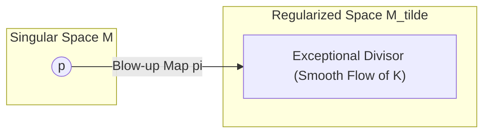
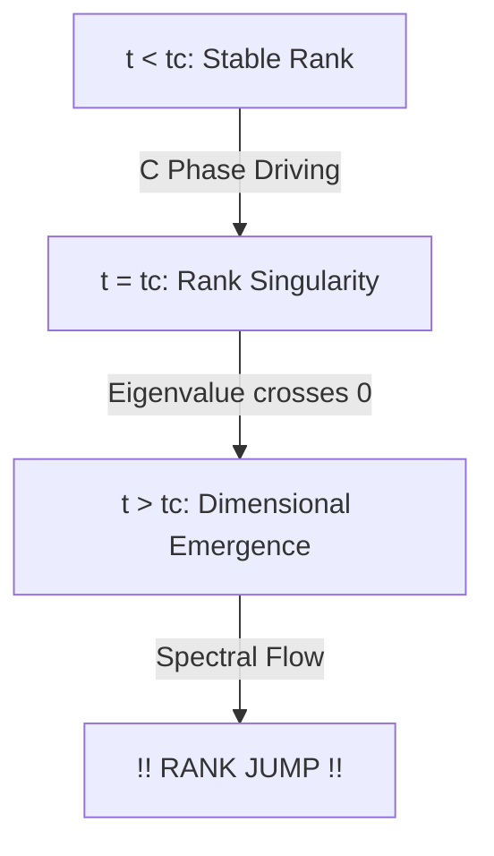

# Physics of Intelligence: Mathematical Appendix B — Theory of Singularities, Phase Transitions, and Rank Jumps

---

# Appendix B: Theory of Singularities, Phase Transitions, and Rank Jumps

This appendix provides a mathematical exposition of the "singularities" that inevitably arise during the temporal evolution of PKGF. It details how these singularities lead to "phase transitions" and "rank jumps" (discontinuous increases in logical rank) within the framework of intelligence.

---

# B1. Classification and Geometric Interpretation of PKGF Singularities

In the unified PKGF equation $\nabla K = [\Omega, K] - \lambda \mathcal{D}(K)$, points where the smoothness of the solution is lost or structural changes occur are classified into the following three types:

| Singularity Type | Mathematical Condition | Phenomenon in Physics of Intelligence |
| :--- | :--- | :--- |
| **Rank Singularity** | $\det(K) \to 0$ | Collapse of existing concepts or a precursor to a dimensional jump (Axiom U6). |
| **Gauge Singularity** | $\|[\Omega, K]\| \to \infty$ | Fatal contradiction between external semantic requirements ($\Omega$) and internal logic ($K$). |
| **Curvature Singularity** | $\|R\| \to \infty$ | Limitations of prior knowledge (background curvature); necessitates a paradigm shift. |

---

# B2. Regularization of Singularities via Blow-up Techniques

To precisely analyze the behavior near a rank singularity ($\det(K)=0$), we introduce the algebraic-geometric technique of **Blow-up**. For detailed analysis of blow-up techniques, refer to [blowups_resolution], and for a geometric visualization of resolution of singularities, see Schlichting (2007) [resol_sing2].

## B2.1 Definition of the Blow-up Map
For a singularity $p \in M$, we construct a map $\pi : \widetilde{M} \to M$ that replaces the point $p$ with a hyperplane (exceptional divisor) while preserving the directional information of the eigenspace. By considering the pull-back $\widetilde{K} = \pi^* K$ of the Parallel Key, the rank change—which was discontinuous on the original manifold—can be described as a smooth "flow" on the higher-dimensional manifold $\widetilde{M}$.

*Fig. B.1 (Diagram): Regularization of singularities via the blow-up map.*

---

# B3. Spectral Flow and Proof of Rank Jumps

The essence of a dimensional jump (Axiom U6) lies in the topological change that occurs when the eigenvalues $\lambda_i$ of the Parallel Key $K$ cross zero.

## B3.1 Definition of Spectral Flow
For a family of operators $K(t)$ depending on time $t$, the net difference between the number of eigenvalues crossing zero from negative to positive and those crossing from positive to negative is called the **Spectral Flow**.
$$\text{SF}(K_t) = \#\{\lambda_i(t) \text{ crossing negative to positive}\} - \#\{\lambda_i(t) \text{ crossing positive to negative}\}$$
In the context of structural changes in intelligence, we define this as the increment in rank:
$$\text{SF}(K_t) = \text{rank}(K_{\text{post}}) - \text{rank}(K_{\text{pre}})$$
The count of eigenvalues transitioning from negative to positive serves as a geometric indicator of the rank increase (dimensional emergence) of intelligence.

## B3.2 Topological Necessity of Dimensional Jumps
The process by which intelligence acquires new concepts (dimensions) is formulated as a phenomenon where this spectral flow becomes non-zero:
1. In the **Construction Phase (C)**, eigenvalues are driven in the positive direction.
2. At a specific critical point $t_c$, an eigenvalue $\lambda_k(t_c) = 0$, passing through a rank singularity.
3. For $t > t_c$, $\text{rank}(K)$ increases, resulting in a discontinuous jump in the effective dimension $d_{\text{eff}}$ (creative ignition).

*Fig. B.2 (Diagram): Process of rank jump and dimensional emergence driven by spectral flow.*

---

# B4. Phase Transitions via Morse Theoretic Approach

Morse theory is applied to analyze the critical points ($\delta S = 0$) of the intelligence action $S$.

## B4.1 Evolution of the Index
The stability of intelligence is determined by the number of negative eigenvalues in the second variation of the action (the Morse index). Topological analysis of phase transitions using Morse theory, along with loss landscape analysis in deep linear networks, provides a detailed description of these physical transitions (Akhtiamov & Thomson, 2023) [akhtiamov23a]; (Achour et al., 2024) [23-0493].
* **Stable Conviction**: A local minimum with an index of 0.
* **Hesitation / Conflict**: A saddle point (singularity) with an index of 1 or higher.

At the moment spontaneous gauge breaking (U4) occurs, this index changes discontinuously, and the system undergoes a topological "tunneling" transition from an "old stable solution (old concept)" to a "new stable solution (new concept)." This transition is the geometric manifestation of insight or sudden understanding (the "Aha!" moment).

---
