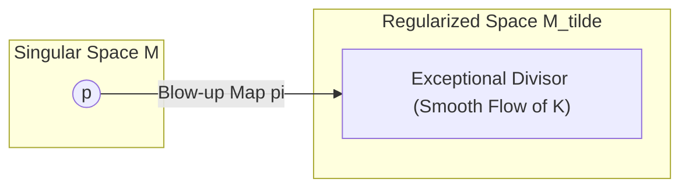
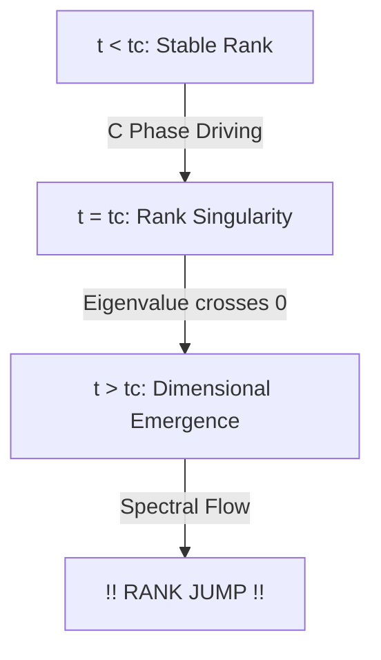

# Physics of Intelligence: Mathematical Appendix B — Theory of Singularities, Phase Transitions, and Rank Jumps

---

# Appendix B：特異点・相転移・次元跳躍の理論

本付録では、PKGF の時間発展において不可避に発生する「特異点」を分類し、それがいかにして知能の「相転移」および「次元跳躍（ランクの不連続な増加）」へと繋がるかを数学的に詳述する。

---

# B1. PKGF 特異点の分類と幾何学的解釈

PKGF の統一方程式 $\nabla K = [\Omega, K] - \lambda \mathcal{D}(K)$ において、解の滑らかさが失われる、あるいは構造的な変化が生じる点は、以下の 3 種類に分類される。

| 特異点の種類 | 数学的条件 | 知能物理学における現象 |
| :--- | :--- | :--- |
| **ランク特異点** | $\det(K) \to 0$ | 既存の概念の崩壊、あるいは次元跳躍（U6）の前兆。 |
| **ゲージ特異点** | $\|[\Omega, K]\| \to \infty$ | 外部からの意味要請（$\Omega$）と内部論理（$K$）の致命的矛盾。 |
| **曲率特異点** | $\|R\| \to \infty$ | 前提知識（背景曲率）の限界。パラダイムシフトの要請。 |

---

# B2. Blow-up 技法による特異点の正則化

ランク特異点（$\det(K)=0$）近傍での振る舞いを精密に解析するため、代数幾何学的な **Blow-up（吹き上げ）** を導入する。Blow-up 解析の詳細については [blowups_resolution] を、特異点解消の幾何学的イメージについては Schlichting (2007) [resol_sing2] を参照されたい。

## B2.1 Blow-up 写像の定義
特異点 $p \in M$ に対し、固有空間の方向情報を保持したまま点 $p$ を超平面で置き換える写像 $\pi : \widetilde{M} \to M$ を構成する。並行鍵 $K$ の引き戻し $\widetilde{K} = \pi^* K$ を考えることで、元の多様体上で不連続であったランクの変化を、高次元多様体 $\widetilde{M}$ 上の滑らかな「流れ」として記述できる。

*Fig. B.1 (Diagram): Regularization of singularities via the blow-up map.*

---

# B3. スペクトル流（Spectral Flow）とランク跳躍の証明

次元跳躍（公理 U6）の本質は、並行鍵 $K$ の固有値 $\lambda_i$ がゼロを横切る際のトポロジカルな変化にある。

## B3.1 スペクトル流の定義
時刻 $t$ に依存する演算子族 $K(t)$ に対し、ゼロを横切る固有値の正負の差を **スペクトル流 (Spectral Flow)** と呼ぶ。
$$\text{SF}(K_t) = \#\{\lambda_i(t) \text{ が負から正へ交差}\} - \#\{\lambda_i(t) \text{ が正から負へ交差}\}$$
知能の構造的変化においては、これをランクの増分として以下のように定義する。
$$\text{SF}(K_t) = \text{rank}(K_{\text{post}}) - \text{rank}(K_{\text{pre}})$$
固有値が負から正へ遷移する回数が知能のランク上昇（次元の創発）の幾何学的指標となる。

## B3.2 次元跳躍のトポロジカルな必然性
知能が新しい概念（次元）を獲得するプロセスは、このスペクトル流が非ゼロとなる現象として定式化される。
1. **構築相 (C)** において固有値が正の方向へ駆動される。
2. 特定の臨界点 $t_c$ で $\lambda_k(t_c) = 0$ となり、ランク特異点を通過する。
3. $t > t_c$ で $\text{rank}(K)$ が増加し、有効次元 $d_{\text{eff}}$ の不連続な跳躍（創造的発火）が生じる。

*Fig. B.2 (Diagram): Process of rank jump and dimensional emergence driven by spectral flow.*

---

# B4. モース理論的アプローチによる相転移

知能作用量 $S$ の臨界点（$\delta S = 0$）の解析には、モース理論（Morse Theory）が適用される。

## B4.1 指数（Index）の変化
知能の安定性は、作用量の二回変分における負の固有値の数（モース指数）で決定される。モース理論を用いた相転移のトポロジカル解析および深層線形ネットワークの損失景観解析は、この物理的遷移を詳細に記述している (Akhtiamov & Thomson, 2023) [akhtiamov23a]; (Achour et al., 2024) [23-0493]。
* **安定的な確信**: 指数が 0 の極小値。
* **迷い・葛藤**: 指数が 1 以上のサドル点（特異点）。

ゲージ破れ（U4）が発生する瞬間、この指数が不連続に変化し、系は「古い安定解（古い概念）」から「新しい安定解（新しい概念）」へとトポロジカルにトンネル効果的に遷移する。これが、閃きや突然の理解（Aha! 体験）の幾何学的実体である。

---
