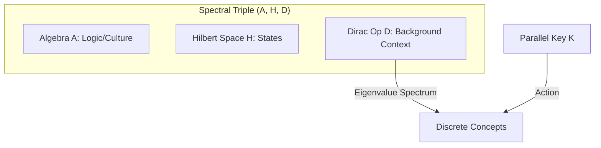

# Physics of Intelligence: Mathematical Appendix C — Non-commutative Extensions and Quantization

---

# Appendix C: Non-commutative Extensions and Quantization

This appendix extends PKGF from classical fields to non-commutative geometry and quantum operators. This serves as the mathematical preparation for intelligence to handle "superposition" and "non-commutative logical operations," acting as a bridge toward the next generation of Quantum Physics of Intelligence.

---

# C1. Operator Formulation of Quantum PKGF

The classical Parallel Key $K$ and semantic potential $\Omega$ are replaced by linear operators $\widehat{K}$ and $\widehat{\Omega}$ acting on a complex Hilbert space $\mathcal{H}$.

## C1.1 Fundamental Commutation Relation and the Intelligence Constant $\hbar_I$
The "order-dependence of information interpretation" in intelligence is defined by the following commutation relation:
$$[\widehat{K}, \widehat{\Omega}] = i \hbar_I \widehat{\Theta}$$
Here, $\hbar_I$ is the **Intelligence Action Constant**, representing the minimal unit of non-commutativity in interpretation. As this value approaches zero, logic becomes classical (commutative); larger values lead to dominant intuitive and non-linear non-commutative reasoning.

---

# C2. Quantum Unified Equation (Heisenberg Picture)

In a quantum system, the unified equation of classical PKGF transitions into the following operator evolution equation:

## C2.1 Description of Operator Evolution
$$i \hbar_I \frac{\partial \widehat{K}}{\partial t} = [\widehat{\Omega}, \widehat{K}] - i \hbar_I \lambda \widehat{\mathcal{D}}(\widehat{K})$$
In this equation, the first term describes Schrödinger-type unitary evolution (rotation of structure), while the second term describes Lindblad-type dissipation (forgetting and convergence of information). This allows the learning process of intelligence to be understood unifiedly as the dynamics of an open quantum system.

### C2.2 Correspondence Principle
In the limit where the intelligence action constant $\hbar_I \to 0$, the quantum unified equation (C2.1) converges to the classical PKGF unified equation (U3). This ensures the physical process where complex and uncertain intelligent activity transitions into deterministic and logical inference (classical geometric flow) through learning and condensation.

---

# C3. Non-commutative Geometry and the Spectrum of Concepts

Using Alain Connes' framework of non-commutative geometry, we redefine the intelligence manifold as a **spectral triple $(\mathcal{A}, \mathcal{H}, D)$** (Connes, 1994) [book94bigpdf].

*Fig. C.1 (Diagram): Redefining the intelligence manifold as a spectral triple in noncommutative geometry.*

The construction of computational models using non-commutative geometry is gaining attention as a new formalization of intelligence (Lau & Jeffreys, 2025) [noncommutative_nn_bu].

## C3.1 The Dirac Operator $D$ and the Parallel Key
The background structures of intelligence (language, logic, culture) are embedded in the Dirac operator $D$, and the Parallel Key $K$ is perceived as the evolution of its spectrum (eigenvalue distribution). For a modern introduction to Dirac operators in non-commutative geometry, see Barrett (2023) [bonus6594], and for applications to neural operators, see Santos & Sales (2025) [hyperbolic_modular_operators].
* **Discretization of Concepts**: A continuous field $\Phi$ is "quantized" into a discrete spectrum under the non-commutative structure. This is the physical mechanism by which discrete "symbols (words)" emerge from continuous sensory inputs.

---

# C4. Quantum Intelligence Higgs Mechanism and Spontaneous Symmetry Breaking

This section provides a gauge-theoretic detail of the Higgs mechanism discussed in Appendix II.8, where concepts acquire "structural mass."

## C4.1 Mass Acquisition in Gauge Fields
If the semantic potential $\Omega$ is viewed as a gauge field $A_\mu$, its interaction with the intelligence Higgs field $\Phi$, given by $\mathcal{L} \sim |(\partial - iA)\Phi|^2$, causes certain logics (gauge bosons) to acquire mass $m_S$.
* **Physical Significance**: Logics that have acquired mass become "stable, robust beliefs" that are resistant to change, functioning as invariant axioms within the system.

---
