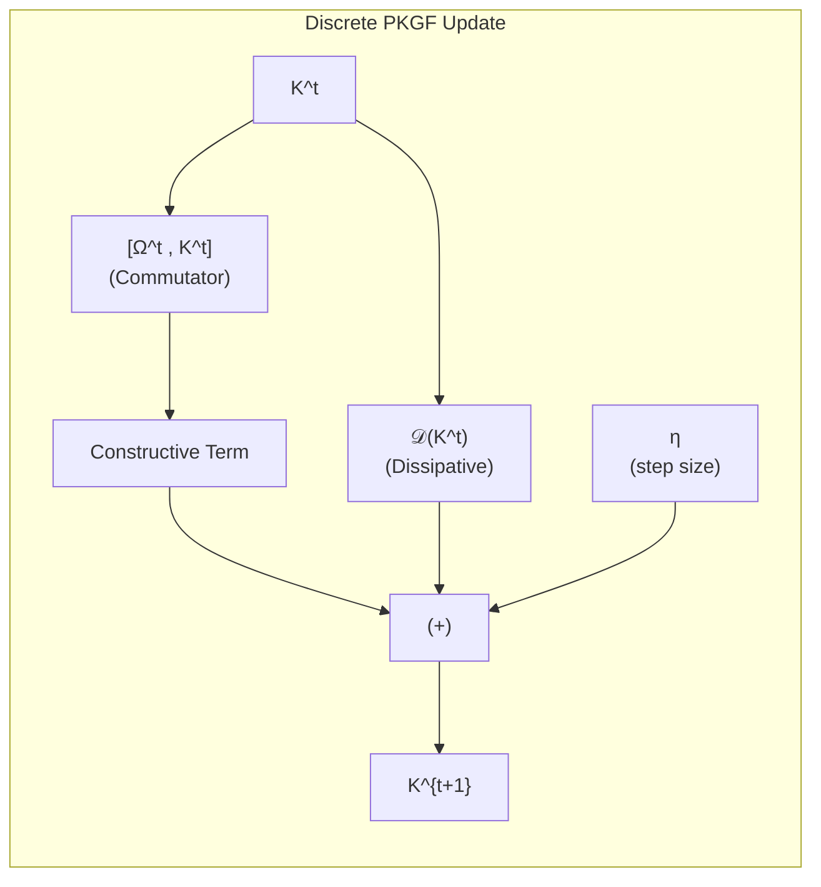
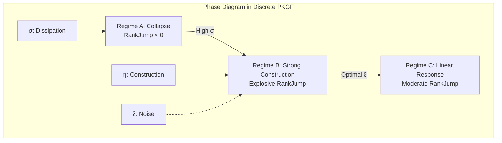

# Physics of Intelligence: Mathematical Appendix D — Discretization and Numerical Implementation

---

# Appendix D: Discretization and Numerical Implementation

This appendix details the discretization methods and numerical implementation strategies required to execute the continuous PKGF unified equations, defined in Chapter 2, on digital computing systems.

---

# D1. Spatial Discretization
The intelligence manifold $M$ is approximated by an $N \times N$ square lattice $M_\delta$.  
The Parallel Key $K$ is represented as an $N^2 \times N^2$ real (or complex) matrix.

# D2. Discrete Form of the Unified Equation
The continuous unified equation
\[
\nabla K = [\Omega, K] - \lambda \mathcal{D}(K)
\]
is discretized using the forward Euler method with time step $\eta$:

\[
K^{t+1} = K^t + \eta \Big( [\Omega^t, K^t] - \frac{1}{\tau} \mathcal{D}(K^t) \Big)
\]

Where:
- $[\Omega, K]$ is calculated directly via the matrix commutator operation $AB - BA$.
- $\mathcal{D}(K)$ is approximated by spatial convolution with a Gaussian kernel or via the graph Laplacian.

*Fig. D.1: Single-step update flow of the discretized PKGF unified equation.*

# D3. Numerical Calculation of Effective Dimension ($d_{\text{eff}}$)
The effective dimension $d_{\text{eff}}$, defined in the theoretical analysis, is calculated in numerical implementations as a continuous function using the singular value spectrum $\lambda_i$:

\[
d_{\text{eff}} = \sum_i \frac{\lambda_i^2}{\lambda_i^2 + \epsilon^2}
\]

Here, $\epsilon$ is a regularization constant that determines the "resolution" of the structure under noise. This formulation corresponds to the "smooth spectral approximation of matrix rank" widely used in information geometry and effective dimension analysis, providing mathematical rigor rather than an ad-hoc definition. The $\text{RankJump}$ in the Step 5 phase diagram is calculated as the difference between the initial and steady-state values of $d_{\text{eff}}$.

# D4. Implementation of Non-linear Gauge Breaking (U-Phase)
To simulate the sharpening of structure and gauge breaking in the metabolic phase, the following non-linear operation can be applied at any step:

\[
K \leftarrow \exp(\alpha K), \quad \alpha \approx 2.0
\]

# D5. Stability Conditions and Recommended Parameters
For numerical stability, we recommend maintaining the following ratio between the construction rate $\eta$ and the dissipative time constant $\tau$:

\[
\frac{\eta}{\tau} < 0.3
\]

Within this range, the three phases based on the unified parameter $\Pi = \eta(1+a\xi^2)/\sigma$ defined in Step 5 are appropriately reproduced.

*Fig. D.2: Relationships between the three phases in discretized PKGF (simplified version of the Step 5 phase diagram).*

# D6. Implementation Notes
The discretization of geometric flows involving commutator operations is analogous to numerical methods for Ricci flow in deep learning, and its validity has been confirmed in recent studies (Chen et al., 2024; Baptista et al., 2024).

For large values of $N$, efficient execution can be achieved by leveraging Apple Silicon's ANE/GPU.

---
