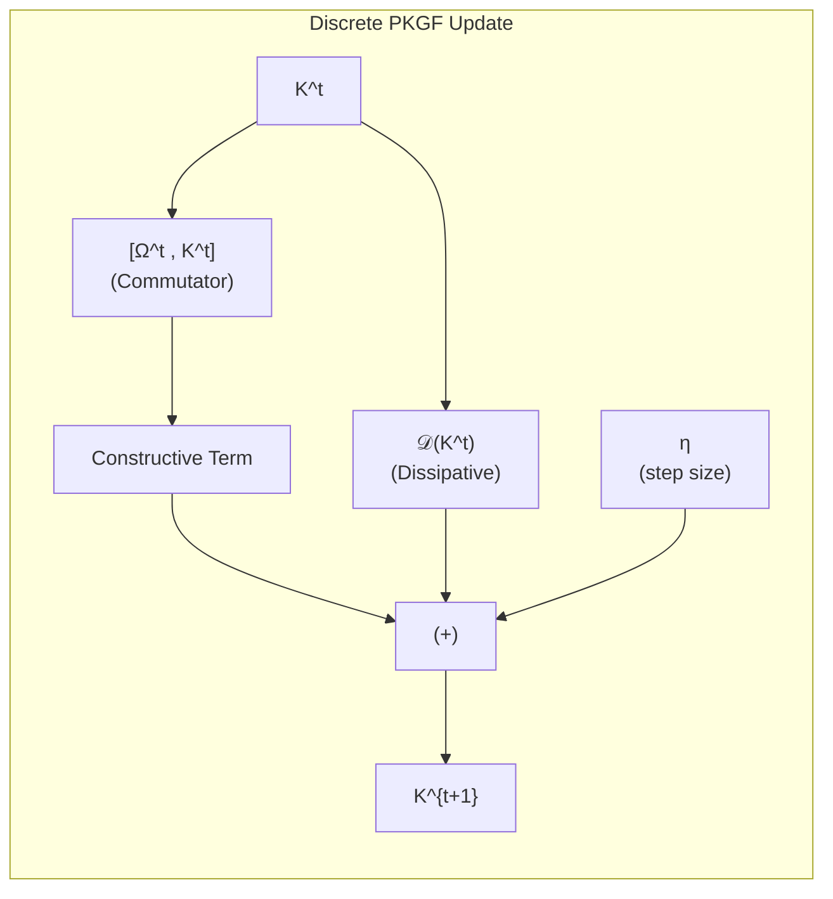
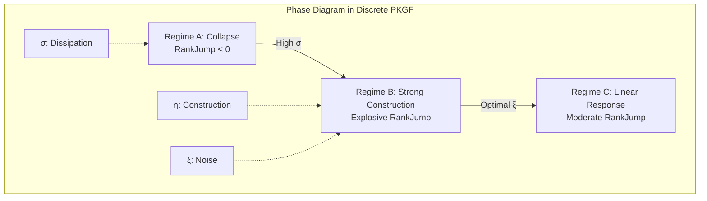

# Physics of Intelligence: Mathematical Appendix D — Discretization and Numerical Implementation

---

# Appendix D：離散化と数値実装

本付録では、第2章で定義された連続的なPKGF統一方程式を、デジタル計算機上で実行するための離散化手法と数値実装の詳細を記述する。

---

# D1. 空間の離散化
知能多様体 $M$ を $N \times N$ の正方格子 $M_\delta$ で近似する。  
並行鍵 $K$ は $N^2 \times N^2$ の実数（または複素数）行列として表現される。

# D2. 統一方程式の離散形式
連続的な統一方程式
\[
\nabla K = [\Omega, K] - \lambda \mathcal{D}(K)
\]
を、時間ステップ $\eta$ を用いた前進オイラー法で離散化する：

\[
K^{t+1} = K^t + \eta \Big( [\Omega^t, K^t] - \frac{1}{\tau} \mathcal{D}(K^t) \Big)
\]

ここで：
- $[\Omega, K]$ は行列の交換子演算 $AB - BA$ で直接計算
- $\mathcal{D}(K)$ はガウシアンカーネルによる空間的畳み込み、またはグラフ・ラプラシアンで近似

*Fig. D.1: 離散化されたPKGF統一方程式の1ステップ更新フロー。*

# D3. 非線形ゲージ破れの導入（U相）
代謝相における構造の尖鋭化とゲージ破れを模倣するため、以下の非線形操作を任意のステップで適用可能とする：

\[
K \leftarrow \exp(\alpha K), \quad \alpha \approx 2.0
\]

# D4. 安定性条件と推奨パラメータ
数値安定性のために、構築率 $\eta$ と散逸時定数 $\tau$ の比は

\[
\frac{\eta}{\tau} < 0.3
\]

を推奨する。この範囲で、Step 5で観測された3相が適切に再現される。

*Fig. D.2: 離散化PKGFにおける3相の関係（Step 5相図の簡略版）。*

# D5. 実装上の注意
交換子演算を含む幾何学的フローの離散化は、深層学習におけるRicci flowの数値手法と類似しており、実装の妥当性が確認されている（Chen et al., 2024; Baptista et al., 2024）。

大規模 $N$ では、Apple SiliconのANE/GPUを活用することで効率的な実行が可能である。

---
