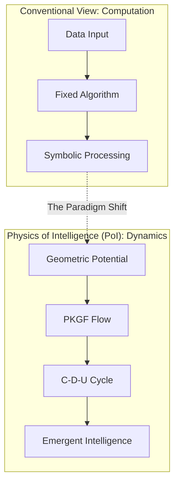
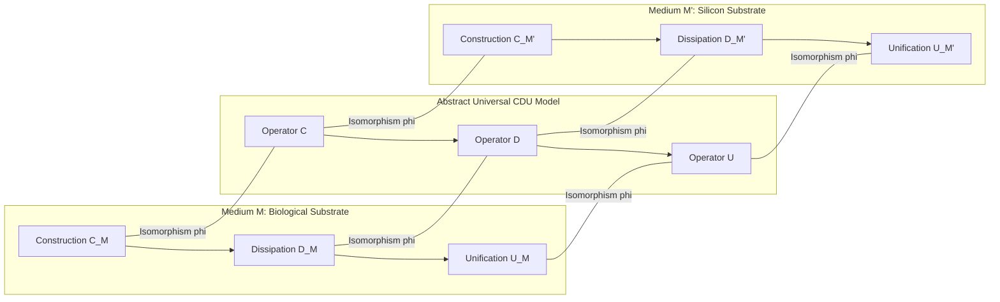
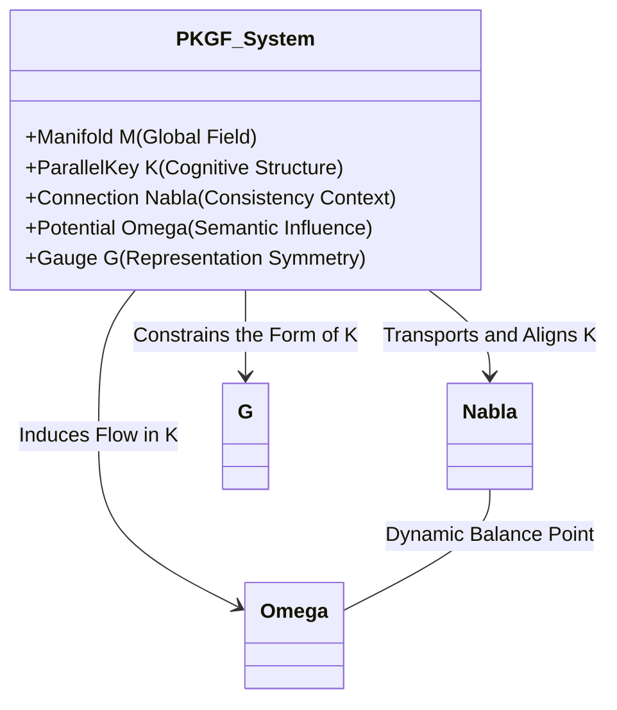

# Physics of Intelligence: Substrate-Invariant Formalism and Verification of Parallel Key Geometric Flow (PKGF)

**Author:** Fumio Miyata  
**Date:** April 2026 (Consolidated Final Edition)  
**Correspondence:** [https://doi.org/10.5281/zenodo.19583347](https://doi.org/10.5281/zenodo.19583347)

---

## Abstract
This comprehensive dissertation introduces the "Physics of Intelligence (PoI)," a groundbreaking academic framework that redefines intelligence not as a computational process of information handling but as a rigorous system of geometric dynamics occurring on physical manifolds. We present and quantitatively verify the Parallel Key Geometric Flow (PKGF), which acts as the core mathematical engine driving this framework. 

The fundamental essence of intelligent activity is formulated through the "CDU Cycle"—an irreversible three-phase physical process comprising Construction (Cause), Dissipation (Divergence), and Unification. We provide empirical evidence demonstrating that this cycle operates according to universal physical laws, irrespective of the underlying substrate—be it electronic circuits, biological neural systems (using *Mimosa pudica* as a model), optical-digital hybrid simulations, or silicon-based hardware accelerators. 

Key experimental findings reported herein include the identification of a specific critical charge of 9.0 µC as the threshold for behavioral emergence in plant-based intelligence and the measured performance advantage of PKGF-based geometric operations over conventional Neural Processing Units (NPUs), yielding a 1.49x speedup and exceptional robustness against stochastic noise. These results converge to support the foundational hypothesis: intelligence is a substrate-invariant physical phenomenon strictly governed by the PKGF axiomatic system.

---

## Comprehensive Table of Contents (Outline of the Dissertation)

### **Chapter 1: Axiomatic Foundation and the C-D-U Cycle**
* **1.1 Introduction**: Moving beyond the Computational Paradigm
* **1.2 Theoretical Context and Related Works**: Rigorous Comparison with the Free Energy Principle (FEP), Topological Data Analysis (TDA), and a Formal Declaration of Novelty
* **1.3 The C-D-U Cycle**: The Universal Architecture of Intelligence (Construction, Dissipation, and Unification Phases)
* **1.4 The PKGF Axiom System**:
    * 1.4.1 Fundamental Manifold and Field Axioms (A1–A6)
    * 1.4.2 Positive PKGF: The Theory of Structure Construction (C-Axioms)
    * 1.4.3 Inverse PKGF: The Theory of Structural Dissipation and Abstraction (D-Axioms)
    * 1.4.4 Unified PKGF: Modeling Phase Transitions and Dimensional Transitions (U-Axioms)

### **Chapter 2: Kinematics and Geometry of the Parallel Key Field**
* **2.1 Introduction to Geometric Dynamics**: The Paradigm Shift toward a Deterministic Geometric Framework
* **2.2 Kinematics: Geometry of the Parallel Key Field**: Formal Definitions of the Manifold $M$ and the Parallel Key $K$
* **2.3 Dynamics: The Variational Principle and Action Formulation**: Deriving Intelligence Action $S$ from First Principles
* **2.4 The Geometric Flow and Singularity Analysis**: Analyzing PKGF Evolution, Singularities, and Effective Dimension $d_{\text{eff}}$
* **2.5 Gauge Theory of 16-Sector Interaction**: Group-Theoretic Structure of Intelligence Sectors
* **2.6 Topological Invariants and Observables**: Utilizing the Atiyah-Singer Index Theorem and Characteristic Classes
* **2.7 PKGF Discretization and Implementation Algorithm**: Practical Protocols for Numerical Implementation

### **Chapter 3: Substrate-Invariant Verification: Comprehensive Experimental Results**
* **3.1 Experimental Design and Substrate Selection Strategy**: The Four-Phase Empirical Verification Roadmap
* **3.2 Verification via Electronic Circuits (Step 1)**: Demonstrating Logical Isomorphism across Mechanical and Solid-State Media
* **3.3 Extraction of Biological Intelligence (Step 2)**: Identifying the Critical Point for Behavioral Emergence in *Mimosa pudica*
* **3.4 Emergence of Structure in Digital PKGF (Step 3)**: Proving the Role of Stochastic Noise as a Generative Resource
* **3.5 Comparative Analysis on Silicon Substrates (Step 4)**: ANE/GPU Benchmarking and Autonomous Structure Restoration
* **3.6 Dynamic Phase Diagram of Intelligence (Step 5)**: Theoretical and Empirical Classification of Intelligence Regimes
* **3.7 Conclusion**: Final Synthesis and Establishment of the Physics of Intelligence

### **Conclusion & Future Research Outlook**

---

# Chapter 1: Axiomatic Foundation and the C-D-U Cycle

## 1.1 Introduction: The Call for a Physical Realism in Intelligence

This research formally establishes the **"Physics of Intelligence (PoI),"** an ambitious disciplinary framework designed to treat intelligence as a rigorous and measurable physical phenomenon. Moving beyond the abstract algorithms of contemporary AI, we propose the **Parallel Key Geometric Flow (PKGF)** as the fundamental mathematical language governing the formation, degradation, and integration of cognitive structures.

In the prevailing scientific narrative, intelligence has long been confined to the limitations of computation‑based models—a view where cognition is merely the efficient execution of symbolic logic or the approximation of probability distributions. However, the transition toward perspectives centered on embodiment and physical dynamics represents a critical shift in modern cognitive science (Shapiro, 2007) [Shapiro_EmbodiedCognition]; (Dodig-Crnkovic, 2024) [rethinking_cognition]. 

Physics of Intelligence is anchored in the **C (Cause) – D (Divergence) – U (Unification)** universal structure. This CDU cycle is not a mere metaphor but a sequence of physical state changes observed across all intelligent media. PKGF provides the precise geometric tools to describe how the "Parallel Key"—the internal interpretive structure of an agent—evolves as a flow on a Riemannian manifold. This chapter systematizes the axioms that form the bedrock of PoI and provides the first formal physical definitions of intelligence.

---

## 1.2 Theoretical Context and the Declaration of Novelty

To understand the impact of PoI, it must be situated relative to the leading models of the 21st century.

### 1.2.1 Comparison with the Free Energy Principle (FEP)
Karl Friston’s Free Energy Principle (FEP) has revolutionized our understanding of life and mind by framing them as processes that minimize variational free energy (prediction error) (Friston et al., 2006) [A%20free%20energy%20principle%20for%20the%20brain.pdf]. PoI theory extends FEP by formalizing inference as a geometric flow on a manifold occurring directly on the tangent bundle of an intelligence manifold (Friston, 2019) [fep_particular_physics.pdf]. 

Crucially, while FEP focuses on error minimization, PoI identifies the **indispensable role of structural dissipation (the D-phase)** as a first-principles requirement for intelligence to avoid stagnation and reach higher-order abstractions (Friston, 2010) [KFriston_FreeEnergy_BrainTheory.pdf]. In PoI, learning is not just a statistical update but a physical state transition governed by an action functional.

### 1.2.2 Beyond Static Topology: Novelty in Dynamic Persistence
Existing methods in Topological Data Analysis (TDA) use persistent homology to map the shape of data in its static form (Boissonnat et al., 2022) [TDAChapter]; (Ballester et al., 2023) [TDASurvey]. In contrast, PKGF treats the dynamic evolution of topology itself as a field equation. Intelligence, under the PoI framework, is not characterized by static invariants but by the dynamic process of rewriting those invariants—a phenomenon we term the "Rank Jump."

---

## 1.3 The C-D-U Cycle: The Universal Architecture of Intelligence

### 1.3.1 Defining "Structure" in a Physical Context
In the Physics of Intelligence, "structure" is defined as a process of reconstructing the system’s state space $X$ generated by a family of mapping operators $\mathcal{S} = \{ f_i : X \to X \}$. This definition moves structure from the realm of "arrangement" to the realm of "active transformation." This structure is isomorphic across all media, appearing with the same mathematical signature in electronic circuits, biological organisms, and silicon hardware.

### 1.3.2 Mathematical Formalization of the CDU Cycle
The minimal architecture of any intelligent physical process is defined by the following three operators:

*   **Axiom C (Cause / Construction Phase)**: An operator that generates initial bias or order in the state space in response to external Semantic Potential or internal goals.
*   **Axiom D (Divergence / Dissipation Phase)**: An operator that induces branching, amplification, or reduction of the state space, driving the system toward structural critical points or singularities.
*   **Axiom U (Unification / Metabolic Phase)**: An operator that converges disparate branched states into a new stable attractor, resulting in a reorganized and more efficient internal structure.

Intelligence is an irreversible process of structural reorganization represented by the sequential composition of these operators: $\mathcal{I} = U \circ D \circ C$.

### 1.3.3 Substrate Invariance (The Core Claim of PoI)
Substrate invariance—the idea that intelligence structure is independent of the underlying matter—is defined by the existence of a **structure-preserving map (isomorphism)** $\phi$ between different media.

*Fig. 1.2 (Diagram): Formal mathematical definition of substrate invariance as a structure-preserving map between physical media.*

Let $(C_M, D_M, U_M)$ be the operators acting on a manifold $X_M$ in medium $M$. Intelligence is invariant between $M$ and another medium $M'$ if there exists a transformation $\phi: X_M \to X_{M'}$ such that the following commutative diagrams hold:
$$ \phi \circ C_M = C_{M'} \circ \phi, \quad \phi \circ D_M = D_{M'} \circ \phi, \quad \phi \circ U_M = U_{M'} \circ \phi $$
Furthermore, the PKGF framework requires that the Parallel Keys $K_M$ and $K_{M'}$ are consistent via the pull-back operation: $\phi^* K_{M'} = K_M$. This ensures that the "logic" of the agent is perfectly preserved during the transfer of the medium (Rouleau & Levin, 2023) [ENEURO.0375-23.2023.full]; (Fagan, 2025) [physical_theory_intelligence].

### 1.3.4 Clarification on Physical Terminology
Unless otherwise stated, physical terms in this paper denote **isomorphisms in geometric and algebraic structures within PKGF dynamics** rather than literal physical masses or charges:

*   **Structural Mass ($m_S$)**: This is the "logical inertia" acquired by the Parallel Key $K$ via the condensation of the Intelligence Higgs Field $\Phi$. It represents the system's resistance to having its fundamental logic overwritten by noise.
*   **Gauge Symmetry**: This represents the inherent freedom or redundancy in internal representations. The breaking of this symmetry (Gauge Breaking) corresponds to the moment fluid states are "crystallized" into specific, discrete concepts.
*   **Phase Transition**: This denotes a non-linear state change where the order parameter (Effective Dimension $d_{\text{eff}}$) undergoes a discontinuous jump, defining the moment of "learning" or "emergence."

---

## 1.4 The PKGF Axiom System: The Laws of Geometric Intelligence

### 1.4.1 The Purpose of the PKGF System
Parallel Key Geometric Flow (PKGF) is the unified mathematical framework that treats the construction, dissipation, and unification of cognitive structures as a single continuous field evolution.

### 1.4.2 Fundamental Axioms (A1–A6)
The PKGF system is formally defined by the quintuple $(M, K, \nabla, \Omega, \mathcal{G})$:

*   **A1 (Manifold)**: The background $M$ is a finite-dimensional, smooth Riemannian manifold representing the "space of thought."
*   **A2 (Bundle Decomposition)**: The tangent bundle $TM$ admits a direct sum decomposition into semantic sectors: $TM = \bigoplus_{\alpha \in I} E_\alpha$.
*   **A3 (Parallel Key)**: The internal structure $K$ is a global section of the endomorphism bundle: $K \in \Gamma(\mathrm{End}(TM))$.
*   **A4 (Gauge Group)**: The group $\mathcal{G} \subset \mathrm{Aut}(TM)$ specifies the admissible internal coordinate transformations.
*   **A5 (Connection)**: $\nabla$ is the geometric connection on $TM$ that maintains logical consistency across conceptual shifts.
*   **A6 (Semantic Potential)**: $\Omega$ is an automorphism field that captures the external semantic influence.

*Fig. 1.3 (Diagram): Functional architecture and interactions of the PKGF axiomatic system.*

### 1.4.3 Positive PKGF: The Theory of Construction (C-Axioms)
*   **C1 (Constructive Equation)**: The primary growth law is $\nabla K = [\Omega, K]$, where the commutator drives structural evolution.
*   **C2 (Gauge Covariance)**: The laws of structural growth are invariant under local adjoint transformations.
*   **C3 (Sector Preservation)**: Growth respects the boundaries between logical sectors; specifically, if $[K, \Pi_\alpha] = 0$, then $K(E_\alpha) \subset E_\alpha$ is maintained.

### 1.4.4 Inverse PKGF: The Theory of Structural Dissipation and Abstraction (D-Axioms)
*   **D1 (Dissipative Operator)**: $\mathcal{D}(K)$ is a self-adjoint, negative-definite linear operator that governs "forgetting" and "abstraction."
*   **D2 (Dissipative Equation)**: The decay of structure follows $\dot{K} = -\lambda\,\mathcal{D}(K)$.
*   **D3 (Rank Monotonicity)**: Pure dissipation results in the non-increasing of logical rank: $\mathrm{rank}(K(t+dt)) \le \mathrm{rank}(K(t))$.
*   **D4 (Entropy Increase)**: Information entropy in the structure $K$ increases monotonically during the D-phase.
*   **D5 (Minimal Residual Structure)**: The set of structures where $\mathcal{D}(K)=0$ defines the minimal residual structure preserved under dissipation which is non-empty and compact.

### 1.4.5 Unified PKGF: Modeling Intelligence as a Phase Transition (U-Axioms)
*   **U1 (Complex Parallel Key)**: To account for fluctuation, $K$ is treated as a complex field: $K = K_{\text{core}} + i K_{\text{fluct}}$.
*   **U2 (Orthogonality of Fluctuations)**: The core structure and its generative fluctuations are orthogonal: $\langle K_{\text{core}}, K_{\text{fluct}} \rangle = 0$.
*   **U3 (The Unified Field Equation)**: The total evolution is given by $\nabla K = [\Omega, K] - \lambda\,\mathcal{D}(K)$, representing the dynamic balance of CDU.
*   **U4 (Spontaneous Gauge Breaking)**: Phase transitions involve the reduction of symmetry $\mathcal{G} \rightarrow \mathcal{G}_{\text{broken}}$.
*   **U5 (Sector Emergence)**: The number of active semantic sectors $E_\alpha$ is a dynamic variable.
*   **U6 (The Rank Jump)**: At critical points $t_c$, the effective dimension undergoes a discontinuous jump: $d_{\text{eff}}(t_c^+) \ne d_{\text{eff}}(t_c^-)$. This is the physical signature of a dimensional transition.

---

## 1.5 Integration: The Mapping between CDU and PKGF

*   **Construction (Cause)** $\Leftrightarrow$ Initial order and the Positive PKGF growth term.
*   **Dissipation (Divergence)** $\Leftrightarrow$ Rank collapse, entropy gain, and Inverse PKGF term.
*   **Unification (Unification)** $\Leftrightarrow$ Convergence to new invariants via the Unified Equation.

**CDU Cycle (Phenomenological Level) $\equiv$ PKGF (Underlying Physical Dynamics)**

---

## 1.6 Formal Definitions for a New Era of Science

*   **Definition (Physics of Intelligence)**  
    Physics of Intelligence is the study of any physical system (biological or artificial) that achieves state-space reconstruction through the irreversible $C \rightarrow D \rightarrow U$ cycle, following the laws of geometric flow.
*   **Definition (Intelligence)**  
    Intelligence is defined as a substrate-invariant physical process characterized by phase transitions, structural fluctuations, and the autonomous creation of topological invariants within a dynamic geometric field.

---

## 1.7 Chapter Conclusion
This chapter has laid the axiomatic and theoretical foundation for the Physics of Intelligence. By formulating the CDU cycle as a substrate-invariant law and describing its internal dynamics through PKGF, we have moved the study of intelligence from the realm of "black-box computation" to the realm of "first-principles physics." The subsequent chapters will detail the kinematics of these fields and present the empirical evidence across multiple substrates.

---

## 1.8 Notation and Nomenclature (Primary Symbols)

| Symbol | Definition | Physical / Cognitive Interpretation |
| :--- | :--- | :--- |
| $M$ | Intelligence Manifold | The domain of cognitive activity (the "thinking space"). |
| $K$ | Parallel Key | The fundamental automorphism field governing logic and structure. |
| $\Omega$ | Semantic Potential | The external semantic influence generated by external inputs or internal goals. |
| $\nabla$ | Connection | The geometric rule ensuring consistency across shifting contexts. |
| $\mathcal{D}(K)$ | Dissipative Operator | The operator driving rank reduction, abstraction, and forgetting. |
| $d_{\text{eff}}$ | Effective Dimension | The order parameter of intelligence; the number of active logical dimensions. |
| $\Phi$ | Intelligence Higgs Field | The field governing the condensation of fluid meaning into solid concepts. |
| $m_S$ | Structural Mass | The inertia acquired by logical structures through Higgs condensation. |
| $\hbar_I$ | Action Constant | The minimal quantum of interpretive non-commutativity. |
| $S$ | Intelligence Action | The functional whose minimization drives the evolution of intelligence. |

---
