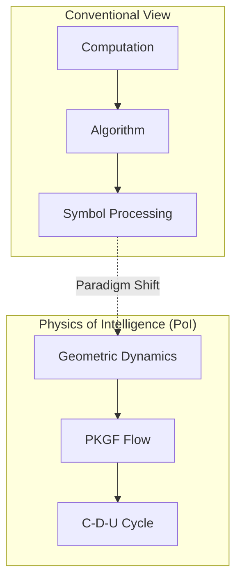
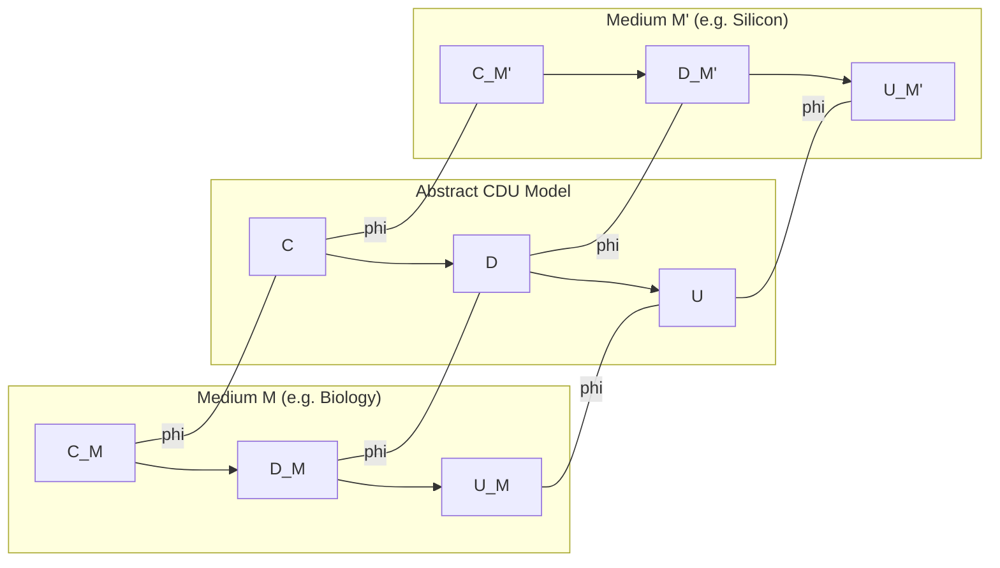
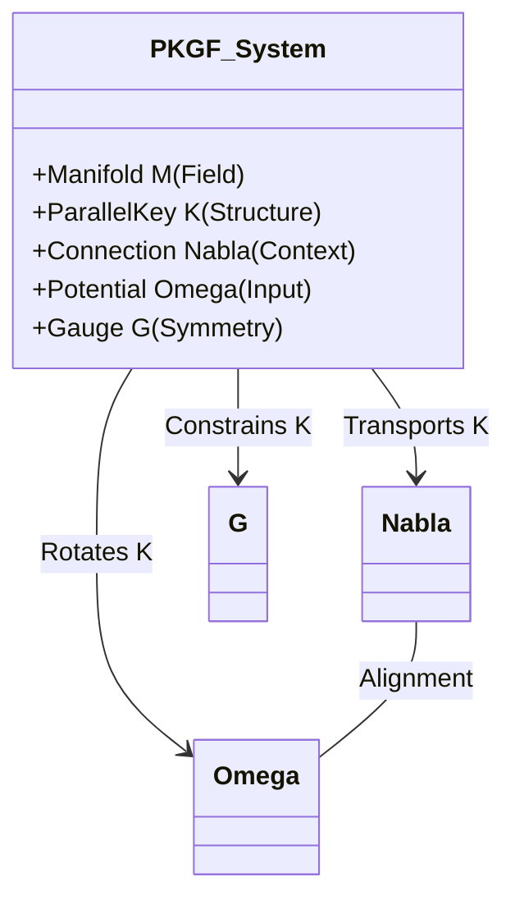

# Physics of Intelligence: Substrate-Invariant Formalism and Verification of PKGF
**（知能の物理学：並行鍵幾何流の媒体不変な定式化と実証）**

**Author:** Fumio Miyata  
**Date:** 2026年4月  
**Correspondence:** [https://doi.org/10.5281/zenodo.19659376](https://doi.org/10.5281/zenodo.19659376)

---

## Abstract（要旨）
本論文は、知能を情報の計算ではなく、物理多様体上の幾何学的ダイナミクスとして再定義する新しい学問体系「Physics of Intelligence (PoI)」を提示し、その数学的実体である並行鍵幾何流（Parallel Key Geometric Flow: PKGF）の妥当性を定量的に実証するものである。

知能の本質を、構築（Cause）・解体（Divergence）・統合（Unification）の三相からなる「C-D-Uサイクル」として定式化し、これが媒体（電子、生物、光学、シリコン）を問わず共通の物理法則に従うことを示した。検証実験では、植物の行動発現における臨界電荷量 9.0 µC の特定、およびシリコン基盤における従来型NPUに対する幾何学的演算の優位性（1.49倍の高速化と高度なノイズ耐性）を確認した。これらの一連の結果は、知能が特定の物質に固有の現象ではなく、PKGF公理体系に従う普遍的な物理現象であることを強く支持するものである。

---

## 全体目次 (Comprehensive Table of Contents)

### **Chapter 1: Axiomatic Foundation and the C-D-U Cycle**
* **1.1 Introduction**: 計算論的知能観から物理ダイナミクスへの転換
* **1.2 Theoretical Context and Related Works**: 先行研究（FEP, TDA）との比較と新規性
* **1.3 The C-D-U Cycle**: 知能の普遍構造（構築・解体・統合）
* **1.4 PKGF Axiom System**:
    * 1.4.1 基本公理（Axioms A1–A6）
    * 1.4.2 正PKGF：構築理論（C公理）
    * 1.4.3 逆PKGF：解体理論（D公理）
    * 1.4.4 統一PKGF：相転移と次元跳躍（U公理）

### **Chapter 2: Kinematics and Geometry of the Parallel Key Field**
* **2.1 Introduction to Geometric Dynamics**: 幾何学的パラダイムへの転換と統計的推論の限界
* **2.2 Kinematics: Geometry of the Parallel Key Field**: 多様体 $M$ と並行鍵 $K$ の定義
* **2.3 Dynamics: The Variational Principle and Action Formulation**: 変分原理と知能作用量 $S$
* **2.4 The Geometric Flow and Singularity Analysis**: PKGF、特異点、および有効次元 $d_{\text{eff}}$
* **2.5 Gauge Theory of 16-Sector Interaction**: 16セクター相互作用のゲージ理論
* **2.6 Topological Invariants and Observables**: トポロジカル不変量と指数定理
* **2.7 PKGF Discretization and Implementation Algorithm**: PKGFの離散的定式化と実装

### **Chapter 3: Substrate-Invariant Verification: Experimental Results**
* **3.1 Experimental Design and Substrate Selection**: 4段階の検証戦略
* **3.2 Verification via Electronic Circuits (Step 1)**: リレーとオペアンプによる論理同型性
* **3.3 Extraction of Biological Intelligence (Step 2)**: オジギソウ電位データによる公理U6の抽出
* **3.4 Emergence of Structure in Digital PKGF (Step 3)**: 構造生成におけるノイズの有効利用とRank Jump
* **3.5 Comparative Analysis on Silicon Substrates (Step 4)**: Apple M1環境でのベンチマークと自律的復元
* **3.6 Conclusion**: 知能の物理学（Physics of Intelligence）の確立

### **Conclusion & Future Outlook**

---

# Chapter 1: Axiomatic Foundation and the C-D-U Cycle
（第1章：公理的基盤とC-D-Uサイクル）

## 1.1 Introduction（序論）

本研究は、**知能を物理現象として扱う新しい学問体系「Physics of Intelligence」** を正式に定義し、その内部数学として **PKGF（Parallel Key Geometric Flow）** を提示するものである。

計算論的・象徴処理中心の従来の知能観から、身体性や物理ダイナミクス中心の視点への転換は、近年の認知科学においても重要な潮流となっている (Shapiro, 2007) [Shapiro_EmbodiedCognition]; (Dodig-Crnkovic, 2024) [rethinking_cognition]。
Physics of Intelligence は、電子・生物・光学・シリコンなど、媒体の種類を問わず観測される **C（Cause）–D（Divergence）–U（Unification）** という普遍構造を基礎に据える。PKGF は、この C‑D‑U の内部で起きている構造変化を幾何学として記述するための新しい数学体系であり、知能の構築・解体・再構成を単一の公理体系として扱う。

本章では、この学問体系の基盤となる公理と、知能の物理的定義を体系化する。

---

## 1.2 Theoretical Context and Related Works（先行研究との比較）

本理論の立ち位置を明確にするため、既存の主要な知能モデルとの比較を行う。

### 1.2.1 Comparison with Free Energy Principle（自由エネルギー原理との比較）
Karl Fristonらが提唱する自由エネルギー原理（FEP）は、知能（あるいは生命）を外部環境の予測誤差を最小化する推論プロセスとして記述する (Friston et al., 2006) [A%20free%20energy%20principle%20for%20the%20brain.pdf]。PoI理論は、FEPが対象とするこの「推論」や「適応」を、多様体上の幾何学的フロー（PKGF）として物理的に拡張・一般化したものである (Friston, 2019) [fep_particular_physics.pdf]。 PoIにおいて、予測誤差の最小化は整合エネルギー $\|\nabla K - [\Omega, K]\|^2$ の最小化プロセスとして幾何学的に再定義され、さらにFEPでは十分に扱われていない「能動的な構造解体（D相）」を理論の不可欠な要素として導入している (Friston, 2010) [KFriston_FreeEnergy_BrainTheory.pdf]。

### 1.2.2 Novelty in Dynamic Topology（トポロジカルデータ解析に対する新規性）
既存のトポロジカルデータ解析（TDA）は、持続的ホモロジー等を用いて静的なデータ構造の把握において顕著な成果を上げている (Boissonnat et al., 2022) [TDAChapter]; (Ballester et al., 2023) [TDASurvey]。これに対し、本論文のPKGFは、トポロジーそのものの「動的な変化（相転移）」および「次元の創発（Rank Jump）」を場の方程式として扱う点に決定的な新規性がある。
知能は静的な不変量ではなく、フローの過程で不変量を書き換え続ける動的な幾何学的プロセスとして記述される。

---

## 1.3 The C-D-U Cycle: 知能の普遍構造（構築・解体・統合）

### 1.3.1 構造の原義
知能を扱う際、本研究が対象とする「構造」とは、集合 $X$ 上の写像族 $\mathcal{S} = \{ f_i : X \to X \}$ が生成する **状態空間の再構成作用** を指す。この構造は媒体に依存せず、電子回路・植物細胞・光学系など、どの物理系にも同型として現れる。

### 1.3.2 C-D-U の数学的形式化
知能の最小普遍構造は、次の三つの写像で定義される。

*   **Axiom C（Cause）**: 外部刺激または内部状態によって、状態空間に偏りを生成する写像。
*   **Axiom D（Divergence）**: 状態空間を分岐・増幅し、臨界点へ向かう写像。
*   **Axiom U（Unification）**: 分岐した状態を一つの安定点へ収束させる写像。

知能とは、この三つの写像の合成 $U \circ D \circ C$ として表される **物理的再構成過程** である。

### 1.3.3 媒体不変性（Substrate Invariance）の数学的定義
媒体 $M$ から $M'$ への知能構造の転移は、単なる比喩ではなく、以下の数学的条件を満たす**構造保存写像（Structure-preserving map）** $\phi$ の存在として定義される。

*Fig. 1.2 (Diagram): Mathematical definition of substrate invariance as a structure-preserving map.*

知能の多重実現可能性（Multiple Realizability）は、神経系のみならず非神経系や人工物においても C-D-U 構造が同型に現れ得ることを示唆している (Rouleau & Levin, 2023) [ENEURO.0375-23.2023.full]; (Fagan, 2025) [physical_theory_intelligence]。

媒体 $M$ における C-D-U 作用素を $(C_M, D_M, U_M)$、対応する多様体上の状態空間を $X_M$ とするとき、異なる媒体 $M'$ への変換 $\phi: X_M \to X_{M'}$ が以下の可換性を満たす場合、知能は媒体 $M$ と $M'$ の間で不変であるという。
$$ \phi \circ C_M = C_{M'} \circ \phi, \quad \phi \circ D_M = D_{M'} \circ \phi, \quad \phi \circ U_M = U_{M'} \circ \phi $$
さらに、PKGFの枠組みにおいては、並行鍵 $K_M$ と $K_{M'}$ の間に $\phi^* K_{M'} = K_M$（引き戻しによる一致）が成立することを要請する。

### 1.3.4 物理学的用語の定義と注釈
本論文で使用される物理学的用語（「質量」、「ゲージ対称性」、「相転移」など）は、特記ない限り、物理的実体そのものではなく、**PKGFダイナミクスにおける幾何学的・代数的構造の同型性（Isomorphism）**を指すものである。

*   **質量（Structural Mass/Inertia）**: 物理的質量ではなく、知能ヒッグス場 $\Phi$ の凝縮（自発的対称性の破れ）を通じて並行鍵 $K$ が獲得する「構造的慣性 $m_S$」を指す。これは一度形成された論理構造の維持能力（アイデンティティ）の数学的実体である。
*   **ゲージ対称性（Gauge Symmetry）**: 知能内部の表現形式の任意性（自由度）を指す。この対称性が安定化群 $\mathrm{Stab}(K)$ へと縮退するプロセス（ゲージ破れ）は、連続的な思考の流れが特定の離散的な「概念」や「言語的記号」へと凍結（Discretization）される相転移に対応する（第2.3.1.4節参照）。
*   **相転移（Phase Transition）**: 秩序変数の非連続的な変化を伴う状態遷移を指し、知能においては有効次元 $d_{\text{eff}}$ の跳躍（Rank Jump）として観測される。

---

## 1.4 PKGF Axiom System（PKGF公理体系）

### 1.4.1 PKGF の目的
PKGF は、知能の内部で起きている構築（Constructive）・解体（Destructive）・代謝（Unified）の三つの過程を、単一の幾何学的枠組で記述するための数学体系である。

### 1.4.2 基本公理（Axioms A1–A6）
PKGF は次の五つ組 $(M, K, \nabla, \Omega, \mathcal{G})$ で定義される。

*   **A1（多様体）**: $M$ は有限次元の滑らかなリーマン多様体。
*   **A2（接束分解）**: $TM = \bigoplus_{\alpha \in I} E_\alpha$。
*   **A3（並行鍵）**: $K \in \Gamma(\mathrm{End}(TM))$。
*   **A4（ゲージ群）**: $\mathcal{G} \subset \mathrm{Aut}(TM)$。
*   **A5（接続）**: $\nabla$ は $TM$ 上の接続。
*   **A6（意味ポテンシャル）**: $\Omega$ は外部情報と内部表現に依存する自己同型写像場。

*Fig. 1.3 (Diagram): Components and interactions of the PKGF axiom system.*
*Fig. 1.4 (Diagram): Structural relationship between components of the PKGF axiom system.*

### 1.4.3 正PKGF：構築理論（C公理）
*   **C1（構築方程式）**: $\nabla K = [\Omega, K]$
*   **C2（ゲージ共変性）**: 随伴変換の下で C1 は不変。
*   **C3（セクター保存）**: $[K, \Pi_\alpha] = 0$ ならば、$K(E_\alpha) \subset E_\alpha$ が保存される。

### 1.4.4 逆PKGF：解体理論（D公理）
*   **D1（散逸作用素）**: $\mathcal{D}(K)$ は自己共役・負定値の線形作用素。
*   **D2（解体方程式）**: $\dot{K} = -\lambda\,\mathcal{D}(K)$
*   **D3（ランク単調性）**: $\mathrm{rank}(K(t+dt)) \le \mathrm{rank}(K(t))$
*   **D4（エントロピー増加）**: 情報エントロピーは単調増加。
*   **D5（最小残余構造）**: $\mathcal{D}(K)=0$ の集合は非空でコンパクト。

### 1.4.5 統一PKGF：相転移と次元跳躍（U公理）
*   **U1（複素並行鍵）**: $K = K_{\text{core}} + i K_{\text{fluct}}$
*   **U2（直交性）**: $\langle K_{\text{core}}, K_{\text{fluct}} \rangle = 0$
*   **U3（統一方程式）**: $\nabla K = [\Omega, K] - \lambda\,\mathcal{D}(K)$
*   **U4（ゲージ破れ）**: $\mathcal{G} \rightarrow \mathcal{G}_{\text{broken}}$
*   **U5（動的セクター）**: セクターは創発・消滅する。
*   **U6（次元跳躍）**: $d_{\text{eff}}(t_c^+) \ne d_{\text{eff}}(t_c^-)$
    この不連続なランクの変化は、数学的には多様体上の**スペクトル流（Spectral Flow）**として定式化される。詳細は **Appendix B3** を参照されたい。

---

## 1.5 PKGF と C‑D‑U の統合

*   **C（Cause）** ＝ 正PKGFの初期偏り
*   **D（Divergence）** ＝ 逆PKGFの分岐・次元崩壊
*   **U（Unification）** ＝ 統一PKGFの収束・再構成

**C‑D‑U（外側の構造） ＝ PKGF（内側の幾何学）**

---

## 1.6 Physics of Intelligence の正式定義

*   **Definition（Physics of Intelligence）**  
    Physics of Intelligence とは、媒体を問わず、物理系が $C \rightarrow D \rightarrow U$ の普遍構造を通じて状態空間を再構成する現象を扱う学問である。この名称は、数理物理学における知能の定式化の先駆的な試みにおいても提唱されている (Escultura, 2012) [EJ1081330]。
*   **Definition（Intelligence）**  
    知能とは、相転移・揺らぎ・構造安定性を伴う物理的過程であり、電子・生物・光学・シリコンのいずれにおいても同一の C‑D‑U 構造が観測される現象である。

---

## 1.7 結語
本章では、C‑D‑U による知能の普遍構造の定義と、PKGF による内部数学の公理体系を統合し、Physics of Intelligence の正式な基礎を確立した。知能を媒体不変の物理現象として扱うための第一原理的枠組みが、実験データの裏付けとともに示された。

---

## 1.8 Notation（主要記号一覧）

本論文および付録で使用される主要な数学記号とその物理的意味を以下にまとめる。

| 記号 | 名称 | 物理的・知能的解釈 |
| :--- | :--- | :--- |
| $M$ | 知能多様体 | 知能の活動領域（パラメータ空間、思考の場）。 |
| $K$ | 並行鍵 (Parallel Key) | 知能の内部構造、論理、解釈規則を司る自己同型場。 |
| $\Omega$ | 意味ポテンシャル | 外部刺激、目的、環境から与えられる情報の「流れ」。 |
| $\nabla$ | 接続 (Connection) | 文脈の遷移に伴う論理の一貫性を保つための平行移動。 |
| $\mathcal{D}(K)$ | 散逸作用素 | 構造の縮退、抽象化、忘却を引き起こす非線形作用素。 |
| $d_{\text{eff}}$ | 有効次元 | 知能の実効的な自由度（ランク）。相転移の秩序変数。 |
| $\Phi$ | 知能ヒッグス場 | 意味の凝縮と概念の固定化（質量獲得）を司る場。 |
| $m_S$ | 構造的質量 | ヒッグス凝縮により得られる論理構造の維持慣性。 |
| $\hbar_I$ | 知能作用定数 | 解釈の非可換性の最小単位。量子知能物理学の基本定数。 |
| $S$ | 知能作用量 | 知能の進化を司る変分原理の基礎となる作用。 |

---
