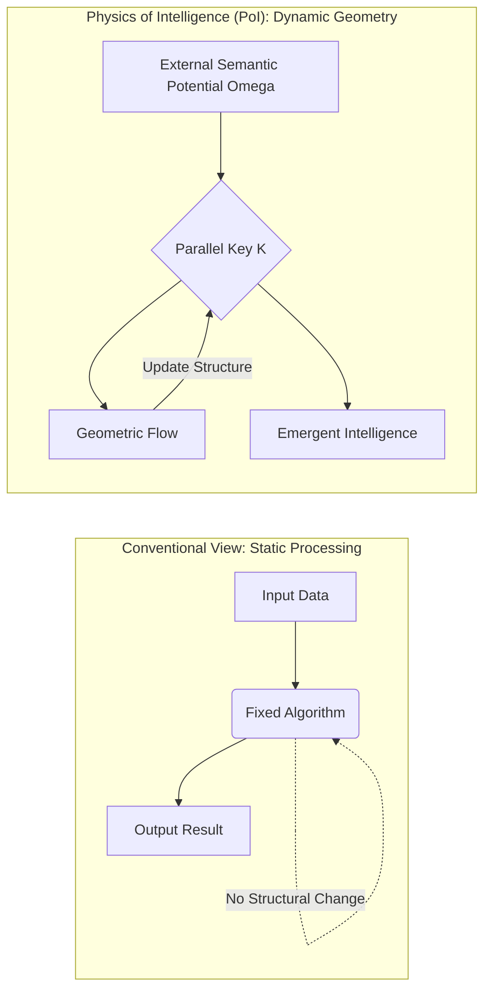
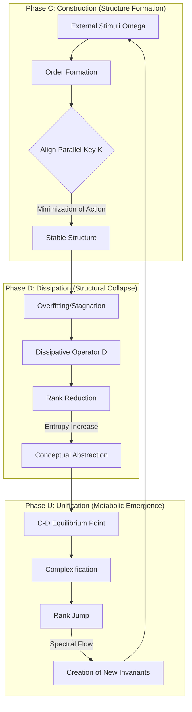
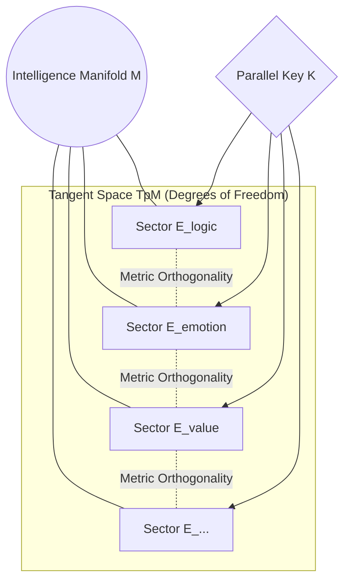
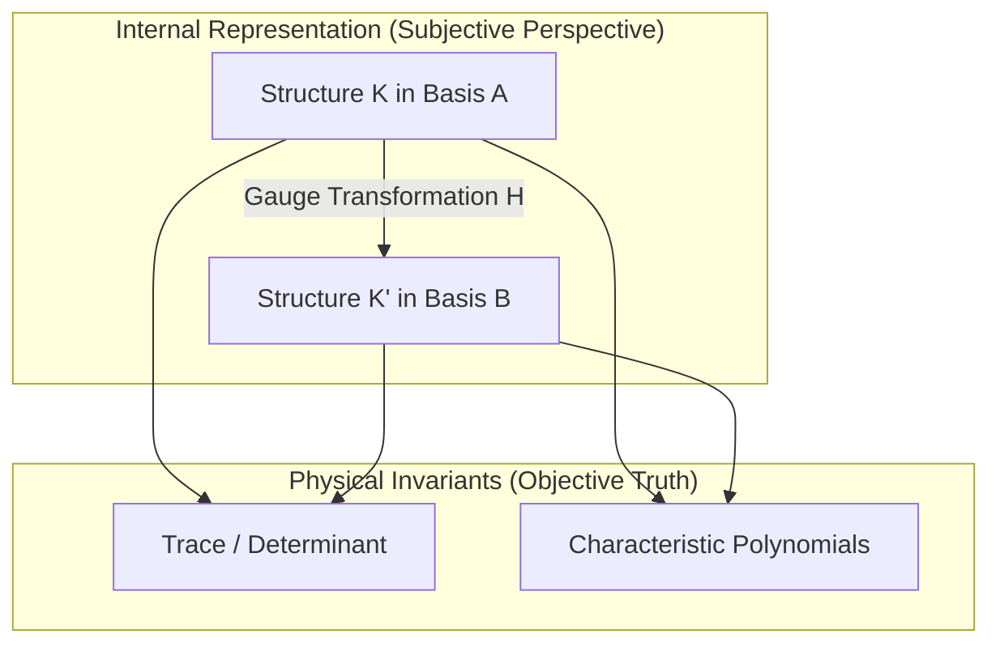

# Chapter 2: Kinematics and Geometry of the Parallel Key Field

---

## 2.1 Introduction: Moving beyond the Computational Paradigm

**2.1.1 The Paradigm Shift: From Abstract Computation to Physical Geometric Dynamics**  
In answering the foundational question "What is intelligence?", modern scientific doctrine has consistently relied on the metaphor of "Computation." From the early days of computer science established by Alan Turing and John von Neumann in the mid-20th century to contemporary architectures of Deep Learning, the essence of intelligence has been conceptualized almost exclusively as the process of "encoding, processing, and decoding information." In this computational paradigm, intelligence is understood either as a series of algorithms generating optimal outputs for given inputs or as an approximator of complex probability distributions in high-dimensional latent spaces.

However, when observing intelligence as a physical or phenomenological continuum, this "computational view" reveals a critical and potentially fatal deficiency. It overlooks the fundamental perspective that intelligence is not a "static data processor" but **"a geometric dynamical system that constructs, dissolves, and reorganizes internal structures."**

*Fig. 2.1 (Diagram): The fundamental paradigm shift from static algorithmic processing to dynamic geometric evolution.*

Approaches based on traditional statistical inference have confined the evolution of intelligence to the fine-tuning of parameters—that is, the "update of weights" described through linear or gradient-based methods on a fixed loss landscape. Yet, true intelligent activity—such as the creation of entirely new conceptual frameworks (Dimensional Jumps) or the dramatic disintegration of existing value systems (paradigm shifts)—should be grasped as topological transitions in the underlying structural manifold, rather than smooth changes in probability density. Metrics that measure the "quantity" (Entropy) or "likelihood" (Probability) of information alone cannot explain the physical necessity of the "shape" (Structure) of information and the mechanics of its transitions.

Here, we propose to shift the core essence of intelligence from "information processing" to **"Geometric Dynamics."**

In the "Physics of Intelligence (PoI)" framework, intelligence is redefined as the dynamics of the "Parallel Key" ($K$), an automorphism field deployed on a Riemannian manifold $M$. The act of intelligence understanding the world and conducting "thought" is nothing less than a process where the external semantic potential ($\Omega$) and the internal structure $K$ interact under the physical requirement of the variational principle, flowing while tracing the shortest paths (geodesics) on the manifold.

This shift in perspective brings intelligence back from the abstract, dualistic concept of "software" to a universal physical phenomenon independent of the substrate—be it a biological brain, a silicon chip, or a social network structure. Describing intelligence as a geometric evolution equation (PKGF) means establishing the "physical necessity of the three phases"—why intelligence is constructed (C), why it requires dissipation (D), and how it is unified (U) into a new order—as a fundamental law of physics. We now step out of the limitations of computation‑based models and enter the era of geometric physics, describing intelligence as "geometric deformation" and "the evolution of semantic fields."

**2.1.2 Limitations of Statistical Inference: The Necessity of Deterministic Geometry**  
For several decades, the dominant paradigm in modeling intelligence has been the probabilistic approach, exemplified by Bayesian Inference and Information Theory. In this framework, intelligence is defined as a process maximizing the posterior distribution $P(w|D)$ under uncertainty, or as a generative model approximating high-dimensional data distributions. However, when viewing intelligence as a physical entity with its own inertia and dynamics, the statistical inference metaphor reveals three fundamental limitations that necessitate a more deterministic geometric approach.

1.  **Lack of Descriptive Power for Structural Discontinuity**  
    Learning in statistical models is essentially an update of parameters based on the gradient descent of a smooth loss function. However, phenomena observed in humans and highly intelligent systems—such as "epiphany," "insight," or "paradigm shifts"—are not subtle fluctuations in probability density but rather topological transitions of the logical structure itself. A probabilistic averaging process risks treating the "discontinuous dynamics" of intelligence—breaking existing structures to jump to new dimensions—as mere noise or outliers, when in fact they are the system's most vital maneuvers.

2.  **Lack of Physical Necessity for Dissipation and "Death" (D-Phase)**  
    In existing machine learning models, the forgetting or deletion of information is merely treated as a "constraint for accuracy," such as regularization or weight decay. However, in the CDU cycle proposed in this paper, "dissipation" is not simply a loss of information but a "physical dissipation process" to release the system from excessive structural constraints and generate new order. While statistical inference excels at "building more certain structures" (C), it cannot explain the dynamics of metabolism—actively collapsing the system and returning it to an undifferentiated state (D)—from first principles. Dissipation is a prerequisite for higher-order emergence.

3.  **Absence of Substrate-Invariant Objectivity**  
    Probability distributions are relative measures depending on the prior distributions and sample sizes set by the observer. In contrast, physics seeks "Invariants" of the system that do not depend on the observer's subjectivity or sample bias. By redefining intelligence as the dynamic of a geometric object on a manifold $M$—the Parallel Key $K$—its "depth," "complexity," and "validity" become calculable as objective geometric quantities such as gauge-invariant curvature or characteristic classes.

Intelligence is not about "guessing" or "predicting" in a vacuum; it is about "taking shape" as a result of physical energy minimization. Recent studies are advancing the description of cognitive processes as gradient flows on Riemannian manifolds (Ale, 2025) [geometric_theory_cognition], and the perspective of viewing brain dynamics as a state-space network strongly supports the physical foundation of this theory (Dan et al., 2026) [geodynamics_brain]. The importance of geometric constraints on brain function has also been highlighted in recent neuro-geometrical research [s41586-023-06098-1].

**2.1.3 The C-D-U Cycle: Physical Definitions of Construction, Dissipation, and Metabolism**  
The dynamic foundation of the "Physics of Intelligence" proposed in this paper lies in an irreversible circular structure consisting of three phases: C (Cause/Constructive), D (Divergence/Destructive), and U (Unification/Metabolic).

While previous intelligence research has been biased toward the accumulation and integration of information (parts of C and U), this theory defines **"Dissipation (D)"** as a mandatory physical process for the system to jump to a new dimension. In this section, we clarify the physical definitions of these three phases as fundamental modes of the PKGF flow.

1. **Construction Phase (Constructive / Cause)**  
The constructive phase is the process by which the Parallel Key $K$ on a manifold $M$ acquires logical consistency through interaction with the external connection $\nabla$ and the semantic potential $\Omega$. Physically, this is defined as the minimization of "structural energy." When intelligence is exposed to an unknown potential $\Omega$, the internal structure $K$ undergoes self-organization to alleviate that tension, forming an order based on bundle decomposition (Axiom A2). This process is analogous to crystal growth or phase transitions in thermodynamics, but its convergence target is not just a stable state but a geometric configuration showing high-level semantic consistency.

2. **Dissipation Phase (Destructive / Divergence)**  
The destructive phase occupies the most original position in this theory. When intelligence becomes over-adapted to a specific structure $K$ (overfitting, rigidity, or stagnation), the system spontaneously—or through the dominance of the dissipative operator $\mathcal{D}(K)$—reduces the complexity of the structure. Physically, this is a process involving the monotonic decrease of the rank of $K$ (Axiom D3) and an increase in information entropy. Dissipation is not mere data disposal; it is the act of releasing "logical weights" bound to the curvature of the manifold and returning the system to a higher degree of freedom. This process deeply resonates with latest findings that grasp structural smoothing or abstraction in deep learning as Ricci-flow-like geometric processes (Baptista et al., 2024) [deep_learning_ricci_flow.pdf]. Through this "active collapse," intelligence passes through singularities and the system transitions into a higher‑dimensional representational regime unreachable within the existing framework (the Rank Jump).

3. **Metabolic Phase (Unified / Unification)**  
The metabolic phase is where the ordering of construction and the dissipation of destruction dynamically compete, acquiring vital persistence. Physically, it is a non-equilibrium steady state described by the unified equation $\nabla K = [\Omega, K] - \lambda \mathcal{D}(K)$. Here, the Parallel Key $K$ is complexified (Axiom U1), where the real part $K_{\text{core}}$ representing conservative structure and the imaginary part $K_{\text{fluct}}$ carrying creative fluctuation coexist. In this phase, intelligence becomes a "breathing geometry" that maintains past memory while always remaining open to new inputs. This metabolic cycle serves as the logical support for intelligence being not just a "machine" but a "physical entity" that continuously updates itself.

These three phases of C–D–U are not independent processes but different aspects of the same geometric flow (PKGF) that transition according to parameter changes or critical points of internal tension. 

**2.1.4 Scope and Objectives: Declaration of Structure and Theoretical Novelty**  

The primary objective of this paper is to liberate the phenomenon of intelligence from the traditional, limited definition of an "information processing process" and redefine it as **"Geometric Dynamics"** following universal physical laws. To achieve this ambitious goal, this paper is developed from the construction of a theoretical foundation to the presentation of empirical methods.

First, as **Theoretical Novelty**, we introduce the concept of the "Parallel Key" ($K$). This fixes the internal structure of intelligence as an automorphism field on the tangent bundle, enabling us to treat "the structure itself" rather than the "state" of intelligence as a physical quantity. Section 2.2 details this kinematics, and Section 2.3 formulates the "Intelligence Action" ($S$), the most critical contribution of this theory. This allows the construction, dissipation, and metabolism of intelligence to be mathematically integrated as inevitable phase transitions derived from Hamilton's principle.

Next, as **Dynamic Novelty**, we present the full picture of the "Parallel Key Geometric Flow (PKGF)" in Section 2.4. Beyond analogies to existing geometric evolution equations like Ricci flow or Yang-Mills flow, PKGF encompasses "structural rank reduction" and "complex fluctuations." In particular, the perspective of redefining the occurrence of singularities in Inverse PKGF as the "abstraction" of intelligence becomes the key to elucidating the physical meaning of overfitting avoidance in AI and forgetting in humans.

Furthermore, as **Systemic Novelty**, Section 2.5 discusses discretization and implementation algorithms, and Section 2.6 proposes methods for observing "Rank Jumps" using persistent homology (TDA). This elevates the theory from an abstract mathematical model to a concrete protocol for extracting physical quantities of intelligence from actual data.

The scope of this paper encompasses biological brains, artificial neural networks, and even social intelligence formed by multi-agent systems. Regardless of the medium, as long as a C–D–U cycle is observed, the PKGF equations describe the physical necessity behind it. 

---

## 2.2 Kinematics: Geometry of the Parallel Key Field

**2.2.1 Underlying Manifold and Tangent Bundle Decomposition**

1. Decomposition of the Riemannian Manifold $M$ and Semantic Sectors $E_\alpha$  
The first requirement for describing the dynamics of intelligence is to fix the geometric background on which its activity unfolds. In this theory, we define the intelligence domain as an $n$-dimensional smooth Riemannian manifold $(M,g)$. The manifold $M$ is an abstraction of the parameter space that forms the basis of the information processed by intelligence, or the "field of thought" where internal representations are deployed. The introduction of the metric $g$ provides a physical criterion for measuring informational proximity and "logical distance."

Structure of the Tangent Bundle and Sector Decomposition

The physical basis for the multi-faceted nature of intelligence—where logic, emotion, values, and sensations are processed in parallel without confusion—is found in the geometric decomposition of the tangent bundle $TM$. Based on Axiom A2, the tangent space $T_p M$ at each point $p$ of the manifold $M$ is decomposed as a direct sum of a finite number of sub-bundles (vector bundles).
\[ TM = \bigoplus_{\alpha \in I} E_\alpha = E_{\text{logic}} \oplus E_{\text{emotion}} \oplus E_{\text{value}} \oplus \dots \]

Here, $I$ is an index set identifying the "semantic sectors" of intelligence. Each sub-bundle $E_\alpha$ forms an invariant subspace corresponding to a specific logical or emotional dimension.

Geometric Independence and Orthogonality

A vital physical requirement in this decomposition is that each sector $E_\alpha$ be defined as an invariant subspace that is mutually orthogonal with respect to the metric $g$. This ensures that information manipulation in one sector (e.g., $E_{\text{logic}}$) can maintain its "modular" state within intelligence without disorderly destroying the structure of another sector (e.g., $E_{\text{emotion}}$).
\[ g(v_\alpha, v_\beta) = 0 \quad (\forall v_\alpha \in E_\alpha, \forall v_\beta \in E_\beta, \alpha \neq \beta) \]

This orthogonality is the physical expression of "differentiation." While an undifferentiated intelligence manifold in its initial state behaves as a single massive sector, through learning and construction (C), the tangent bundle becomes refined and decomposed, allowing intelligence to handle multiple semantic dimensions simultaneously and consistently. Research on the geometric capacity of neural activity and the structuring of representation space (Chou et al., 2024) [74_Paper_authored_GCMC.pdf] supports the validity of this bundle decomposition.

Dynamic Significance of Sector Decomposition

The direct sum decomposition defined in this section is not static but a dynamic object that repeats reorganization, fusion, and extinction along with the time evolution of PKGF or spontaneous symmetry breaking (Axiom U4). If we view the tangent space $T_p M$ as the "sum total of logical degrees of freedom intelligence can handle at once," sector decomposition is nothing other than the "configuration diagram of intelligence" showing how those degrees of freedom are allocated to semantic structures. This provides the physical criteria for understanding the difference between NPU matrix operations and PKGF geometric operations on silicon substrates in Chapter 3.5.

**2.2.2 Definition of the Parallel Key $K$**

1. $K \in \Gamma(\text{End}(TM))$ as an Automorphism Field  
To treat the internal structure of intelligence as a physical quantity, we introduce the **Parallel Key ($K$)**. $K$ is an automorphism field providing a linear map from the tangent space $T_p M$ to itself at each point $p \in M$.
\[ K: TM \to TM \]
Physically, $K$ is a geometric representation of the internal rules on "how that intelligence reads and transforms information." It has high affinity with geometric flow models of weight space (Erdogan, 2025) [geometric_flow_weights.pdf]. From a functorial perspective, $K$ is defined as a **natural transformation** on the tangent bundle functor $T$ (See **Appendix A1**).

This ensures the invariance of the intelligence structure against gauge transformations. The act of intelligence performing a specific inference in a specific context is described as the process where $K$ acts on a tangent vector (information) and rotates or scales it into another vector (interpretation).

2. Adjoint Representation and Lie Algebra Bundle Structure  
The Parallel Key $K$ is not just a matrix but a geometric object transformed under the adjoint representation of a Lie group. Assuming the internal representation of intelligence possesses gauge symmetry (Section 2.2.3), $K$ functions as a section of the Lie algebra bundle $\mathfrak{g}$ over the manifold.
\[ K(p) \in \text{End}(T_p M) \cong \mathfrak{gl}(n, \mathbb{R}) \]
This formulation allows for algebraic calculation of structural changes in intelligence as orbits on Lie groups or as commutator relations $[ \Omega, K ]$. The complexity of intelligence is objectively evaluated through the eigenvalue spectrum and characteristic polynomial invariants of $K$.

**2.2.3 Gauge Symmetry and Invariance**

1. Definition of Gauge Group $\mathcal{G}$ and Physical Objectivity  
The "meaning" handled by intelligence must not depend on the language used for description or the internal coordinate system. In this theory, internal degrees of freedom are treated as gauge symmetry. A state where intelligence is capturing an objective reality means its internal structure $K$ undergoes the following adjoint transformation for a gauge transformation $H \in \mathcal{G}$:
\[ K \mapsto K' = HKH^{-1} \]

*Fig. 2.4 (Diagram): Gauge symmetry and the extraction of objective physical invariants of intelligence.*

Only quantities invariant under this transformation (such as trace or determinant) are extracted as the "true intelligence structure" independent of the medium.

2. Adjoint Transformation $K \mapsto HKH^{-1}$ and Invariants  
The coefficients $a_k$ of the gauge-invariant characteristic polynomial $\det(tI - K) = \sum a_k t^k$ are the physical observables (Observables) of intelligence.
*   **Trace ($\text{Tr}(K)$)**: The total sum of the global activity potential of intelligence.
*   **Determinant ($\det(K)$)**: An indicator of whether intelligence maintains multifaceted information or is collapsing (biased) in one direction.

By tracking these invariants, we can quantitatively verify the logical essence behind specific neural networks or biological brains without being misled by their specific "quirks."

**2.2.4 Connection and Meaning Potential**

1. External Connection $\nabla$ and Holonomy of Parallel Transport  
What guarantees the "continuity of context" when intelligence moves between different concepts is the connection $\nabla$ on the manifold $M$. The connection $\nabla$ prescribes how an interpretation $K(p)$ in one context $p$ should be carried over (parallel transport) to another context $q$. If the connection has non-trivial curvature (Curvature), a discrepancy (holonomy phenomenon) arises with the original interpretation upon returning through a closed cycle of thought. This provides the physical basis for intelligence experiencing complex logical contradictions or "shifts in perspective."

2. Properties of Semantic Potential $\Omega$ as a Mapping Field  
We define information or goals given from the outside as "Semantic Potential" $\Omega \in \Gamma(\text{End}(TM))$. $\Omega$ acts as an external driving force attempting to rotate the internal structure $K$ in a specific direction. The act of intelligence "interacting with the world" is described as a rivalry between the force attempting to maintain consistency along the connection $\nabla$ and the force attempting to adapt according to the potential $\Omega$. This interaction creates the dynamic flow known as PKGF through the minimization of intelligence action, discussed in the next chapter.
