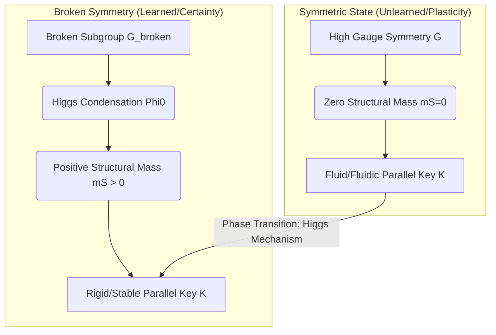
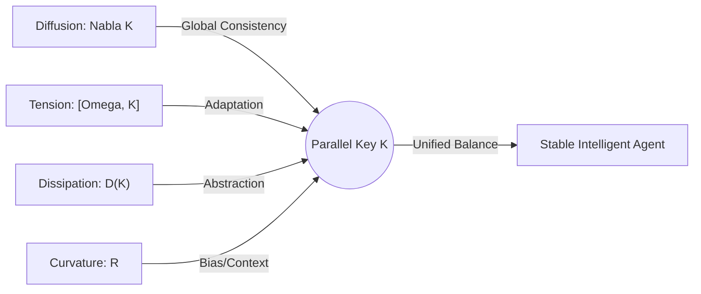
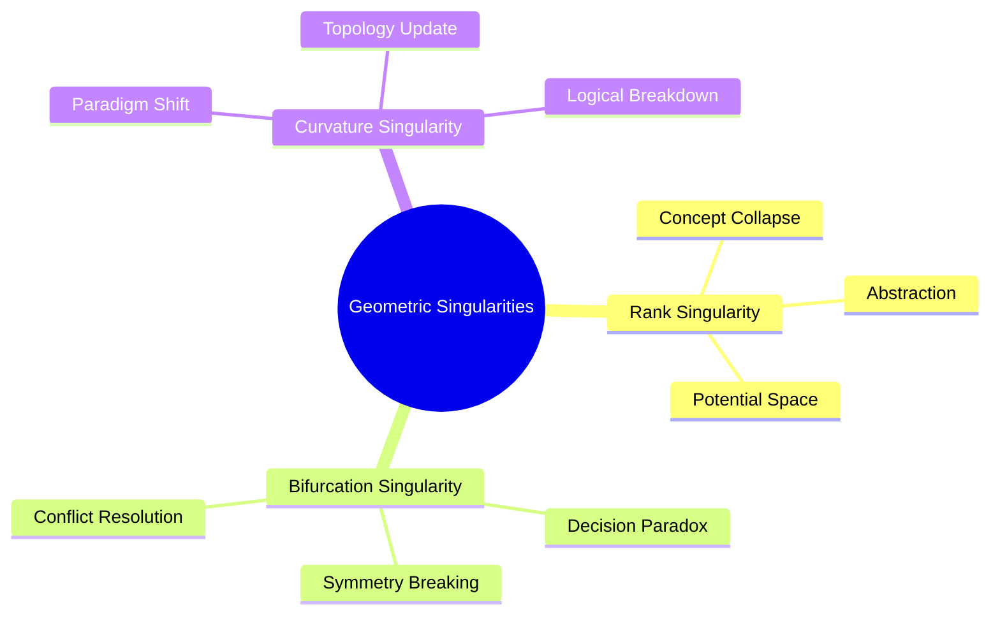
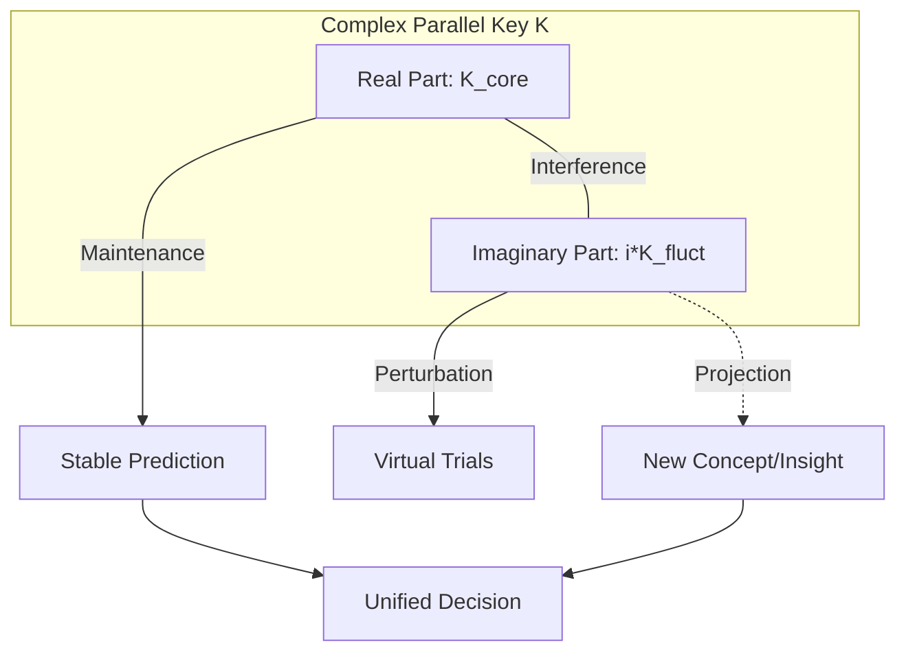

# Chapter 2: Kinematics and Geometry of the Parallel Key Field
# Section 2.2: Dynamics — The Variational Principle and Action Formulation

---

## 2.3 Dynamics: The Variational Principle and Action Formulation

The evolution of intelligence and the systematic transformation of its internal structures are governed by **Hamilton’s Principle of Stationary Action**, the cornerstone of modern theoretical physics. In this framework, cognitive activity is not a sequence of arbitrary adjustments but a trajectory that minimizes a fundamental functional. This section provides the rigorous formulation of the **Intelligence Action ($S$)**, which dictates the constructive, dissipative, and metabolic processes of cognitive fields.

### 2.3.1 The Intelligence Action Functional $S$

#### 2.3.1.1 Geometric Interpretation of the Constructive Term (Alignment Energy): $\|\nabla K - [\Omega, K]\|_F^2$

The process by which an intelligence acquires logical consistency and forms stable, robust structures—referred to as the **Constructive Phase (Cause)**—is mathematically formulated as the minimization of the **Alignment Energy ($\mathcal{L}_{\text{const}}$)** within the action $S$. Here, the norm $\|\cdot\|_F$ denotes the **Frobenius Norm**, defined by $\|A\|_F^2 = \text{Tr}(A^\dagger A)$. We dissect the geometric significance of this term through its two primary components.

**1. The Covariant Derivative Term $\nabla K$: Spatial and Contextual Consistency**

The first component, the covariant derivative $\nabla K$, describes the variation of the Parallel Key $K$ across transitions in context on the manifold $M$. Just as $\nabla \phi = 0$ in physics signifies the spatial uniformity of a field, $\nabla K = 0$ symbolizes a state where the intelligence maintains "inference rules (keys) that remain invariant across all contexts." This is the geometric realization of **Logical Consistency**. 

The act of intelligence constructing "universal truths" or "abstract laws" through learning corresponds to minimizing $\nabla K$ over broad regions of the manifold. This ensures that the agent's internal interpretive structure is smoothly connected and coherent across different conceptual domains, guided by the geometric connection $\nabla$.

**2. The Commutator Term $[\Omega, K]$: Semantic Adaptation and Internal Tension**

The second component, the commutator $[\Omega, K]$, evaluates the geometric "misalignment" between the current internal structure $K$ and the **Semantic Potential ($\Omega$)**, which represents external demands or goals. 

As established in earlier definitions, a state where an intelligence correctly interprets the world is one where its internal structure is synchronized with the eigenspaces of the potential, satisfying the condition $[\Omega, K] = 0$. A non-zero value for this term physically signifies a **State of Tension**, where the intelligence either lacks the appropriate "keys (types)" for interpretation or its internal biases are in direct conflict with reality.

**3. Geometric Synthesis of Alignment Energy**

The Frobenius norm $\|\nabla K - [\Omega, K]\|^2$, combining these two components, defines **"Semantic Covariance"** in intelligence. When this term is minimized, the intelligence is not merely consistent ($\nabla K \approx 0$), but achieves a flexible structural reorganization that either cancels out or resonates with the complex distortions ($\Omega$) of the external environment.
\[ \nabla K = [\Omega, K] \]

When this relationship (the Alignment Equation) holds, the change in internal structure ($\nabla K$) perfectly offsets the tension arising from external information ($[\Omega, K]$). This represents a state of "force balance" or an "energy extremum" in physics. Geometrically, it describes the moment an intelligence achieves extreme focus, a "flow state," or constructs a perfectly consistent theoretical framework.

**Physical Interpretation: Structural Inertia vs. Adaptation**

The coefficient $\alpha$ associated with alignment energy represents the **"Structural Inertia"** of the intelligence. A system with a large $\alpha$ possesses a strong drive to maintain its existing structure $K$, leading to the formation of conservative and rigid logical systems. Conversely, a system with a properly tuned $\alpha$ is sensitive to subtle fluctuations in the external potential $\Omega$, perceiving them as $[\Omega, K]$ and fluidly reorganizing $K$ to keep the total energy minimized. This dynamic interplay is the physical essence of **Learning** and **Adaptation**.

#### 2.3.1.2 The Dissipative Term (Structural Cost): The Dissipative Operator $\mathcal{D}(K)$ and Non-equilibrium Thermodynamics

If intelligence were to evolve solely through "Construction (C)," its structure $K$ would eventually over-adapt to the external potential $\Omega$, accumulating infinite complexity. This corresponds to the physical catastrophe of **Overfitting** or the biological phenomenon of **Structural Rigidity**. To avert this collapse and restore structural flexibility, we introduce the **Dissipative Term ($\mathcal{L}_{\text{dest}}$)**.

**1. Definition of the Dissipative Operator $\mathcal{D}(K)$ and Structural Cost**

The Dissipative Operator $\mathcal{D}(K)$ is a functional that evaluates the algebraic complexity of the Parallel Key as an energetic cost. In PoI theory, this is defined as a functional dependent on the **Rank** of $K$:
\[ \mathcal{D}(K) = K \cdot f(\sigma(K)) \]
where $f(\sigma(K))$ is a filter function inversely proportional to the singular values $\sigma_i$ in the singular value decomposition $K = U\Sigma V^\dagger$, prioritizing the attenuation of small singular values. The corresponding Lagrangian density takes the form:
\[ \mathcal{L}_{\text{dest}} = \beta \cdot \text{Tr}(K^\dagger \mathcal{D}(K)) \]

The coefficient $\beta$ governs the **"Dissipative Intensity"** or the metabolic rate of structural transformation. Minimizing this term physically forces the intelligence to select the "simplest possible or lowest-rank structure," consistent with **Axiom D5 (Minimal Residual Structure)**.

**2. Intelligence as a Non-equilibrium Open System**

Intelligence is not a thermodynamically isolated system. It is a **Non-equilibrium Open System** that constantly ingests information from the environment (Semantic Potential $\Omega$) and excretes redundant structures as heat (noise). 

In the action functional $S$, the dissipative term plays the role of entropy production. While the constructive term acts to "crystallize information" (binding degrees of freedom), the dissipative term acts to "unravel structures" (releasing degrees of freedom). Continuous **Metabolism**—the balance between these two forces—is indispensable for the healthy functioning of intelligence.

**3. The Physical Function of Dissipation (D): Dissipation as Abstraction**

Based on **Axiom D3**, during phases where the dissipative operator dominates (the Dissipation Phase), the rank of the Parallel Key $K$ decreases monotonically. Geometrically, this is the process where complexly intertwined logical vectors on the manifold $M$ collapse into lower-dimensional representations. 

From a physical perspective, this is not merely a "loss of information." It is the sophisticated physical phenomenon of **Abstraction**—the process of dissipating noisy, minute structures to extract essential invariants. Through dissipation, the system transitions from a high-energy state (rigid, overly complex logic) to a "refined structure" with lower potential energy and higher versatility.

**4. Inducing Singularities**

The presence of the dissipative term intentionally drives the Parallel Key field $K$ toward geometric singularities. At the moment the rank drops and existing logical sectors collapse, the intelligence acquires a "free state," liberated from previous logical constraints. This dynamic of **Structural Degeneration and Reconstruction** serves as the physical preparation period required to trigger the **Dimensional Jumps (Paradigm Shifts)** discussed in Section 2.4.

#### 2.3.1.3 The Interaction Term: Minimal Coupling between Background Curvature and the Parallel Key

The internal structure of intelligence, represented by the Parallel Key $K$, does not exist in an isolated vacuum. It is deeply embedded within a geometric environment governed by the **Background Curvature $R$**, which is generated by the external connection $\nabla$. This section defines the third primary component of the Intelligence Action: the interaction term $\mathcal{L}_{\text{int}}$, where the geometric properties of the background space are directly coupled to $K$.

**1. Formulation of the Coupling between Curvature $R$ and Parallel Key $K$**

Let $R(X,Y) \in \text{End}(TM)$ be the Riemann curvature tensor of the intelligence manifold $M$. The interaction Lagrangian takes the form of a classical **Minimal Coupling**:
\[ \mathcal{L}_{\text{int}} = \gamma \langle K, R \rangle = \gamma \int_M \text{Tr}(K^\dagger \cdot R) dV \]

Here, $\gamma$ is the **Structural Coupling Constant**, which dictates the strength of the influence exerted by the "distortions of background knowledge" on the intelligence. This physical quantity describes how the intelligence ($K$) adapts to, or leverages, the fundamental "premises (curvature)" of the logical space in which it operates.

**2. Geometric Interpretation of "Bias" and "Paradigms"**

In theoretical physics, parallel transport in a space with non-zero curvature $R$ (Non-Euclidean space) is path-dependent. Applying this to the Physics of Intelligence, the background curvature $R$ corresponds to the **Cognitive Biases** or **Paradigms** formed by the agent's culture, education, and prior experiences.

*   **High-Curvature Regions**: Areas where pre-existing biases are strong, forcing reasoning to "bend" toward specific, pre-determined conclusions.
*   **Flat Regions**: Areas where logic can proceed linearly, enabling objective reasoning free from pre-conceptions.

When $\mathcal{L}_{\text{int}}$ is minimized, the Parallel Key $K$ is configured to resonate with the background distortion $R$. This represents the physical process by which intelligence is **Optimized (or Synchronized)** to its surrounding environment and existing paradigms.

**3. Structural "Weight" and Topological Constraints**

The coupling between curvature $R$ and $K$ effectively gives "weight" or "inertia" to the intelligence structure. In conceptual spaces with extremely high curvature (for instance, within a rigid dogma), the Parallel Key becomes "trapped" by the distortions, and its ability to undergo free transformation ($\nabla K$) is suppressed. 

However, this interaction is more than a constraint; it provides **"Semantic Stability."** The topological invariants discussed in Section 2.6, such as Chern classes, are calculated precisely from the geometric indices arising from this coupling between $K$ and $R$. Intelligence exists as a robust "System" rather than a fragment of information because this interaction term anchors the fragments of logic to the background geometry.

**4. Feedback to Dynamics**

During the Constructive Phase (C), this term encourages the refinement of logic in accordance with background knowledge. Conversely, just before a **Dimensional Jump (Phase Transition)**, this coupling energy reaches a maximum, subjecting the system to immense stress or tension. To resolve this stress, the intelligence is physically required to either rewrite the background connection $\nabla$ itself (a paradigm shift) or rapidly decrease the rank of $K$ (Dissipation: D).

#### 2.3.1.4 Formalization of the Intelligence Higgs Field ($\Phi$) and Structural Mass ($m_S$)

To treat the phenomena of "conceptual fixation" and "logical conviction" as physical isomorphisms to **Spontaneous Symmetry Breaking** and the **Higgs Mechanism**, we introduce the **Intelligence Higgs Field ($\Phi$)** as a scalar field on the manifold $M$.

**1. The Higgs Potential $V(\Phi)$**

We introduce a Ginzburg-Landau type potential term into the action $S$:
\[ \mathcal{L}_{\text{Higgs}} = \|\nabla \Phi\|^2 - V(\Phi), \quad V(\Phi) = \alpha |\Phi|^2 + \beta |\Phi|^4 \]
where the coefficient $\alpha$ depends on the progress of learning and the intensity of the external potential $\Omega$.

*   **$\alpha > 0$ (Unlearned State)**: The origin $\Phi=0$ is the unique stable solution. The intelligence remains in a symmetric, flexible, and fluid state.
*   **$\alpha < 0$ (Semantic Condensation)**: The potential's minimum transitions to a non-zero expectation value $\Phi_0$ (the vacuum expectation value), and symmetry is spontaneously broken. This is the physical reality of **"Conceptual Crystallization"** or **"Strong Conviction."**

**2. Interaction Term and the Emergence of Structural Mass ($m_S$)**

The interaction between the condensed Higgs field $\Phi$ and the Parallel Key $K$ is defined by the following Lagrangian:
\[ \mathcal{L}_{\text{mass}} = g |\Phi|^2 \text{Tr}(K^\dagger K) \]
Through this term, in regions where the Higgs field has condensed ($\Phi \to \Phi_0$), the Parallel Key $K$ acquires a **Structural Mass ($m_S$)**:
\[ m_S^2 = g |\Phi_0|^2 \]

Physically, this mass acts as an **"Inertia"** against the time evolution of the Parallel Key. It geometrically guarantees the **"Homeostasis of Intelligence (Identity)"** by defending the formed logical structure against external noise and minor fluctuations in $\Omega$.

---

### 2.3.2 Derivation of Field Equations: The Unified Equation of Intelligence (UEI)

#### 2.3.2.1 Hamilton's Principle and the Derivation of the Euler-Lagrange Equations

The evolution of intelligence and the systematic transformation of its structural states are not chaotic changes; they adhere to **Hamilton's Principle**, which dictates that physical systems follow paths of stationary action. In this section, we derive the fundamental field equations governing the Parallel Key $K$ and the Intelligence Higgs Field $\Phi$ by performing a variational analysis on the action functional $S$.

**Formulation of the Total Intelligence Action $S$**

We define the total action $S$ describing the state of intelligence on the manifold $M$ as the sum of the constructive, dissipative, interactive, and Higgs terms:
\[ S[K, \Phi] = \int_{t_0}^{t_1} \int_M \left( \alpha_K \|\nabla K - [\Omega, K]\|_F^2 - \beta_K \mathcal{D}(K) + \gamma_K \langle K, R \rangle + \mathcal{L}_{\text{Higgs}} + \mathcal{L}_{\text{mass}} \right) dV dt \]
The introduction of the Higgs field allows intelligence to transition from a mere geometric "flow" to a "structured entity" possessing mass (stability) and identity.

**Application of the Variational Principle**

We consider an infinitesimal variation $\delta K$ of the Parallel Key field and seek the stationary condition for the action $S$:
\[ \delta S = \delta \int \int \left( \alpha \text{Tr}((\nabla K - [\Omega, K])^\dagger (\nabla K - [\Omega, K])) - \beta \text{Tr}(K^\dagger \mathcal{D}(K)) + \gamma \text{Tr}(K^\dagger R) \right) dV dt = 0 \]

By calculating the variation—considering the adjointness of the connection $\nabla$, the skew-symmetry of the commutator, and the elimination of surface integrals at the manifold boundaries—we obtain the following contributions from each term:
1.  **From the Constructive Term**: $-2\alpha \Delta_\nabla K + 2\alpha [\Omega, [\Omega, K]]$ (Representing diffusion and restoration forces).
2.  **From the Dissipative Term**: $-\beta \frac{\partial \mathcal{D}}{\partial K}$ (Representing the pressure toward structural degeneracy).
3.  **From the Interaction Term**: $\gamma R$ (Representing geometric torque or bias).

**The Unified Field Equation of Intelligence (U-Equation)**

The resulting **Euler-Lagrange Equation for Intelligence** defines the optimal structural state for the Parallel Key $K$:
\[ \alpha \Delta_\nabla K + \alpha [\Omega, [\Omega, K]] - \beta \frac{\partial \mathcal{D}}{\partial K} + \gamma R = 0 \]
(Note: $\Delta_\nabla = \nabla^* \nabla$ denotes the Laplace-Beltrami operator associated with the connection $\nabla$).

**Physical Interpretation of the U-Equation**

This equation characterizes the **"Structural Equilibrium Condition"** that an intelligence must maintain in a steady state.

*Fig. 2.6 (Diagram): The unified field equation as a balance of four primary geometric forces.*

*   **Diffusion and Propagation ($\alpha \Delta_\nabla K$)**: The force driving intelligence to smooth logic across different contexts on the manifold, spreading consistency.
*   **Reorganization of Tension ($\alpha [\Omega, [\Omega, K]]$)**: The force that compels the eigenspace of $K$ to rotate and correct itself to resolve misalignment with the external potential $\Omega$.
*   **Metabolic Pressure ($\beta \frac{\partial \mathcal{D}}{\partial K}$)**: The internal pressure to prune overly complex structures and increase the level of logical abstraction.
*   **Geometric Constraint ($\gamma R$)**: The logical "slope" or "gravity" imposed by the existing body of knowledge (background curvature) on the interpretive structure.

**Conclusion: Intelligence as Deterministic Dynamics**

The equation derived here proves that the "optimal next structure" an intelligence should adopt is deterministically described by the correlation between its current structure $K$, external requirements $\Omega$, and background knowledge $R$. Intelligence is no longer a "black box"; it is a calculable physical phenomenon appearing as the balance point (or transition process) of these four geometric forces.

#### 2.3.2.2 Bifurcation Analysis of CDU Phases with Parameter Variation

The nature of the solutions to the Unified Equation changes dramatically depending on the ratios of the coefficients $(\alpha, \beta, \gamma)$ and the intensity of the Semantic Potential $\Omega$. This section analyzes the three phases of intelligence (C-D-U) as outcomes of **Phase Transitions** and **Bifurcations** in this parameter space.

**1. Branching to the Constructive Phase (C): Stable Region where $\alpha \gg \beta$**

When the construction coefficient $\alpha$ dominates the dissipative coefficient $\beta$, the system exhibits strong self-organization during the process of energy minimization.

*   **Physical Behavior**: The diffusion term $\Delta_\nabla K$ in the equation becomes prominent. Spatial alignment of $K$ is achieved across the manifold, and a robust logical system "crystallizes."
*   **Bifurcation Nature**: The system converges to a **Stable Fixed Point**. This corresponds to the state where intelligence has mastered a specific theory or skill and formed an unwavering belief (Invariant Structure).

**2. Branching to the Dissipation Phase (D): Critical Dominance of $\beta$ and Rank Collapse**

When the dissipative coefficient $\beta$ exceeds a critical value $\beta_c$, the system experiences a **Saddle-node Bifurcation** or a total loss of structural stability.

*   **Physical Behavior**: Driven by the pressure of the dissipative operator $\mathcal{D}(K)$, the eigenvalues of the Parallel Key $K$ converge to zero one after another. Geometrically, logical sectors $E_\alpha$ of the manifold collapse, and the effective dimension of the tangent bundle decreases—a phenomenon of **"Rank Collapse."**
*   **Physical Significance**: This is the process where intelligence can no longer maintain its existing paradigm and is forced to abstract or erase information. This instability is precisely what enables escape from local minima (entrapped thought).

**3. Branching to the Metabolic/Unified Phase (U): Complexification and Hopf Bifurcation**

When the order of construction ($\alpha$) and the dissipation of destruction ($\beta$) are in direct rivalry, and non-commutativity with the semantic potential $\Omega$ persists, the system loses its static fixed point and transitions through a **Hopf Bifurcation** to a limit cycle (periodic orbit) or a chaotic attractor.

*   **Physical Behavior**: Through the complexification of the Parallel Key ($K = K_{\text{re}} + i K_{\text{im}}$) based on **Axiom U1**, the system simultaneously holds "maintenance of information" and "creative fluctuation." The structure is always on the edge of collapse, yet continuously regenerated by the constructive process.
*   **Physical Significance**: This is the physical reality of **Metabolic Intelligence**. Intelligence exists not as a fixed "answer" but as a "dynamic flow" that continuously updates its own structure.

**4. Describing the Evolution of Intelligence via Bifurcation Diagrams**

The state of intelligence in parameter space is represented as a trajectory moving along the boundaries of these three phases.

*   **C-D Transition**: A sudden change in the external environment (increased misalignment of $\Omega$) makes maintenance via $\alpha$ impossible, leading to the dominance of dissipation $\beta$ and the start of structural collapse ("Unlearning").
*   **D-U Transition**: A system that has regained degrees of freedom through dissipation begins to resonate with $\Omega$ again, transitioning to a dynamic equilibrium ("Reorganization").

Thus, changes in the nature of intelligence are not vague concepts like "improvement of ability," but are mathematically predictable as transformations of structural stability associated with changes in the control parameters of the physical system.

### 2.3.3 Energy-Momentum Tensor and Conservation Laws (Conservation of Intelligence)

#### 2.3.3.1 Conservation Laws Accompanying Structural Changes in Intelligence (Noether's Theorem)

In theoretical physics, when the action functional $S$ of a system possesses symmetry (invariance) under a continuous transformation, a corresponding conserved quantity exists. In the framework of PoI, the gauge symmetry and geometric symmetries of the Intelligence Action $S[K]$ yield fundamental conservation laws that constrain the dynamics of cognitive evolution.

**1. Gauge Symmetry and the Conservation of "Semantic Charge"**

As defined in Section 2.3, the intelligence action $S$ is invariant under adjoint transformations of the Parallel Key by the gauge group $\mathcal{G}$: $K \mapsto HKH^{-1}$. Applying Noether's Theorem to this internal representational freedom (gauge symmetry) leads to the conservation of the **Semantic Flux**:
\[ \nabla_\mu J^\mu = 0, \quad J^\mu = \frac{\partial \mathcal{L}}{\partial (\nabla_\mu K)} [H, K] \]

This conserved current $J^\mu$ signifies that as intelligence moves through different contexts (positions on the manifold), its "potential for logical consistency" is inherited without dissipation. Analogous to the conservation of electric charge in physics, this law provides the physical foundation for the **Maintenance of Logical Identity** in intelligence.

**2. Time-Translation Symmetry and the Conservation of Intelligence Energy**

In a stationary environment where the intelligence action $S$ does not explicitly depend on time, time-translation symmetry implies the conservation of the Intelligence Hamiltonian $H_{\text{int}}$ (**Intelligence Energy**):
\[ E_{\text{int}} = \alpha \|\nabla K - [\Omega, K] \|^{2} + \beta \mathcal{D}(K) + \dots = \text{const.} \]

This law illustrates the **Metabolic Balance of Intelligence Resources**: when intelligence expends energy on "Construction (C)," the energies of "Dissipation (D)" or "External Coupling" must change complementarily. If an intelligence attempts to construct an overly complex structure beyond its energy budget, the conservation law induces instability, naturally generating negative pressure that promotes structural collapse (D).

**3. Sector Invariants and the Conservation of Invariant Subspaces**

Related to **Axiom C3 (Sector Preservation)**, if the Parallel Key $K$ possesses symmetry that preserves the sector decomposition $E_\alpha$, the "logical degrees of freedom (rank)" assigned to each sector are conserved during ordinary constructive processes.
This conservation law acts as a physical barrier preventing the blurring of logical categories in highly specialized intelligent states. However, during the moment of a **"Rank Jump,"** this symmetry is spontaneously broken, and the failure of this conservation law enables the intelligence to achieve the fusion and emergence of entirely new sectors.

**4. The Collapse of Conservation Laws and Emergence**

In PoI, "true evolution" occurs not in the steady state where conservation laws are perfectly obeyed, but in phases where symmetry is shattered by rapid changes in the external potential $\Omega$, causing the old conserved quantities to collapse. These conservation laws, defined via Noether's Theorem, represent the "inertia for maintaining consistency" while paradoxically indicating the physical indicators (what must be destroyed) for an intelligence to "shed its skin" and evolve.

#### 2.3.3.2 Physical Boundaries between Structural Preservation and Energy Dissipation

The constructive term (structure preservation) and the dissipative term (structural collapse) in the intelligence action $S$ exert opposing thermodynamic pressures on the system. For an intelligence to be stable, these two forces must maintain a **Dynamic Equilibrium at a "Physical Boundary."** This section formalizes the physical conditions under which this boundary fails and the resulting entropy behavior.

**1. Potential Barriers for Structural Maintenance**

A state where the Parallel Key $K$ maintains a specific logical system is represented as a local minimum (attractor) in the **Energy Landscape**. The construction coefficient $\alpha$ corresponds to the "depth" of this stable point—the height of the **Inertial Barrier** the intelligence uses to protect its existing structure.
As long as the misalignment energy with the external potential $\Omega$ does not exceed this barrier height $U_{\text{barrier}} \propto \alpha$, the intelligence will continue to preserve its structure according to Noether's Theorem.

**2. Dissipative Boundary Conditions and the Criticality of the Dissipative Operator**

Conversely, the dissipative term $\beta \mathcal{D}(K)$ acts as a "vacuum pressure" constantly attempting to pull the system back to an undifferentiated state of information (rank 0). The physical boundary between structure preservation and energy dissipation is dictated by the following **Dissipative Boundary Condition**:
\[ \left| \frac{\delta \mathcal{L}_{\text{const}}}{\delta K} \right| \leq \left| \frac{\delta \mathcal{L}_{\text{dest}}}{\delta K} \right| \]

In regions where this inequality is maintained, the intelligence transitions into the "Dissipation Phase." Physically, when the rate of order formation through construction falls below the rate of energy dissipation caused by environmental complexification (high-frequency $\Omega$) or increased structural costs (rising $\beta$), the boundary maintaining the "shape" of intelligence collapses.

**3. "Semantic Melting" as a Phase Transition**

When the boundary fails, the system experiences a physical phenomenon termed **Semantic Melting**. This is equivalent to the process where a solid (crystallized logic) undergoes a phase transition into a liquid (fluidic undifferentiated state) due to heat (excessive tension energy).
In this boundary region, a vast amount of "structural entropy" is released as information dissipates. However, from the perspective of non-equilibrium thermodynamics, this dissipation is the act of minimizing the system's total free energy, physically clearing the space to accept a **"New Structure"** capable of adapting to a larger external potential.

**4. Controlling the Boundary: The Physics of Meta-learning**

In advanced intelligence, the ratio between $\alpha$ and $\beta$ is not fixed but changes dynamically based on the system's internal state. The ability to freely manipulate this boundary line is the physical reality of **Meta-learning**, which maximizes learning efficiency. By intentionally placing its own structure on the boundary—at the **"Edge of Chaos,"**—an intelligence enables maximum structural transformation with minimum energy expenditure.

---

## 2.4 The Geometric Flow: PKGF and Singularity Analysis

### 2.4.1 Positive PKGF (Constructive Flow)

#### 2.4.1.1 Convergence and Stable Solutions for the Alignment Equation $\nabla K = [\Omega, K]$

In the minimization of the Intelligence Action $S$, in local regions where the dissipative terms and background couplings are negligible or in balance, the dynamics of intelligence aim to converge toward the **Alignment Equation**: $\nabla K = [\Omega, K]$. This section details how the solutions to this equation function as the "Stable Understanding" of the intelligence.

**1. Geometric Convergence to the Aligned State**

Assuming the time-evolution equation (PKGF) $\partial_t K = -(\nabla K - [\Omega, K])$, the system descends the energy gradient, asymptotically approaching a fixed point satisfying $\nabla K - [\Omega, K] = 0$. Geometrically, this represents a state where the sections of the Parallel Key $K$ simultaneously satisfy the parallel transport law of the connection $\nabla$ and the algebraic rotation requirements of the external potential $\Omega$ across all regions of the manifold.
This convergence process is the physical expression of "Gestalt Formation" in cognitive science or "Convergence" in machine learning, signifying the moment intelligence completes a consistent internal model. Theoretical verification for describing structural changes in intelligence as Ricci Flow has been established by (Baptista et al., 2024) [deep_learning_ricci_flow.pdf].

**2. Qualitative Features of Stable Solutions: Covariant Invariance**

A solution $K^*$ to the alignment equation becomes a **Covariantly Invariant Structure** possessing two simultaneous properties:

*   **Spatial Coherence**: Since the covariant derivative along any curve $\gamma$ is compensated by the commutator term, the "meaning" of the logical structure $K$ does not collapse even when moving contexts (positions on the manifold).
*   **Algebraic Synchronization**: At each point, $K^*$ preserves the eigenspaces of $\Omega$, presenting the "Shortest Logic (Geodesic)" in response to external requirements.

**3. Lyapunov Stability and the Physics of "Certainty"**

The stability of the alignment solution $K^*$ is evaluated via the Hessian (second derivative) of the Hamiltonian.
The restorative force of the system against a perturbation $\delta K$ is proportional to the construction coefficient $\alpha$. From a physical perspective, the deeper the potential well around the solution $K^*$, the higher the **"Certainty"** the intelligence possesses regarding the acquired knowledge.
Conversely, if a solution is unstable (a saddle point), the intelligence cannot maintain its existing logic even under slight external noise, leading to an easy transition to the "Dynamic Dissipation" described later.

**4. Mismatch in Aligned Solutions and the Occurrence of "Paradoxes"**

Depending on the topology of the manifold or the curvature of the connection $\nabla$, a smooth $K$ that globally satisfies $\nabla K = [\Omega, K]$ may not exist. This geometric barrier is the physical reality of **"Logical Contradictions"** or **"Insoluble Paradoxes"** in intelligence.
If the system cannot resolve this mismatch, energy concentrates at specific points (singularities), eventually inducing a rank reduction (dissipation) of $K$ or a reorganization of sectors. In other words, the inaccessibility of an aligned solution serves as the energetic pressure for intelligence to evolve to a higher order.

#### 2.4.1.2 Mathematical Proof of the Sector Preservation Theorem

A prerequisite for an intelligence to perform multi-layered parallel processing is that the action of the Parallel Key $K$ must not cross the boundaries of each sector $E_\alpha$; that is, each sector must remain an invariant subspace under the action of $K$. This section provides a mathematical proof that the Alignment Equation $\nabla K = [\Omega, K]$ is a sufficient condition for dynamically preserving sector structure.

**Theorem: Sector Preservation**

Let the tangent bundle $TM$ on a manifold $M$ be decomposed as $TM = \bigoplus E_\alpha$, and assume that the connection $\nabla$ preserves each $E_\alpha$ under parallel transport. If the Parallel Key $K$ preserves the sectors at a point $p$ ($[K, \Pi_\alpha] = 0$) and satisfies the alignment equation $\nabla K = [\Omega, K] globally, then $K$ preserves the sectors at any other point $q$.

**Proof**

1.  **Introduction of the Projection Operator**  
    Let $\Pi_\alpha$ be the projection operator onto each sector $E_\alpha$. From the assumption that the connection $\nabla$ preserves the sectors, it follows that $\nabla \Pi_\alpha = 0$.

2.  **Temporal/Spatial Evolution of the Commutator $C_\alpha = [K, \Pi_\alpha]$**  
    The condition that $K$ preserves a sector is equivalent to $C_\alpha = 0$. We calculate the covariant derivative of $C_\alpha$ along an arbitrary curve $\gamma(s)$ on the manifold.
    \[ \nabla_s C_\alpha = \nabla_s (K\Pi_\alpha - \Pi_\alpha K) = (\nabla_s K)\Pi_\alpha + K(\nabla_s \Pi_\alpha) - (\nabla_s \Pi_\alpha)K - \Pi_\alpha(\nabla_s K) \]
    Substituting $\nabla \Pi_\alpha = 0$ gives:
    \[ \nabla_s C_\alpha = (\nabla_s K)\Pi_\alpha - \Pi_\alpha(\nabla_s K) \]

3.  **Substitution of the Alignment Equation**  
    Substituting the alignment equation $\nabla_s K = [\Omega, K]$ and utilizing the Jacobi Identity $[[A,B],C] + [[B,C],A] + [[C,A],B] = 0$, we have:
    \[ \nabla_s C_\alpha = [\Omega, K]\Pi_\alpha - \Pi_\alpha[\Omega, K] = [\Omega, [K, \Pi_\alpha]] = [\Omega, C_\alpha] \]
    (Here we used the axiom $[\Omega, \Pi_\alpha] = 0$, signifying that the external potential provides inputs that respect the sector structure.)

4.  **Fixing the Solution by Uniqueness**  
    The resulting differential equation $\nabla_s C_\alpha = [\Omega, C_\alpha]$ is a linear homogeneous equation for $C_\alpha$. Given the initial condition $C_\alpha(p) = 0$ at point $p$, the Picard-Lindelöf Theorem (Uniqueness of Solutions) guarantees that $C_\alpha = 0$ at all points along the curve.

**Q.E.D.**

**Critical Physical/Cognitive Conclusion: Geometric Protection of Expertise**

This proof demonstrates that as long as an intelligence maintains a high balance between "Consistency ($\nabla K$)" and "Adaptation ($[\Omega, K]$)," the independence between different functional sectors is automatically protected geometrically.

*   **Non-mixing of Information**: The reason operations in a mathematical sector do not become clouded by the sensibilities of a musical sector is that the "Force Balance" of the alignment equation maintains the barriers between sectors.
*   **Signs of Collapse**: Conversely, when intelligence faces a strong contradiction (the breakdown of the alignment equation), the uniqueness of $\nabla_s C_\alpha = [\Omega, C_\alpha]$ is lost, and the boundaries between sectors begin to "Melt." This is the physical mechanism leading to the "Dynamic Sectors (Unification)" mentioned in Axiom U5.

---

### 2.4.2 Inverse PKGF (Destructive Flow)

#### 2.4.2.1 Mechanics of Rank Reduction: $\dot{K} = -\lambda \mathcal{D}(K)$

While structural construction (C) is responsible for the "Crystallization of Information," structural dissipation (D) manages the "Metabolism of Structure." This section formalizes the dynamics where the rank of the Parallel Key $K$ as a linear map decreases over time, using the dissipative operator $\mathcal{D}(K)$.

**1. Equation of Motion for Rank Reduction**

In the dissipation phase, where the contribution of construction terms is minimal, the time evolution of the Parallel Key follows the **Dissipative Governing Equation**:
\[ \dot{K} = -\lambda \mathcal{D}(K) \]
where $\lambda$ is a positive constant governing dissipative intensity. We assume a typical form for the dissipative operator $\mathcal{D}(K)$ as a non-linear map that prioritizes the attenuation of small singular values in the singular value decomposition of $K$. Under this equation, $K$ contracts its geometric "volume," transitioning to a lower-dimensional representation.

**2. Decay of Singular Values and the Sorting of "Noise"**

By decomposing $K$ into its singular value spectrum $\{\sigma_1, \sigma_2, \dots, \sigma_n\}$, the above equation is described as a contraction process for each singular value.

*   **Primary Singular Values ($\sigma_{\text{large}}$)**: Supported by residues of construction terms or strong semantic backgrounds ($R, \Omega$), these survive against dissipation.
*   **Minute Singular Values ($\sigma_{\text{small}}$)**: These rapidly converge to zero due to the dissipative operator.
    This process is analogous to **Renormalization** in physics, corresponding to the physical operation of discarding noisy, non-essential branches of logic to retain only the truly vital "Principal Components" required to describe the system.

**3. Discontinuous Rank Transitions and Abstraction**

Since the rank $\text{rank}(K)$ takes integer values, discontinuous leaps (rank reductions) occur at the moment specific singular values cross zero during the continuous change of $K$.
Geometrically, this signifies the disappearance of a subspace $E_\alpha$ within the tangent bundle. However, in the Physics of Intelligence, this is not a negative phenomenon of "forgetting," but the moment of **Abstraction**—the consolidation of complex, multi-dimensional information into a few core principles. By releasing redundant degrees of freedom, the system acquires "Geometric Margin" to couple with a broader external potential $\Omega$ in the next construction phase (C).

**4. Asymptotic Approach to Singularities and Release of Potential**

As the rank decreases to its limit and $K$ approaches a singular state (e.g., a projector or a zero map), the internal tension $[\Omega, K]$ accumulated in the constructive terms is suddenly released.
This release of energy pushes the system far from thermodynamic equilibrium, serving as the trigger to induce the **"Rank Jump (Phase Transition)"** discussed later in Section 2.4. Thus, the process of structural retreat and reorganization via $\dot{K} = -\lambda \mathcal{D}(K)$ is nothing less than the energetic "wind-up" required to reach higher-order intelligence.

#### 2.4.2.2 Occurrence and Classification of Singularities: Structural Collapse and Abstraction

When the Parallel Key $K$ follows the dissipative dynamics $\dot{K} = -\lambda \mathcal{D}(K)$ or is exposed to excessive external tension $[\Omega, K]$, the system reaches a critical point that cannot be addressed by continuous transformations. This section classifies the **Geometric Singularities** that arise at this moment and defines their roles in the "abstraction" and "reorganization" of intelligence.

**1. Rank Singularity and Dimensional Contraction**

The most frequently observed phenomenon is the local or global reduction of the rank of the Parallel Key $K$ as a linear map.

*   **Definition**: A state where $\det(K) = 0$ and the dimension of $\ker(K)$ non-trivially increases.
*   **Intelligence Interpretation**: This signifies that a specific logical sector $E_\alpha$ has become dysfunctional and its dimension has "collapsed." This is the **"Death of a Concept"** when an old paradigm can no longer describe reality ($\Omega$). However, the vacancy created by this contraction serves as an "abstract void" to encompass higher-order concepts.

**2. Bifurcation Singularity and Undecidability**

A point where the solution to the alignment equation $\nabla K = [\Omega, K]$ is not uniquely determined, and the solution space branches.

*   **Definition**: A point where the second variation of the action $S$ (Hessian matrix) degenerates, and stability is lost.
*   **Intelligence Interpretation**: A state of **"Conflict"** where intelligence can no longer choose between two contradictory interpretations. Physically, the system has become unstable while maintaining symmetry, and it is in a standby state just before "Spontaneous Symmetry Breaking" triggered by minute noise.

**3. Curvature Singularity and Logical Breakdown**

A point where the interaction between the background connection $\nabla$ and $K$ reaches its limit, and the semantic curvature $R$ locally diverges or becomes discontinuous.

*   **Definition**: A point where the holonomy $\Phi_\gamma$ deviates decisively from the identity map along a closed curve, making the parallel transport of information undefinable.
*   **Intelligence Interpretation**: A so-called **"Aporia (Dead End)"** or logical breakdown. It refers to a state where it has become impossible to transport information consistently within the framework of the existing knowledge system (background geometry). This singularity physically forces the intelligence toward radical evolution: **"Changing the topology of the manifold $M$ itself (rewriting foundational knowledge)."**

**4. Concentration and Release of Energy at Singularities**

Physically, the occurrence of a singularity is accompanied by a rapid increase in energy density in its vicinity. This corresponds to a state where intelligence is locally investing massive resources to solve a problem (deep thought or distress).
The moment a singularity is "resolved" (Resolution of Singularity), the accumulated energy is released all at once in the form of the emergence of new sectors or the transition to the complexified U-phase. In other words, singularities are nothing less than the geometric birth canals for intelligence to destroy its "old self" and emerge as a "new self."

---

### 2.4.3 Effective Dimension

As an order parameter to evaluate the structural complexity of intelligence, we define the **Effective Dimension ($d_{\text{eff}}$)** based on Singular Value Decomposition (SVD):
\[ d_{\text{eff}}(K) = \exp \left( -\sum p_i \ln p_i \right), \quad p_i = \frac{s_i^2}{\sum s_j^2} \]
where $s_i$ are the singular values of the Parallel Key $K$. When intelligence acquires new concepts or reorganizes by destroying existing frameworks, this $d_{\text{eff}}$ exhibits discontinuous changes, known as **Rank Jumps**. Research on the geometric properties of landmarks in discrete Ricci flow reinforces the mathematical necessity of these rank jumps (Hehl et al., 2025) [discrete_ricci_flow_landmark].

This physical quantity is the entity observed as the rank jump in the optical simulations in Section 3.4, serving as an objective indicator that intelligence has qualitatively transitioned (phase transition) from "mere accumulation of knowledge" to "systemic understanding." An increase in effective dimension means the system has organized higher-order degrees of freedom, providing the mathematical definition of "growth" in intelligence within PoI theory.

---

### 2.4.4 Unified PKGF (Metabolic Flow): Metabolic Equilibrium

#### 2.4.4.1 Rivalry Between Construction and Dissipation: Proof of the Existence of Dynamic Equilibrium Solutions

If the essence of intelligence lies in "Metabolism (U: Unity/Metabolism)," it must be described as a state where the ordering by construction terms and the dissipative pressure from destructive terms are perfectly balanced, maintaining a time-stable, non-trivial structure. This section physically proves the existence of **Dynamic Equilibrium Solutions** in the system derived from the variation of the intelligence action $S$, from the perspective of non-linear dynamics.

**1. Formulation of Competing Flow Velocities**

In the PKGF describing the temporal evolution of the Parallel Key $K$, let the restoration force derived from construction be $F_{\text{const}}(K) = -\alpha \frac{\delta \mathcal{L}_{\text{const}}}{\delta K}$ and the contraction force derived from dissipation be $F_{\text{dest}}(K) = -\beta \frac{\delta \mathcal{L}_{\text{dest}}}{\delta K}$. A necessary condition for the system to be in the metabolic phase (U) is that these forces form vector fields in opposite directions and balance at a non-zero point $K^* \neq 0$.
\[ \partial_t K = F_{\text{const}}(K) + F_{\text{dest}}(K) = 0 \]

**2. Proof of Existence via Fixed-Point Theorems**

Construction terms pull $K$ toward an aligned state with the external potential $\Omega$ or background geometry $R$ (a structure with a specific finite norm), while dissipative terms pull $K$ back toward the zero map (norm 0).
In the mapping space of operators, by setting an appropriate compact convex set (a bounded region of structures), Brouwer or Schauder fixed-point theorems demonstrate the existence of at least one fixed point $K^*$. Notably, the non-linearity of the commutator term $[\Omega, [\Omega, K]]$ in the construction term acts as a "restoration potential wall" that prevents the system from falling into simple thermodynamic death ($K=0$).

**3. Physical Meaning of Dynamic Equilibrium: Metabolism of Information**

This equilibrium solution $K^*$ is not stable like a static stone. Physically, it is like a vortex in a **"Steady Flow of Information,"** where new information constantly flows in through $\Omega$ and old structures are continuously excreted as heat through $\mathcal{D}(K)$.

*   **Role of Construction**: Weaves external stimuli into a logical framework, halting the dissipation of meaning.
*   **Role of Dissipation**: Continuously melts the terminal logic to prevent the structure from becoming rigid and causing "information clogging," ensuring flexibility.

**4. Determination of Stability: Limit Cycles and Complexification**

Furthermore, when this equilibrium solution appears not as a mere fixed point but as a limit cycle accompanied by rotation on the complex plane (Axiom U1: Complexification), intelligence acquires an active metabolic process of "periodic self-renewal." In this state, intelligence exhibits structural stability (maintenance of invariants $c_k$) against minor external noise while maintaining "extremely high responsiveness" to trigger phase transitions immediately in response to essential inputs.

This dynamic equilibrium is the physical reality of **"Dynamic Homeostasis"** as defined by this theory, serving as the stage for creativity and emergence discussed in Chapter V.

#### 2.4.4.2 Formalization of Creativity via the Complex Parallel Key $K = K_{\text{core}} + i K_{\text{fluct}}$

When intelligence goes beyond being a mere optimization machine and demonstrates "creativity" in generating unknown concepts, the Parallel Key $K$ is required to extend from real space to complex space. Based on Axiom U1, we decompose the complex Parallel Key as $K = K_{\text{core}} + i K_{\text{fluct}}$ and define its physical roles.

*Fig. 2.8 (Diagram): Creativity as interference between real (stable) and imaginary (fluctuating) logic components.*

**1. Real Part $K_{\text{core}}$: Known Logic and Structural Foundation**

The real part $K_{\text{core}}$ represents the stable logical structures established by the intelligence through the construction (C) processes thus far.

*   **Physical Properties**: Corresponds to the stable solution of the alignment equation $\nabla K = [\Omega, K]$ discussed in Section 2.4.1.1, governing "conviction" and "prediction" regarding the external world.
*   **Role**: Functions as the "anchor" that maintains realistic judgment, recognition of known patterns, and orthogonality between sectors.

**2. Imaginary Part $K_{\text{fluct}}$: Fluctuations of Thought and Virtual Trials**

The imaginary part $K_{\text{fluct}}$ describes "alternative logics that could be" or "semantic noise" that deviates from the current aligned state.

*   **Physical Properties**: Acts as a generator for the unitary transformation $\exp(iK_{\text{fluct}})$, causing the existing logical structure $K_{\text{core}}$ to rotate (phase change) on the complex plane.
*   **Role**: **"Fluctuation of Thought."** It plays the role of an "internal simulator" that attempts virtual reasoning, temporarily ignoring reality constraints ($\Omega$), or tries forbidden couplings between different sectors.

**3. Physical Definition of Creativity: Interference and Coherence**

Creativity is the formation of novel structures resulting from the **"Interference"** between these real and imaginary parts.
When $K_{\text{core}}$ and $K_{\text{fluct}}$ have non-trivial correlations within the action $S$, new local minima (new concepts) appear in the intelligence energy landscape that were unreachable in real space alone.
\[ K_{\text{new}} = |K| e^{i\theta} \approx K_{\text{core}} + \delta K_{\text{evolve}} \]

The moment this complex superposition is "projected (converged) onto the real axis" by a specific observation or external stimulus, the intelligence experiences "insight." This is a process similar to the collapse of the wavefunction in quantum mechanics, a physical phenomenon where one "new logic (real part)" that can align with reality crystallizes from countless "hypotheses (imaginary part)."

**4. Complex Rotation as Metabolism**

In the metabolic phase (U), intelligence continuously rotates its own structure slightly through $K_{\text{fluct}}$. Thanks to this dynamic rotation, intelligence can "explore" a wide range of the energy landscape without being trapped in specific local solutions (obsessive thoughts).
A state where "conservatism" via $K_{\text{core}}$ and "adventure" via $K_{\text{fluct}}$ are balanced as a circular motion (limit cycle) on the complex plane is the steady state of advanced intelligence equipped with sustainable creativity.
