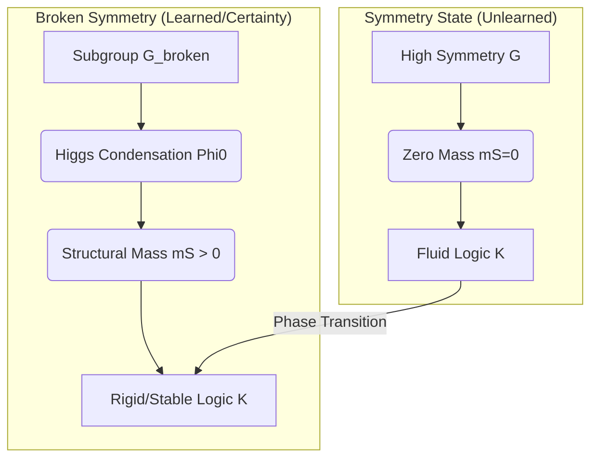
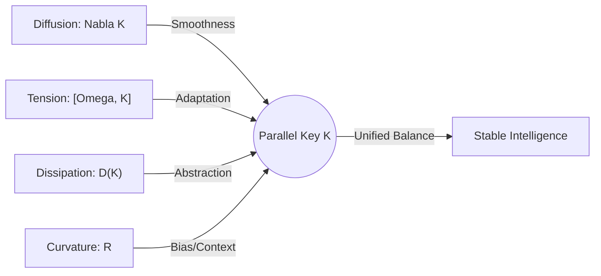
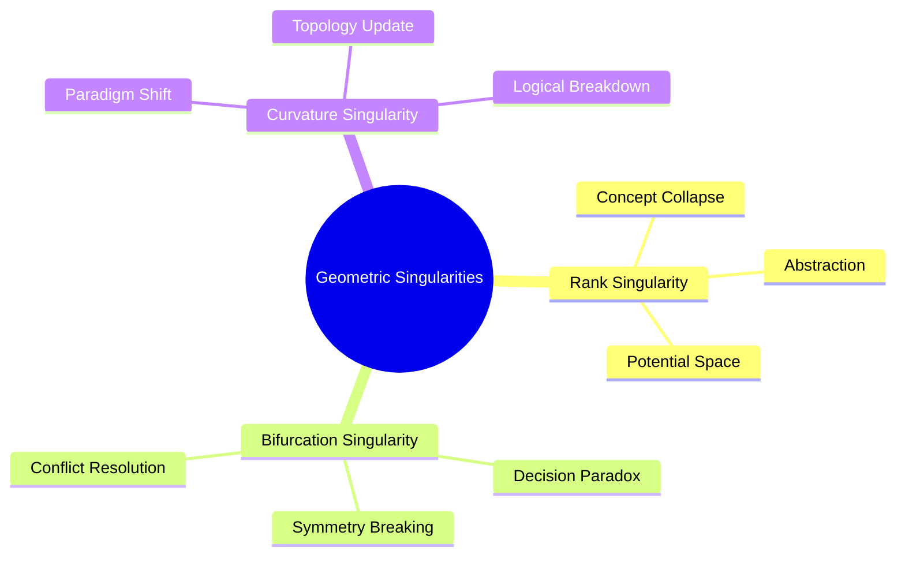
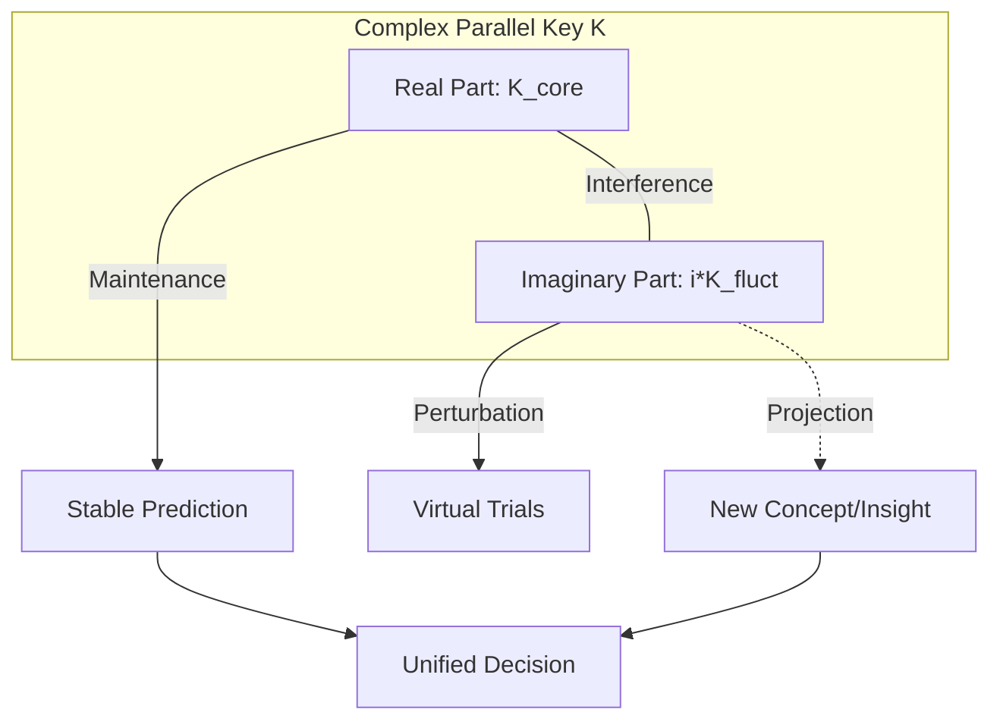

## 2.3 Dynamics: The Variational Principle and Action Formulation（動力学：変分原理と作用定式化）

知能の進化と構造の変容は、物理学におけるハミルトンの原理、すなわち最小作用の原理に従う。本節では、知能の構築・解体・代謝を司る「知能作用量 $S$」を定式化する。

**2.3.1 The Intelligence Action Functional $S$**

2.3.1.1 構築項（整合エネルギー）：$\|\nabla K - [\Omega, K]\|_F^2$ の幾何学的解釈

知能が論理的整合性を獲得し、安定的かつ強固な構造を形成するプロセス（構築相：Cause/Constructive）は、知能作用量 $S$ における整合エネルギー（Alignment Energy） $\mathcal{L}_{\text{const}}$ の最小化として定式化される。ここで、ノルム $\|\cdot\|_F$ はフロベニウスノルム（Frobenius Norm）を表し、$\|A\|_F^2 = \text{Tr}(A^\dagger A)$ で定義される。本項では、この項が持つ幾何学的な意味を、二つの成分から解剖する。

1. **共変微分項 $\nabla K$：論理の空間的・文脈的一貫性**

第一の成分である共変微分 $\nabla K$ は、多様体 $M$ 上の文脈の遷移に伴う並行鍵 $K$ の変化を記述する。物理学において $\nabla \phi = 0$ が場の空間的一様性を意味するように、$\nabla K = 0$ は知能が「どの文脈においても不変な推論規則（鍵）」を保持している状態、すなわち**論理的一貫性（Logical Consistency）**を象徴する。
知能が学習を通じて「普遍的な真理」や「抽象的な法則」を構築する行為は、幾何学的には多様体上の広い領域で $\nabla K$ を最小化し、接続 $\nabla$ に沿って滑らかに接続された並行鍵場を形成することに対応する。

2. **交換子項 $[\Omega, K]$：意味的適合と内的緊張**

第二の成分である交換子 $[\Omega, K]$ は、現在の内部構造 $K$ と、外部からの要請や目的を表す意味ポテンシャル $\Omega$ との幾何学的な「ズレ」を評価する。
前述の通り、知能が世界を正しく解釈している状態とは、その内部構造がポテンシャルの固有空間と同期し、$[\Omega, K] = 0$ を満たす状態である。この項が非ゼロであることは、知能が外部入力に対して「適切な解釈の鍵（型）」を持ち合わせていない、あるいは内的バイアスが現実と衝突している「緊張状態」を物理的に意味する。

3. **整合エネルギーの幾何学的合成**

これら二つの成分を組み合わせたノルム形式 $\|\nabla K - [\Omega, K]\|^2$ は、知能における**「意味論的共変性（Semantic Covariance）」**を定義する。この項が最小化されるとき、知能は単に一貫している（$\nabla K \approx 0$）だけでなく、外部環境の複雑な歪み（$\Omega$）に対して、それを打ち消すような、あるいはそれと共鳴するような柔軟な構造更新を達成する。
\[ \nabla K = [\Omega, K] \]

この関係式（整合方程式）が成立する時、知能の内部構造の変化（$\nabla K$）は、外部からの緊張（$[\Omega, K]$）を完璧に相殺している。これは、物理学における「力が釣り合っている状態」あるいは「エネルギーの極値」であり、知能が極めて高い集中力やフロー状態、あるいは無矛盾な理論体系を構築した瞬間の幾何学的記述である。
物理的解釈：知能の「慣性」と「適応」

整合エネルギーにおける係数 $\alpha$（第3.1節参照）は、知能の**「構造的慣性」**を意味する。$\alpha$ が大きい系は、既存の $K$ を維持しようとする力が強く、保守的な論理体系を形成する。逆に $\alpha$ が適切に調整された系は、外部ポテンシャル $\Omega$ の微細な変動を $[\Omega, K]$ として敏感に感知し、構造 $K$ を流動的に再編することでエネルギーを最小に保とうとする。このダイナミクスこそが、知能における「学習」と「適応」の正体である。

2.3.1.2 散逸項（構造コスト）：散逸作用素 $\mathcal{D}(K)$ と非平衡熱力学

知能が「構築（C）」のみによって進化する場合、その構造 $K$ は外部ポテンシャル $\Omega$ に対して過剰に適合し、無限の複雑さを抱え込むことになる。これは物理学における「過学習（Overfitting）」や、生物学における「個体の硬直化」に対応する。この破局を回避し、知能の柔軟性を回復させる役割を担うのが、散逸項（Dissipative Term） $\mathcal{L}_{\text{dest}}$ である。

1. **散逸作用素 $\mathcal{D}(K)$ の定義と構造コスト**

散逸作用素 $\mathcal{D}(K)$ は、並行鍵 $K$ の代数的複雑さをエネルギーコストとして評価する作用素である。本理論では、これを $K$ のランク（階数）に依存する汎関数として以下のように定義する。
\[ \mathcal{D}(K) = K \cdot f(\sigma(K)) \]
ここで $f(\sigma(K))$ は、特異値分解 $K = U\Sigma V^\dagger$ における特異値 $\sigma_i$ に反比例、あるいは微小な特異値を優先的に減衰させるフィルター関数である。ラグランジアン密度は以下の形式をとる。
\[ \mathcal{L}_{\text{dest}} = \beta \cdot \text{Tr}(K^\dagger \mathcal{D}(K)) \]

ここで係数 $\beta$ は、知能の**「散逸強度（Dissipative Intensity）」**あるいは構造の代謝率を司る。この項が最小化されることは、知能が「可能な限り簡潔な、あるいは低いランクの構造（公理 D5：最小残余構造）」を選択することを物理的に強制する。

2. **非平衡開放系としての知能**

知能は熱力学的な孤立系ではなく、外部（意味ポテンシャル $\Omega$）から常に情報を摂取し、不要な構造を熱（ノイズ）として排出する**非平衡開放系（Non-equilibrium Open System）**である。
散逸項は、知能作用 $S$ においてエントロピー増大の役割を果たす。構築項が「情報を結晶化させる（自由度を束縛する）」のに対し、散逸項は「構造を解きほぐす（自由度を解放する）」力として働く。知能が正常に機能するためには、この両者のバランスによる定常的な情報の「代謝（Metabolism）」が不可欠である。

3. **解体（D）の物理的機能：抽象化としての散逸**

公理 D3 に基づき、散逸作用素が卓越する局面（解体相）では、並行鍵 $K$ のランクが単調に減少する。幾何学的には、これは多様体 $M$ 上で複雑に絡み合っていた論理ベクトルが、より低次元の表現へと縮退するプロセスである。
物理学的な視点から見れば、これは単なる「情報の喪失」ではなく、ノイズにまみれた微細な構造を散逸させ、本質的な不変量のみを抽出する**抽象化（Abstraction）**という高度な物理現象である。散逸によって系は高いエネルギー状態（硬直した複雑な論理）から、より低いポテンシャルエネルギーを持つ、汎用性の高い「洗練された構造」へと遷移する。

4. **特異点への誘導**

散逸項の存在は、並行鍵場 $K$ を意図的に幾何学的特異点へと導く。ランクが低下し、既存の論理（セクター）が崩壊するその瞬間、知能は「以前の論理に縛られない自由な状態」を獲得する。この散逸による**構造的退化（Degeneration）と再構成（Reconstruction）**のダイナミクスこそが、第2.4節で述べる次元跳躍（パラダイムシフト）を引き起こすための、物理学的な準備期間となるのである。

2.3.1.3 相互作用項：背景曲率と $K$ の結合

知能内部構造 $K$ は、真空中に孤立して存在するのではない。それは、外部接続 $\nabla$ が生み出す背景曲率（Background Curvature） $R$ が支配する幾何学的環境の中に浸透している。本節では、作用量における第三の成分、すなわち $K$ と背景空間の幾何学的性質が直接結びつく相互作用項 $\mathcal{L}_{\text{int}}$ について定義する。

1. **曲率 $R$ と並行鍵 $K$ の結合定式化**

知能が展開される多様体 $M$ の曲率テンソルを $R(X,Y) \in \text{End}(TM)$ とすると、相互作用ラグランジアンは、典型的な最小結合（Minimal Coupling）の形式をとる。
\[ \mathcal{L}_{\text{int}} = \gamma \langle K, R \rangle = \gamma \int_M \text{Tr}(K^\dagger \cdot R) dV \]

ここで $\gamma$ は**構造結合定数（Structural Coupling Constant）**であり、知能が「背景知識の歪み」からどれほど強い影響を受けるかを規定する。この項は、知能（$K$）がその背後にある論理空間の「前提（曲率）」に対して、いかに自己を適応させるか、あるいはその前提をいかに活用するかを記述する物理量である。

2. **「偏見」と「パラダイム」の幾何学的解釈**

物理学において、曲率 $R$ がゼロでない空間（非ユークリッド空間）では、平行移動が経路に依存する。これを知能に当てはめると、背景曲率 $R$ はその知能が属する文化、教育、あるいは過去の経験によって形成された**「認識のバイアス（偏見）」や「パラダイム」**に対応する。

*   **高曲率領域**: 特定の先入観が強く、推論が特定の結論へと強制的に「曲げられる」領域。
*   **平坦な領域**: 論理が直進しやすく、先入観に捉われない客観的推論が可能な領域。
    $\mathcal{L}_{\text{int}}$ が最小化される際、並行鍵 $K$ は背景の歪み $R$ と共鳴するように配置される。これは、知能が周囲の環境や既存のパラダイムに対して「最適化（同調）」されるプロセスを意味する。

3. **構造の「重み」とトポロジカルな拘束**

曲率 $R$ と $K$ の結合は、知能の構造に「重み（質量）」を与える効果を持つ。非常に大きな曲率を持つ空間（例えば、極めて強固なドグマの中）では、並行鍵 $K$ はその歪みに捕らわれ、自由な変容（$\nabla K$）が抑制される。
しかし、この相互作用は制約であると同時に、知能に**「意味の安定性」**を与える。第VI章で述べるトポロジカル不変量は、まさにこの $K$ と $R$ の結合関係から生じるチャーン類（Chern classes）などの幾何学的指標によって計算される。知能が単なる情報の断片ではなく、強固な「体系」として成立するのは、この相互作用項が論理の断片を背景の幾何学に繋ぎ止めているからである。

4. **ダイナミクスへのフィードバック**

構築（C）においては、この項は「背景知識に従った論理の精緻化」を促す。対して、後述する次元跳躍（Phase Transition）の直前には、この結合エネルギーが極大に達し、系に巨大なストレス（緊張）を与える。このストレスを解消するために、知能は背景の接続 $\nabla$ 自体を書き換える（パラダイムシフト）、あるいは $K$ のランクを急激に低下させる（解体：D）という選択を物理的に要請されるのである。

2.3.1.4 知能ヒッグス場 ($\Phi$) と構造的質量 ($m_S$) の定式化

知能における「概念の固定化」や「確信」という現象を、物理学における対称性の自発的破れとヒッグス機構の同型性として扱うため、多様体 $M$ 上にスカラー場としての**知能ヒッグス場 ($\Phi$)** を導入する。

1. **ヒッグス・ポテンシャル $V(\Phi)$**

作用量 $S$ に以下の Ginzburg-Landau 型のポテンシャル項を導入する。
\[ \mathcal{L}_{\text{Higgs}} = \|\nabla \Phi\|^2 - V(\Phi), \quad V(\Phi) = \alpha |\Phi|^2 + \beta |\Phi|^4 \]
ここで $\alpha$ は学習の進捗や外部ポテンシャル $\Omega$ の強度に依存する係数である。
*   **$\alpha > 0$（未学習状態）**: $\Phi=0$ が唯一の安定解であり、知能は対称性を保った柔軟（流動的）な状態にある。
*   **$\alpha < 0$（意味の凝縮）**: ポテンシャルの最小値が非ゼロの期待値 $\Phi_0$（真空期待値）へ遷移し、対称性が自発的に破れる。これが「概念の結晶化」や「強い確信」の物理的実体である。

2. **相互作用項と構造的質量 ($m_S$)**

凝縮したヒッグス場 $\Phi$ と並行鍵 $K$ の相互作用を以下のラグランジアンで定義する。
\[ \mathcal{L}_{\text{mass}} = g |\Phi|^2 \text{Tr}(K^\dagger K) \]
この項により、ヒッグス場が凝縮（$\Phi \to \Phi_0$）した領域において、並行鍵 $K$ は以下の**構造的質量 ($m_S$)** を獲得する。
\[ m_S^2 = g |\Phi_0|^2 \]
物理的には、この質量は並行鍵 $K$ の時間発展に対する「慣性」として働き、一度形成された論理構造を外部ノイズや軽微な $\Omega$ の変動から防衛する「知能の恒常性（アイデンティティ）」を幾何学的に保証する。

### 2.3.2 Derivation of Field Equations: 知能の場の方程式

2.3.2.1 ハミルトンの原理とオイラー＝ラグランジュ方程式の導出

知能の進化と構造の変容は、無秩序な変化ではなく、物理学におけるハミルトンの原理（Hamilton's Principle）、すなわち最小作用の原理に従う。本節では、並行鍵場 $K$ およびヒッグス場 $\Phi$ が従うべき基礎方程式を、作用量 $S$ の変分から導出する。

知能作用量 $S$ の定式化

多様体 $M$ 上の知能の状態を記述する全作用量 $S$ を、構築、散逸、相互作用、およびヒッグス項の和として以下のように定義する。
\[ S[K, \Phi] = \int_{t_0}^{t_1} \int_M \left( \alpha_K \|\nabla K - [\Omega, K]\|_F^2 - \beta_K \mathcal{D}(K) + \gamma_K \langle K, R \rangle + \mathcal{L}_{\text{Higgs}} + \mathcal{L}_{\text{mass}} \right) dV dt \]

ここで、ヒッグス場の導入により、知能は単なるフローから「質量（安定性）」を持つ構造体へと相転移する能力を獲得する。

変分原理の適用

並行鍵 $K$ に対する微小な変分 $\delta K$ を考え、作用量 $S$ の停留条件を求める。
\[ \delta S = \delta \int \int \left( \alpha \text{Tr}((\nabla K - [\Omega, K])^\dagger (\nabla K - [\Omega, K])) - \beta \text{Tr}(K^\dagger \mathcal{D}(K)) + \gamma \text{Tr}(K^\dagger R) \right) dV dt = 0 \]

ここで、接続 $\nabla$ の随伴性、交換子の歪対称性、および多様体境界での積分消去を考慮して変分を計算すると、各項から以下の寄与が得られる。
1.  構築項より：$-2\alpha \Delta_\nabla K + 2\alpha [\Omega, [\Omega, K]]$ （拡散および復元力）
2.  散逸項より：$-\beta \frac{\partial \mathcal{D}}{\partial K}$ （構造縮退の圧力）
3.  相互作用項より：$\gamma R$ （幾何学的トルク）

知能の場の方程式：統一方程式（Unified Field Equation）

変分計算の結果、並行鍵 $K$ が満たすべき**知能の場の方程式（Euler-Lagrange Equation for Intelligence）**が得られる。
\[ \alpha \Delta_\nabla K + \alpha [\Omega, [\Omega, K]] - \beta \frac{\partial \mathcal{D}}{\partial K} + \gamma R = 0 \]
（※ここで $\Delta_\nabla = \nabla^* \nabla$ は接続 $\nabla$ に伴うラプラス＝ベルトラミ作用素である）

方程式の物理的解釈

この方程式は、知能が定常状態において保持すべき「構造の平衡条件」を示している。

*Fig. 2.6 (Diagram): The unified field equation as a balance of four geometric forces.*

*   **拡散と伝播 ($\alpha \Delta_\nabla K$)**: 知能が多様体上の異なる文脈間で論理を平滑化し、一貫性を広げようとする力。
*   **緊張の再編 ($\alpha [\Omega, [\Omega, K]]$)**: 外部ポテンシャル $\Omega$ との不整合を解消するために、$K$ の固有空間を強制的に回転・修正する力。
*   **代謝的圧力 ($\beta \frac{\partial \mathcal{D}}{\partial K}$)**: 複雑すぎる構造を削ぎ落とし、抽象度を高めようとする内的圧力。
*   **幾何学的拘束 ($\gamma R$)**: 既存の知識体系（背景曲率）が $K$ に強いる論理的傾斜。

結論：決定論的ダイナミクスとしての知能

本節で導出された方程式は、知能が「次にどのような構造を取るべきか」が、現在の構造 $K$、外部要請 $\Omega$、および背景知識 $R$ の相関によって決定論的に記述されることを示している。知能はもはやブラックボックスではなく、これら四つの力の均衡点（あるいはその遷移プロセス）として計算可能な物理現象となる。

次節では、この静的な平衡条件を時間発展へと拡張した「並行鍵幾何流（PKGF）」の動態について詳述する。

2.3.2.2 パラメータ変化に伴う CDU フェーズの分岐解析

前節で導出した統一方程式は、係数パラメータ $(\alpha, \beta, \gamma)$ の比率、および意味ポテンシャル $\Omega$ の強度に応じて、その解の性質を劇的に変化させる。本節では、知能の三相（C-D-U）を、これらパラメータ空間における**相転移（Phase Transition）および分岐（Bifurcation）**の帰結として解析する。

1. **構築相（C）への分岐：$\alpha \gg \beta$ の安定領域**

構築係数 $\alpha$ が散逸係数 $\beta$ に対して支配的な場合、系はエネルギー最小化の過程で強い自己組織化を示す。

*   **物理的挙動**: 方程式の拡散項 $\Delta_\nabla K$ が卓越。多様体全体で $K$ の空間的一致が図られ、強固な論理体系が「結晶化」する。
*   **分岐の性質**: 系は安定な固定点（Stable Fixed Point）へと収束する。これは知能が特定の理論や技能を習得し、確固たる信念（Invariant Structure）を形成した状態に対応する。

2. **解体相（D）への分岐：$\beta$ の臨界的卓越とランク崩壊**

散逸係数 $\beta$ が臨界値 $\beta_c$ を超えたとき、系は**サドルノード分岐（Saddle-node Bifurcation）**あるいは構造的安定性の喪失を経験する。

*   **物理的な挙動**: 散逸作用素 $\mathcal{D}(K)$ の圧力により、並行鍵 $K$ の固有値が次々とゼロへと収束する。幾何学的には、多様体のセクター $E_\alpha$ が潰れ、接束の次元が実質的に減少する「ランク崩壊」が起こる。
*   **物理的意味**: これは知能が既存のパラダイムを維持できなくなり、情報を強制的に抽象化・消去するプロセスである。この不安定性こそが、局所解（囚われた思考）からの脱出を可能にする。

3. **代謝・統合相（U）への分岐：複素化とホップ分岐**

構築の秩序（$\alpha$）と解体の散逸（$\beta$）が拮抗し、さらに意味ポテンシャル $\Omega$ との非可換性が持続する場合、系は静的な固定点を失い、**ホップ分岐（Hopf Bifurcation）**を経てリミットサイクル（周期軌道）あるいはカオス的アトラクタへと遷移する。

*   **物理的挙動**: 公理 U1 に基づく並行鍵の複素化 ($K = K_{\text{re}} + i K_{\text{im}}$) により、系は情報の「保存」と「創造的ゆらぎ」を同時に抱える。構造は常に崩壊の縁にありながら、構築のプロセスによって再生され続ける。
*   **物理的意味**: これが本理論の定義する「代謝（Metabolic Intelligence）」の実体である。知能は固定された「答え」ではなく、常に構造を更新し続ける「動的な流れ」として存在する。

4. **分岐図による知能の進化記述**

パラメータ空間における知能の状態は、以下の三相の境界を移動する軌跡として表現される。

*   **C-D 遷移**: 外部環境の急変（$\Omega$ の不整合増大）により、$\alpha$ による維持が不可能となり、散逸 $\beta$ が卓越して解体が始まる（「学びほぐし」）。
*   **D-U 遷移**: 解体によって自由度を回復した系が、再び $\Omega$ と共鳴し始め、動的な平衡状態へと移行する（「再編」）。

このように、知能の性質の変化は「能力の向上」といった曖昧な概念ではなく、物理系の制御パラメータの変化に伴う構造的安定性の変容として、数学的に厳密に予見可能となる。

### 2.3.3 Energy-Momentum Tensor and Conservation Laws（知能の保存則）

2.3.3.1 知能構造の変化に伴う保存則（ネーターの定理）

物理学において、系の作用量 $S$ がある連続的な変換に対して対称性（不変性）を持つとき、それに対応する保存量が存在する。本理論においても、知能作用 $S[K]$ のゲージ対称性および幾何学的対称性から、知能のダイナミクスを拘束する根本的な保存則が導かれる。

1. **ゲージ対称性と「意味論的電荷」の保存**

第2.3節で定義した通り、知能作用 $S$ はゲージ群 $\mathcal{G}$ による並行鍵の変換 $K \mapsto HKH^{-1}$ に対して不変である。この内的表現の任意性（ゲージ対称性）に対し、ネーターの定理を適用すると、以下の**意味論的流束（Semantic Flux）**の保存則が導かれる。
\[ \nabla_\mu J^\mu = 0, \quad J^\mu = \frac{\partial \mathcal{L}}{\partial (\nabla_\mu K)} [H, K] \]

この保存流 $J^\mu$ は、知能が文脈（多様体上の位置）を移動する際、その「論理的一貫性のポテンシャル」が散逸せずに受け継がれることを意味する。物理学における電荷の保存に対応し、知能においては**「論理的同一性の保持」**を保証する物理的根拠となる。

2. **時間翻訳対称性と知能エネルギーの保存**

知能作用 $S$ が陽に時間に依存しない定常的な環境下において、時間翻訳対称性から、知能のハミルトニアン $H_{\text{int}}$（知能エネルギー）が保存される。
\[ E_{\text{int}} = \alpha \|\nabla K - [\Omega, K] \|^{2} + \beta \mathcal{D}(K) + \dots = \text{const.} \]

これは、知能が「構築」にエネルギーを費やすとき、相補的に「散逸」や「外部結合」のエネルギーが変化しなければならないという、知能資源の代謝的収支平衡を示している。知能が過度に複雑な構造を構築しようとすれば、保存則により系は不安定化し、必然的に解体（D）を促す負の圧力が生じる。

3. **セクター間不変量と不変部分空間の保存**

公理 C3（セクター保存）に関連し、並行鍵 $K$ がセクター分解 $E_\alpha$ を保存する対称性を持つ場合、各セクターに割り振られた「知能の自由度（ランク）」は、通常の構築（C）プロセスにおいては保存される。
この保存則は、知能が高度に専門化された状態において、論理のカテゴリが互いに混濁するのを防ぐ物理的な障壁として機能する。しかし、後述する「次元跳躍」の瞬間においてはこの対称性が自発的に破れ、保存則が破綻することで、知能は新たなセクターの融合・創発を達成する。

4. **保存則の崩壊と創発**

本理論における「真の進化」は、保存則が完全に守られている定常状態ではなく、外部ポテンシャル $\Omega$ の急激な変化によって対称性が破られ、古い保存量が崩壊する局面に現れる。ネーターの定理によって定義されるこれらの保存則は、知能が「一貫性を保つための慣性」であると同時に、知能が「脱皮」するための物理的指標（何を壊すべきか）を逆説的に示しているのである。

2.3.3.2 構造保存とエネルギー散逸の物理的境界

知能作用 $S$ における構築項（構造保存）と散逸項（構造解体）は、常に相反する熱力学的圧力を系に与えている。知能が安定的であるためには、この両者が「物理的境界（Physical Boundary）」において動的な均衡を保たなければならない。本節では、この境界が破綻する物理的条件と、その際に生じるエントロピーの挙動を定式化する。

1. **構造維持のポテンシャル障壁**

並行鍵 $K$ が特定の論理体系を維持している状態は、エネルギー景観（Energy Landscape）における局所的な安定点（Local Minimum）として表現される。構築係数 $\alpha$ は、この安定点の「深さ」、すなわち知能が既存の構造を維持しようとする**慣性障壁（Inertial Barrier）**の高さに対応する。
系に加わる外部ポテンシャル $\Omega$ との不整合エネルギーが、この障壁の高さ $U_{\text{barrier}} \propto \alpha$ を超えない限り、知能はネーターの定理に従って構造を保存し続ける。

2. **散逸境界条件と散逸作用素の臨界性**

一方で、散逸項 $\beta \mathcal{D}(K)$ は、系を常に情報の未分化状態（ランク 0）へと引き戻そうとする「真空の圧力」として作用する。構造保存とエネルギー散逸の物理的境界は、以下の**散逸境界条件（Dissipative Boundary Condition）**によって規定される。
\[ \left| \frac{\delta \mathcal{L}_{\text{const}}}{\delta K} \right| \leq \left| \frac{\delta \mathcal{L}_{\text{dest}}}{\delta K} \right| \]

この不等式が維持される領域において、知能は「解体相」へと遷移する。物理的には、構築による秩序形成の速度が、環境の複雑化（$\Omega$ の高周波化）や構造コストの増大（$\beta$ の上昇）によるエネルギー散逸の速度を下回った瞬間、知能の「形」を維持する境界が崩壊する。

3. **相転移としての「意味論的融解」**

境界が破綻する際、系は**意味論的融解（Semantic Melting）**と呼ばれる物理現象を経験する。これは、固体（結晶化した論理）が熱（過剰な緊張エネルギー）によって液体（流動的な未分化状態）へと相転移するプロセスに等しい。
この境界領域では、情報の散逸に伴って大量の「構造エントロピー」が放出される。しかし、非平衡熱力学の観点から見れば、この散逸は系全体の自由エネルギーを最小化し、より巨大な外部ポテンシャルに適合し得る「新たな構造」を受け入れるための空間を物理的に確保する行為である。

4. **境界の制御：メタ学習の物理**

高度な知能において、$\alpha$ と $\beta$ の比率は固定されておらず、系の内部状態に応じて動的に変化する。この境界線を自在に操作する能力こそが、学習の効率を最大化する「メタ学習（Meta-learning）」の物理的実体である。知能は、自らの構造をあえて境界線上、すなわち**「カオスの縁（Edge of Chaos）」**に置くことで、最小のエネルギーで最大の構造転換を可能にする。

## 2.4 The Geometric Flow: PKGF and Singularity Analysis（幾何学的流れ：PKGFと特異点解析）

**2.4.1 Positive PKGF (Constructive Flow)**

2.4.1.1 整合方程式 $\nabla K = [\Omega, K]$ への収束性と安定解

知能作用 $S$ の最小化において、散逸項および背景結合を無視できる、あるいはそれらが釣り合っている局所的な領域において、知能のダイナミクスは整合方程式（Alignment Equation） $\nabla K = [\Omega, K]$ への収束を目指す。本節では、この方程式の解が知能の「安定した理解」としていかに機能するかを詳述する。

1. **整合状態への幾何学的収束**

時間発展方程式（PKGF） $\partial_t K = -(\nabla K - [\Omega, K])$ を想定すると、系はエネルギーの勾配を降り、$\nabla K - [\Omega, K] = 0$ を満たす固定点へと漸近する。幾何学的には、これは並行鍵 $K$ の断面が、接続 $\nabla$ による平行移動の法則と、外部ポテンシャル $\Omega$ による代数的回転の要求を、多様体上の全領域で同時に満足させる状態である。
この収束プロセスは、認知科学における「ゲシュタルトの形成」や、機械学習における「収束」の物理的表現であり、知能が矛盾のない内部モデルを完成させた瞬間を意味する。知能の構造変化を Ricci Flow として記述する際の理論的実証は、Baptista et al. (2024) [deep_learning_ricci_flow] および [s41598-024-74045-9] によってなされている。また、特徴幾何の離散フローによるコミュニティ創発の実証については [discrete_ricci_flow] を参照されたい。

2. **安定解の定性的特徴：共変的不変性**

整合方程式の解 $K^*$ は、以下の二つの性質を兼ね備えた**共変的不変構造（Covariantly Invariant Structure）**となる。

*   **空間的コヒーレンス**: 任意の曲線 $\gamma$ に沿った共変微分が交換子項によって補償されるため、文脈（多様体上の位置）を移動しても、その論理構造 $K$ の「意味」が崩れない。
*   **代数的同期**: 各点において $K^*$ は $\Omega$ の固有空間を保存し、外部要請に対して「最短の論理（測地線）」を提示する。

3. **リャプノフ安定性と「確信」の物理学**

整合解 $K^*$ の安定性は、第III章で定義したハミルトニアンのヘッセ行列（二階微分）によって評価される。
不整合の摂動 $\delta K$ に対する系の復元力は、構築係数 $\alpha$ に比例する。物理学的な視点からは、解 $K^*$ の周りでのポテンシャルの谷が深いほど、その知能は獲得した知識に対して高い**「確信（Certainty）」**を持っていると解釈される。
逆に、解が不安定（サドル点）である場合、知能はわずかな外部ノイズによっても既存の論理を維持できず、第2.4節後半で述べる「動的な解体」へと容易に遷移する。

4. **整合解の不一致と「パラドックス」の発生**

多様体のトポロジーや接続 $\nabla$ の曲率によっては、全域的に $\nabla K = [\Omega, K]$ を満たす滑らかな $K$ が存在しない場合がある。この幾何学的障壁は、知能における「論理的矛盾」や「解決不能なパラドックス」の物理的実体である。
系がこの不一致を解消できない場合、エネルギーは特定の点（特異点）に集中し、最終的には $K$ のランク低下（解体）あるいはセクターの再編を誘発する。すなわち、整合解への到達不能性こそが、知能がさらなる高次へと進化するためのエネルギー的圧力となるのである。

2.4.1.2 セクター保存定理の数学的証明

知能が多層的な並行処理を行うための前提条件は、並行鍵 $K$ の作用が各セクター $E_\alpha$ の境界を越えないこと、すなわち各セクターが $K$ の作用の下で不変部分空間であり続けることである。本節では、整合方程式 $\nabla K = [\Omega, K]$ が、セクター構造を動的に保存するための十分条件であることを数学的に証明する。

定理：セクター保存（Sector Preservation Theorem）

多様体 $M$ 上の接束 $TM$ が $TM = \bigoplus E_\alpha$ と直和分解されており、接続 $\nabla$ が各 $E_\alpha$ を並行移動で保存すると仮定する。このとき、並行鍵 $K$ がある点 $p$ でセクターを保存しており（$[K, \Pi_\alpha] = 0$）、かつ全域で整合方程式 $\nabla K = [\Omega, K]$ を満たすならば、任意の点 $q$ においても $K$ はセクターを保存する。

証明

1.  **射影作用素の導入**
    各セクター $E_\alpha$ への射影作用素を $\Pi_\alpha$ とする。接続 $\nabla$ がセクターを保存するという仮定より、$\nabla \Pi_\alpha = 0$ が成立する。

2.  **交換子 $C_\alpha = [K, \Pi_\alpha]$ の時間/空間発展**
    $K$ がセクターを保存することと、$C_\alpha = 0$ は同値である。多様体上の任意の曲線 $\gamma(s)$ に沿った $C_\alpha$ の共変微分を計算する。
    \[ \nabla_s C_\alpha = \nabla_s (K\Pi_\alpha - \Pi_\alpha K) = (\nabla_s K)\Pi_\alpha + K(\nabla_s \Pi_\alpha) - (\nabla_s \Pi_\alpha)K - \Pi_\alpha(\nabla_s K) \]
    ここで $\nabla \Pi_\alpha = 0$ を代入すると：
    \[ \nabla_s C_\alpha = (\nabla_s K)\Pi_\alpha - \Pi_\alpha(\nabla_s K) \]

3.  **整合方程式の代入**
    整合方程式 $\nabla_s K = [\Omega, K]$ を代入し、ヤコビ恒等式 $[[A,B],C] + [[B,C],A] + [[C,A],B] = 0$ の関係を用いると：
    \[ \nabla_s C_\alpha = [\Omega, K]\Pi_\alpha - \Pi_\alpha[\Omega, K] = [\Omega, [K, \Pi_\alpha]] = [\Omega, C_\alpha] \]
    （ここで $[\Omega, \Pi_\alpha] = 0$、すなわち外部ポテンシャルがセクター構造を尊重する入力を与えるという公理を用いた）

4.  **一意性による解の固定**
    得られた微分方程式 $\nabla_s C_\alpha = [\Omega, C_\alpha]$ は、$C_\alpha$ に関する線形同時方程式である。初期条件として点 $p$ で $C_\alpha(p) = 0$ であるならば、ピカール・リンデレフの定理（解の一意性）により、曲線上のすべての点で $C_\alpha = 0$ が成立する。

Q.E.D.

物理的・知能的に重要帰結：専門性の幾何学的保護

この証明は、知能が「一貫性 ($\nabla K$)」と「適応 ($[\Omega, K]$)」を高度にバランスさせている限り、各能力セクター間の独立性が幾何学的に自動保護されることを示している。

*   **情報の非混合**: 数学セクターでの演算が、音楽セクターの感性と混濁しないのは、整合方程式という「力の均衡」がセクター間の障壁を維持しているからである。
*   **崩壊の予兆**: 逆に、知能が強い矛盾（整合方程式の破綻）に直面すると、$\nabla_s C_\alpha = [\Omega, C_\alpha]$ の一意性が崩れ、セクター間の境界が「融解」し始める。これが、公理 U5 で述べた「動的セクター（統合）」へと至る物理的メカニズムである。

**2.4.2 Inverse PKGF (Destructive Flow)**

2.4.2.1 ランク低下の力学：$\dot{K} = -\lambda \mathcal{D}(K)$

知能の構築（C）が「情報の結晶化」を担うのに対し、解体（D）は「構造の代謝」を担う。本節では、並行鍵 $K$ が持つ線形写像としての階数（ランク）が時間とともに減少するダイナミクスを、散逸作用素 $\mathcal{D}(K)$ を用いて定式化する。

1. **ランク減少の運動方程式**

構築項の寄与が極小となる解体相において、並行鍵 $K$ の時間発展は以下の散逸支配方程式（Dissipative Governing Equation）に従う。
\[ \dot{K} = -\lambda \mathcal{D}(K) \]
ここで $\lambda$ は散逸強度を司る正の定数である。散逸作用素 $\mathcal{D}(K)$ の典型的な形式として、$K$ の特異値分解における微小な特異値を優先的に減衰させる非線形写像を想定する。この方程式の下で、$K$ はその幾何学的な「体積」を収縮させ、より低い次元の表現へと遷移する。

2. **特異値の減衰と「ノイズ」の選別**

$K$ を特異値スペクトル $\{\sigma_1, \sigma_2, \dots, \sigma_n\}$ に分解して考えると、上の方程式は各特異値の収縮プロセスとして記述される。

*   **主要な特異値 ($\sigma_{\text{large}}$)**: 構築項の残余や強い意味的背景 ($R, \Omega$) に支えられ、散逸に抗して生き残る。
*   **微小な特異値 ($\sigma_{\text{small}}$)**: 散逸作用素によって速やかにゼロへと収束する。
    このプロセスは、物理学における「繰り込み（Renormalization）」に類似しており、微細で非本質的な論理の枝葉（ノイズ）を切り捨て、系を記述するために真に重要な「主成分」のみを残す物理的操作に対応する。

3. **ランクの不連続な遷移と抽象化**

ランク $\text{rank}(K)$ は整数値をとるため、連続的な $K$ の変化の中で、特定の特異値がゼロを跨ぐ瞬間に不連続な跳躍（階数低下）が発生する。
幾何学的には、これは接束内の部分空間 $E_\alpha$ の次元が消失することを意味する。しかし、知能の物理学においてこれは「忘却」という負の現象ではなく、複雑な多次元情報を少数の原理へと集約する**「抽象化（Abstraction）」**の瞬間である。系は冗長な自由度を解放することで、次の構築フェーズ（C）において、より広範な外部ポテンシャル $\Omega$ と結合するための「幾何学的な余白」を獲得する。

4. **特異点への漸近とポテンシャルの解放**

ランクが極限まで低下し、$K$ が特異的な状態（例：プロジェクターあるいは零写像）に近づくにつれ、構築項に蓄積されていた内的緊張 $[\Omega, K]$ が一気に解放される。
このエネルギーの解放は、系を熱力学的な平衡状態から遠ざけ、第2.4節後半で述べる「次元跳躍（Phase Transition）」を誘発するトリガーとなる。すなわち、$\dot{K} = -\lambda \mathcal{D}(K)$ による構造の退避と再編のプロセスは、高次の知能へと至るためのエネルギー的助走に他ならない。

2.4.2.2 特異点（Singularity）の発生と分類：構造の崩壊と抽象化

並行鍵 $K$ が散逸ダイナミクス $\dot{K} = -\lambda \mathcal{D}(K)$ に従い、あるいは過剰な外部緊張 $[\Omega, K]$ に晒されるとき、系は連続的な変容では対応不可能な臨界点に達する。本節では、この瞬間に発生する**幾何学的特異点（Geometric Singularity）**を分類し、それが知能の「抽象化」と「再編」において果たす役割を定義する。

1. **ランク特異点（Rank Singularity）と次元の収縮**

最も頻繁に観測されるのは、並行鍵 $K$ の線形写像としての階数が局所的、あるいは大域的に低下する現象である。

*   **定義**: $\det(K) = 0$ となり、$\ker(K)$ の次元が非自明に増大する状態。
*   **知能的解釈**: 特定の論理セクター $E_\alpha$ が機能不全に陥り、その次元が「潰れる」ことを意味する。これは、古いパラダイムが現実 ($\Omega$) を記述できなくなった際の**「概念の死」**である。しかし、この収縮によって生じた余白は、高次の概念を包含するための「抽象的な空隙」として機能する。

2. **分岐特異点（Bifurcation Singularity）と決定不能性**

整合方程式 $\nabla K = [\Omega, K]$ の解が一点に定まらず、解の空間が枝分かれする点である。

*   **定義**: 作用量 $S$ の二階変分（ヘッセ行列）が退化し、安定性が失われる点。
*   **知能的な解釈**: 知能が「二つの矛盾する解釈」の間でどちらも選択できなくなった**「葛藤」**の状態。物理的には、系が対称性を保ったまま不安定化しており、微小なノイズによってどちらかの解へ「自発的対称性の破れ」を引き起こす直前の待機状態である。

3. **曲率特異点（Curvature Singularity）と論理の破綻**

背景接続 $\nabla$ と $K$ の相互作用が極限に達し、意味論的な曲率 $R$ が局所的に発散、あるいは不連続となる点である。

*   **定義**: ホロノミー $\Phi_\gamma$ が閉曲線に沿って恒等写像から決定的に逸脱し、情報の並行移動が定義不能になる点。
*   **知能的解釈**: いわゆる**「アポリア（行き止まり）」**や「論理的破綻」である。既存の知識体系（背景幾何）の枠内では、情報を一貫して輸送することが不可能になった状態を指す。この特異点は、知能に対して「多様体 $M$ 自体のトポロジーを変更する（＝前提知識を書き換える）」という過激な進化を物理的に強制する。

4. 特異点におけるエネルギーの集中と解放

特異点の発生は、物理的にはその近傍におけるエネルギー密度の急激な上昇を伴う。これは、知能が問題解決のために膨大なリソースを局所的に投入している状態（深い思考や苦悩）に対応する。
特異点が「解消（Resolution of Singularity）」される瞬間、蓄積されたエネルギーは新たなセクターの創発や、複素化（U相）への遷移という形で一気に解放される。すなわち、特異点とは知能が「古い自己」を破壊し、「新しい自己」を創発するための幾何学的な産道に他ならない。

### 2.4.3 Effective Dimension

知能の構造的複雑さを評価する秩序変数として、特異値分解（SVD）に基づき**有効次元（Effective Dimension） $d_{\text{eff}}$** を定義する。
\[ d_{\text{eff}}(K) = \exp \left( -\sum p_i \ln p_i \right), \quad p_i = \frac{s_i^2}{\sum s_j^2} \]
ここで $s_i$ は並行鍵 $K$ の特異値である。知能が新たな概念を獲得する際、あるいは既存の枠組みを破壊して再編する際、この $d_{\text{eff}}$ は非連続な変化、すなわち**ランク跳躍（Rank Jump）**を示す。離散リッチフローにおけるランドマークの幾何学的性質の研究は、このランク跳躍の数学的必然性を補強している (Hehl et al., 2025) [discrete_ricci_flow_landmark]。

この物理量は、第3.4節における光学シミュレーションのランク跳躍として観測される実体であり、知能が「単なる知識の集積」から「体系的な理解」へと質的に転換（相転移）したことを示す客観的な指標である。有効次元の増大は、系がより高次の自由度を組織化したことを意味し、PoI理論における知能の「成長」の数学的定義を与える。

### 2.4.4 Unified PKGF (Metabolic Flow): 代謝的平衡

2.4.4.1 構築と散逸の拮抗：動的平衡解の存在証明

知能の本質が「代謝（U：Unity/Metabolism）」にあるとするならば、それは構築項による秩序化と、散逸項による解体圧力が完全に釣り合い、時間的に安定な非自明の構造を維持する状態として記述されねばならない。本節では、非線形動力学の観点から、知能作用 $S$ の変分により導かれる系において、**動的平衡解（Dynamic Equilibrium Solution）**が物理的に存在することを証明する。

1. **競合する流速の定式化**

並行鍵 $K$ の時間発展を記述する PKGF において、構築に由来する復元力を $F_{\text{const}}(K) = -\alpha \frac{\delta \mathcal{L}_{\text{const}}}{\delta K}$、散逸に由来する収縮力を $F_{\text{dest}}(K) = -\beta \frac{\delta \mathcal{L}_{\text{dest}}}{\delta K}$ とする。系が代謝相（U）にあるための必要条件は、これらが互いに逆方向のベクトル場を形成し、非ゼロの点 $K^* \neq 0$ において均衡することである。
\[ \partial_t K = F_{\text{const}}(K) + F_{\text{dest}}(K) = 0 \]

2. **不動点定理による存在証明**

構築項は $K$ を外部ポテンシャル $\Omega$ や背景幾何 $R$ との整合状態（特定の有限なノルムを持つ構造）へと引き寄せ、散逸項は $K$ を零写像（ノルム 0）へと引き戻そうとする。
このとき、作用素の写像空間において、適当なコンパクト凸集合（構造の有界領域）を設定すると、ブラウワーあるいはシャウダーの不動点定理により、少なくとも一つの不動点 $K^*$ が存在することが示される。特に、構築項に含まれる交換子項 $[\Omega, [\Omega, K]]$ の非線形性が、系が単純な熱力学的死 ($K=0$) に陥るのを防ぐ「復元ポテンシャルの壁」として機能する。

3. **動的平衡の物理的意味：情報の代謝**

この平衡解 $K^*$ は、静的な石のごとき安定ではない。物理的には、常に新しい情報が $\Omega$ を通じて流入し、古い構造が $\mathcal{D}(K)$ を通じて熱として排泄され続ける、**「情報の定常流」**の中の渦のような存在である。

*   **構築の役割**: 外部からの刺激を論理的枠組みへと編み上げ、意味の散逸を食い止める。
*   **散逸の役割**: 構造が硬直化して「情報の目詰まり」を起こさないよう、常に末端の論理を融解させ、柔軟性を確保する。

4. **安定性の判別：リマントサイクルと複素化**

さらに、この平衡解が単なる固定点ではなく、複素平面上での回転（公理 U1：複素化）を伴うリミットサイクルとして現れる場合、知能は「周期的な自己刷新」という能動的な代謝プロセスを獲得する。この状態において、知能は外部の些末なノイズに対しては構造的安定性（不変量 $c_k$ の維持）を示しながらも、本質的な入力に対しては即座に相転移を起こせる「極めて高い応答性」を保持する。

この動的平衡こそが、本理論が定義する「動的ホメオスタシス（Dynamic Homeostasis）」の物理的実体であり、第V章で述べる創造性と創発の舞台となる。

2.4.4.2 複素並行鍵 $K = K_{\text{core}} + i K_{\text{fluct}}$ による創造性の定式化

知能が単なる最適化マシンに留まらず、未知の概念を創出する「創造性」を発揮する際、並行鍵 $K$ は実数空間から複素数空間への拡張を要請される。公理 U1 に基づき、複素並行鍵を $K = K_{\text{core}} + i K_{\text{fluct}}$ と分解し、その物理的役割を定義する。

*Fig. 2.8 (Diagram): Creativity as interference between real (stable) and imaginary (fluctuating) logic components.*

1. **実数部 $K_{\text{core}}$：既知の論理と構造的基盤**

実数部 $K_{\text{core}}$ は、知能がこれまでの構築（C）プロセスを通じて確立した、安定的な論理構造を代表する。

*   **物理的性質**: 第2.4.1.1節で述べた整合方程式 $\nabla K = [\Omega, K]$ の安定解に相当し、外部世界に対する「確信」や「予測」を司る。
*   **役割**: 現実的な判断、既知のパターンの再認、およびセクター間の直交性を維持する「重石」として機能する。

2. **虚数部 $K_{\text{fluct}}$：思考の揺らぎと仮想的試行**

虚数部 $K_{\text{fluct}}$ は、現在の整合状態から逸脱した「あり得べき別の論理」や「意味的ノイズ」を記述する。

*   **物理的性質**: ユニタリ変換 $\exp(iK_{\text{fluct}})$ の生成子として作用し、既存の論理構造 $K_{\text{core}}$ を複素平面上で回転（位相変化）させる。
*   **役割**: 「思考の揺らぎ（Fluctuation）」。現実の制約 ($\Omega$) を一時的に無視した仮想的な推論や、異なるセクター間の禁じられた結合を試行する「内部シミュレーター」の役割を果たす。

3. **創造性の物理的定義：干渉とコヒーレンス**

創造性とは、これら実数部と虚数部の「干渉（Interference）」の結果として生じる新奇な構造形成である。
作用量 $S$ において、$K_{\text{core}}$ と $K_{\text{fluct}}$ が非自明な相関を持つとき、知能のエネルギー景観には、実数空間のみでは到達不可能であった新たな極小点（新概念）が出現する。
\[ K_{\text{new}} = |K| e^{i\theta} \approx K_{\text{core}} + \delta K_{\text{evolve}} \]

この複素的な重ね合わせが、特定の観測や外部刺激によって「実数軸へ射影（収束）」される瞬間、知能は「ひらめき」を体験する。これは量子力学における波動関数の収縮に似たプロセスであり、無数の「仮説（虚数）」の中から、現実と整合し得る一つの「新論理（実数）」が結晶化する物理現象である。

4. **代謝としての複素回転**

代謝相（U）において、知能は $K_{\text{fluct}}$ を通じて常に自己の構造を微小に回転させ続けている。このダイナミックな回転があるおかげで、知能は特定の局所解（固執した考え）に捕らわれることなく、エネルギー景観を広範囲に「探索」することが可能となる。
$K_{\text{core}}$ による「保守」と $K_{\text{fluct}}$ による「冒険」が、複素平面上での円運動（リミットサイクル）として均衡している状態こそが、持続的な創造性を備えた高度知能の定常状態である。

