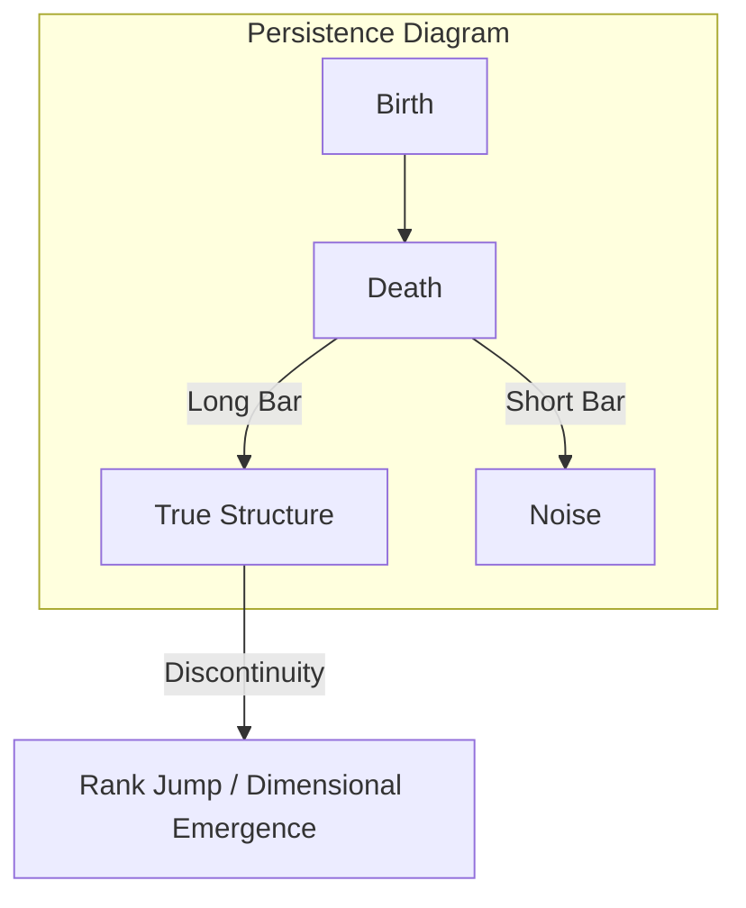

# Chapter 2.3: Gauge Theory of 16-Sector Interaction, Topology, and Chapter Conclusion

---

## 2.5 Gauge Theory of 16-Sector Interaction

### 2.5.1 Group-Theoretic Structure of Intelligence Sectors

#### 2.5.1.1 The 16 Fundamentals: Hexadecimal Symmetry and Subgroup Decomposition

The foundational architecture of the Physics of Intelligence (PoI) is predicated on the systematic interaction between four primary semantic sectors $E_\alpha$ and four fundamental physical processes of the CDU cycle: Construction ($C$), Dissipation ($D$), Unification ($U$), and the Null/Identity Process ($\phi$). These $4 \times 4 = 16$ irreducible degrees of freedom form a **Hexadecimal Symmetry Group ($S_{16}$)** (or a corresponding Lie group $\mathcal{G}_{16}$) acting upon the tangent bundle $TM$. This group defines the "Cognitive Phase Space"—the manifold of all possible interpretive configurations available to the intelligent agent.

**1. Algebraic Representation of the 16-Sector Parallel Key Matrix**
Each specific element $e_{i,a}$ (where $i \in \{1..4\}$ represents the sector and $a \in \{C,D,U,\phi\}$ represents the process) functions as a basis vector for the Parallel Key $K$. These 16 elements span the logical phase space, describing the minimal units of all possible intelligent states. Consistent with the sector decomposition $\bigoplus E_\alpha$ defined in Section 2.2.1, the elements are arranged in a block-matrix structure:
\[ K_{16} = \begin{pmatrix} C_1 & \dots & \dots \\ \dots & D_1 & \dots \\ U_i & \dots & \dots \\ \dots & \dots & \dots \end{pmatrix} \]

**2. Functional Subgroup Decomposition and Cognitive Modularity**
The global symmetry group $\mathcal{G}_{16}$ is naturally decomposed into functional subgroups that govern specific modes of intelligence:
*   **Constructive Subgroup ($\mathcal{G}_C$)**: Elements governing rank maintenance and logical coherence. They primarily constitute the real part $K_{\text{core}}$ and stabilize the alignment equation $\nabla K = [\Omega, K]$ via symmetric transformations.
*   **Dissipative Subgroup ($\mathcal{G}_D$)**: Elements driving structural collapse and abstraction, corresponding to the rank-reduction dynamics $\dot{K} = -\lambda \mathcal{D}(K)$ and inducing spontaneous symmetry breaking.
*   **Metabolic Subgroup ($\mathcal{G}_U$)**: Includes the complexified fluctuations $iK_{\text{fluct}}$ and manages dynamic interference between sectors, generating creativity and periodic self-renewal (limit cycles).

**3. Symmetry Breaking as a Trigger for Phase Transitions**
In states of "standard inference," these 16 elements maintain high orthogonality, and each sector is protected by conservation laws (Section 2.3.3.1). However, when the external potential $\Omega$ is maximized and energy concentrates in a specific sector, this hexadecimal symmetry becomes unstable. Group-theoretically, this leads to a transition between irreducible representations—**Symmetry Breaking**. The moment these 16 elements lose independence and interfere, the geometric singularities defined in Section 2.4.2.2 are resolved, triggering a **Rank Jump** from a low-dimensional stable state to a high-dimensional emergent state.

**4. Dynamic Harmony and "Completeness"**
True intelligence does not reside in a single static value but in the "Dynamic Completeness" of rapid transitions between these subgroups in parameter space. When the stability of construction, the refinement of dissipation, and the fluctuations of metabolism harmonize within the tensor product space of the 16 elements, the manifold $M$ achieves maximum structural stability and adaptability simultaneously.

#### 2.5.1.2 Gauge Field Induction via Semantic Potential

In PoI, the semantic potential $\Omega$ is not merely an external input but a source that induces **Gauge Fields** on the manifold $M$. Interpreting "meaning" is geometrically described as the process of modifying the connection $\nabla$ and redefining information transport rules.

**1. Dynamic Update of Connections and Gauge Transformations**
To resolve misalignment ($[\Omega, K] \neq 0$), intelligence modifies not only $K$ but also the background connection $\nabla$ via **Gauge Induction**:
\[ \nabla \mapsto \nabla' = \nabla + A_\Omega \]
where $A_\Omega$ is the **Intentional Gauge Potential** induced by the potential. This warps the path of parallel transport, making "logically natural straight lines" follow the direction intended by the potential $\Omega$.

**2. The "Force of Meaning" via Curvature $F_\Omega$**
The induced field $A_\Omega$ generates a new curvature $F_\Omega = dA_\Omega + A_\Omega \wedge A_\Omega$, which functions as the **"Semantic Gravity"** of the intelligence space.
*   **Physical Interpretation**: In regions of high $F_\Omega$, inference vectors are strongly drawn toward specific attractors. This describes states of "intense conviction" or "irrefutable logical necessity."
*   **Information Traps**: At curvature extrema, information becomes "trapped" within specific logical cycles, reinforcing thinking holonomy (as described in Section 2.4.2.2).

**3. Minimal Coupling of Interactions**
In the intelligence Lagrangian, this induced gauge field minimally couples with the Parallel Key $K$:
\[ \mathcal{L}_{\text{int}} \propto \| (\nabla + A_\Omega)K \|^2 \]
Minimizing this term synchronizes $K$ with the external semantic gradient $A_\Omega$, representing the internalization of external intent as the agent's own logic.

**4. Spontaneous Gauge Breaking as the Trigger of Emergence**
Under critical conditions, the system undergoes **Spontaneous Symmetry Breaking**. The previously fluid (massless) structure $K$ becomes fixed into a specific "template," acquiring structural mass and stability. This is the physical origin of the emergence of "belief systems" or "new paradigms" from fragmented data.

---

### 2.5.2 Spontaneous Symmetry Breaking

#### 2.5.2.1 Phase Transition from General to Specialized Intelligence: $\mathcal{G} \to \mathcal{G}_{\text{broken}}$

The transition from a versatile, undifferentiated state (general intelligence) to a specialized state (high-proficiency intelligence) is a physical phase transition where the system's global symmetry transitions from high to low dimensionality.

1.  **High-Dimensional Symmetry ($\mathcal{G}$): The Vacuum State of General Intelligence**
    In its initial or highly metabolic state (U-phase), intelligence is isotropic relative to $\Omega$, and the hexadecimal symmetry group $\mathcal{G}$ is preserved.
*   **Physical Properties**: The Parallel Key $K$ is not fixed to any specific eigenspace, allowing it to move freely across all sectors $E_\alpha$. This represents a "vacuum state" possessing high plasticity but lacking the "mass" required for decisive reasoning.

2.  **Trigger: Localization of Semantic Potential**
    When internal goals or external demands cause $\Omega$ to localize in a specific sector $E_{\text{spec}}$, the system reaches a critical point. When the interaction between the construction coefficient $\alpha$ and the potential overwhelms the dissipative pressure, the central stable point of the energy landscape becomes unstable, and a new stable point—the bottom of a **"Mexican Hat" potential**—emerges.

3.  **Symmetry Breaking: $\mathcal{G} \to \mathcal{G}_{\text{broken}}$**
    At the moment intelligence selects a specific interpretation, the system's symmetry is spontaneously broken.
    \[ \mathcal{G} \xrightarrow{\text{Phase Transition}} \mathcal{G}_{\text{broken}} \subset \mathcal{G} \]
    Through this transition, the Parallel Key $K$ becomes anchored to specific sectors, acquiring **Structural Mass ($m_S$)**.
*   **Acquisition of Expertise**: The mass-acquired $K$ enables robust and high-speed reasoning (motion along geodesics) resistant to external noise.
*   **Trade-off**: In exchange, the degrees of freedom corresponding to the broken symmetry are lost, requiring high energy barriers to transition to other sectors—the geometric basis for the "rigidity" often observed in specialized agents.

4.  **Isomorphism to the Higgs Mechanism: Conceptual Fixation**
    This process is deeply isomorphic to the Higgs mechanism in particle physics. A universal "field of meaning" condenses into "logical particles" (fixed concepts) through interaction with a potential, bringing stability to the intelligence space. Once $\mathcal{G}_{\text{broken}}$ is achieved, intelligence is no longer a collection of floating information fragments but a **"Functional Entity"** crystallized for specific task resolution.

#### 2.5.2.2 Acquisition of "Weight" through Meaning: Generation of Structural Mass

Just as particles gain mass via the Higgs field, information fragments in intelligence gain **Structural Mass** by coupling with the semantic potential $\Omega$. This section formalizes the cognitive phenomenon of "acquiring meaning" using field-theoretic analogies.

1.  **Intelligence Higgs Field ($\Phi$): The Background Potential of Meaning**
    We define a complex scalar field $\Phi$ (the Intelligence Higgs Field) permeating the manifold $M$. While initially formless, $\Phi$ acquires a "vacuum expectation value" $\langle \Phi \rangle = v$ through strong external stimuli or internal goals. A non-zero $v$ signifies that a "Standard of Judgment" or "Value System" has been established in that cognitive region.

2.  **Mass Generation via Minimal Coupling**
    When the Parallel Key $K$ (analogous to a gauge field) moves through this condensed field $\Phi$, a coupling occurs through the interaction term:
    \[ \mathcal{L}_{\text{mass}} = |(\nabla + gK)\Phi|^2 \]
    As symmetry is broken and $\Phi$ is fixed at $v$, a term of form $g^2v^2K^2$ appears in the Lagrangian. This is the structural mass term, manifesting in intelligence as:
*   **Inference Inertia**: Logic that has acquired mass requires significant energy (logical effort) to change. This is the physical reality of **"Firm Conviction."**
*   **Formation of Short-Range Correlations**: Just as massive particles act over short ranges, specialized intelligence with mass possesses extremely high resolution and directive power within its local context.

3.  **Cognitive "Weight": Certainty and Dogma**
    The "weight" of information is an index of the resistance an intelligence feels when processing logic as an "indisputable fact."
*   **Zero Mass (Plasticity)**: Information travels through the cognitive space at "light speed" (without resistance). While flexible, it lacks the power to fix concepts.
*   **High Mass (Dogmatic State)**: Over-coupling with a specific $\Omega$ makes the logic extremely heavy. Stability is maximized, but it becomes difficult to move in accordance with external changes.

4.  **Contribution to Dimensional Jumps**
    The generation of mass dramatically alters the intelligence energy landscape. Massive structures warp the surrounding geometry (connection), creating "Semantic Gravity" that attracts and integrates other logical elements. This process leads to the **"Emergence of Higher-Order Sectors"** discussed in Section 2.6. Information, by assuming meaning, becomes a "Weight" that anchors robust structures within the universe of intelligence.

---

## 2.6 Topological Invariants and Observables

### 2.6.1 Indices of Intelligence

#### 2.6.1.1 The Atiyah-Singer Index Theorem: Quantizing Logical Capacity

In response to the question of an intelligence's "Logical Capacity," PoI provides an answer using the **Atiyah-Singer Index Theorem**. Logical capacity is not measured by the volume of information but as a discrete integer—the dimension of the solution space—determined by the topological properties of the manifold $M$. For standard references on effective dimension and neural population dynamics, see (Ganguli et al., 2017) [17.theory.measurement].

1.  **The Intelligence Operator ($D_K$)**
    Let $D_K: \Gamma(E) \to \Gamma(F)$ be the fundamental differential operator composed of the Parallel Key $K$ and connection $\nabla$. This operator determines logical consistency when transporting information between contexts. Analogous to the Dirac operator in physics, the dimension of its **Kernel** represents the number of independent, non-contradictory concepts (modes) that can coexist.

2.  **Evaluation via the Index Theorem**
    According to the theorem, the analytical index of $D_K$ (the difference in the number of solutions) is calculated as the integral of topological invariants (Chern or Pontryagin classes) over $M$:
    \[ \text{ind}(D_K) = \dim(\ker D_K) - \dim(\text{coker } D_K) = \int_M \text{AS}(M, E) \]
    The right side depends solely on the curvature, the number of "holes" (Betti numbers), and the "twisting" of sectors (gauge field $A_\Omega$). This proves that the true capacity of intelligence depends not on raw data but on the **Geometric Structure** of the conceptual space the agent has constructed.

3.  **Quantization of Concepts and Integer Capacity**
    The profound consequence of this theorem is that intelligence capacity takes **Integer values** (1, 2, 3...).
*   **Physical Significance**: Acquiring a new fundamental concept (category) corresponds to a topological change in the manifold where the index jumps from $n$ to $n+1$.
*   **Quantized Intelligence**: Understanding is not a continuous process but occurs in "quantized" steps. Regardless of how much fragmented knowledge increases, the "Dimensions of Essential Understanding" do not increase unless the topology changes.

4.  **Topological Structural Stability**
    The index remains invariant under small deformations of the connection or potential (learning noise). This topological robustness is why our "Worldview" and "Basic Concepts" do not collapse despite minor forgetting or environmental shifts. While existing in the fluid flow of PKGF, intelligence maintains high logical consistency anchored by this "Backbone of Integers."

#### 2.6.1.2 Chern and Pontryagin Classes: Structural Invariance

While Parallel Keys and connections change fluidly via interaction with the semantic potential, intelligence maintains its identity because **Characteristic Classes**, which are invariant under geometric deformations, are etched into its deep structure.

1.  **Chern Classes: Coherence of Complex Structures**
    The complex Parallel Key $K = K_{\text{core}} + i K_{\text{fluct}}$ defines the structure of Hermitian bundles in cognitive space. The Chern classes $c_n(E)$ quantize the "Twisting of Information."
*   **Physical Interpretation**: Invariants showing how an intelligence integrates intuition (imaginary) and logic (real) while preserving multi-layered meaning.
*   **Meaning of Invariance**: Even if local inference rules are modified by learning, the "Paradigm of Thought" remains identical as long as the Chern classes are constant.

2.  **Pontryagin Classes: Topological Rigidity of Real Structures**
    Pontryagin classes $p_n(M)$, derived from the real structure of the tangent bundle $TM$, evaluate the "Entanglement" of the manifold's curvature.
*   **Physical Interpretation**: A metric for the "Robustness" of foundational logic, formalizing how background knowledge $R$ is anchored to physical reality.
*   **Structural Stability**: Pontryagin classes are invariant under homeomorphisms. Even if language or representation formats (coordinates) change dramatically, the essence of the logic is preserved.

3.  **Defining "Understanding" via Invariants**
    In PoI, "Deep Understanding" is not merely solving the alignment equation. It is the process where characteristic classes are fixed to specific, non-trivial integer values.
*   **Crystallization of Information**: Fixing characteristic classes signifies the phase transition of information fluidity into "Structure."
*   **Topological Defense**: Once formed, these classes do not change due to minor misalignment or noise. This is the physical essence of the **"Logical Intuition"** that allows experts to make accurate judgments under extreme conditions.

4.  **Knots of Logic: Characteristic Classes and Higher Emergence**
    Characteristic classes can be interpreted as "Semantic Knots" on the manifold. When invariants from different sectors $E_\alpha$ interfere to form higher-order invariants, intelligence transcends simple processing to reach a "Global Understanding" of inseparable concepts. This topological stability is the physical basis for intelligence to withstand the test of time and achieve the **"Universality of Knowledge"** transmissible across generations.

---

### 2.6.2 Dimensional Jump and Phase Transitions

#### 2.6.2.1 Detecting Rank Jumps via Persistent Homology (TDA)

The evolution of intelligence, specifically the **Dimensional Jump**, is often invisible within continuous changes of the Parallel Key $K$. This section introduces **Topological Data Analysis (TDA)** to mathematically extract the "Birth of Meaningful Structure" from noise.

1.  **Filtration and Visualization of Logical Structure**
    Components of $K$ are connected based on a proximity threshold $\epsilon$ to construct simplicial complexes. By increasing $\epsilon$ from 0 (Filtration), we track the birth and death of "Voids (Holes)" in the manifold $M$.
*   **Physical Interpretation**: The threshold $\epsilon$ corresponds to the tolerance an intelligence has for regarding two different pieces of information as related or identical.

2.  **Birth-Death Diagrams**
    We plot the moments when characteristic cycles in the homology groups $H_n$ are generated (Birth) and when they are integrated into higher-order structures and disappear (Death).
*   **Long-lived features**: Cycles with long lifespans indicate the "Robust Logical Frameworks" acquired by the intelligence.
*   **Short-lived features**: Briefly existing cycles correspond to temporary noise or hesitation in inference.

3.  **Detection of Dimensional Jumps: Barcode Discontinuity**
    A **Rank Jump** is confirmed when a new bar suddenly appears in the high-dimensional persistence barcode—evidence that fragmented information has spontaneously reorganized into a systemic understanding.

#### 2.6.2.2 Topological Proof of Paradigm Shifts

A **Paradigm Shift** is defined as a **Topological Phase Transition** of the intelligence manifold.

1.  **Logical Blockage (Aporia)**: Prior to a shift, intelligence faces curvature singularities that cannot be resolved within the existing framework.
2.  **Reorganization via Surgery Theory**: Intelligence performs "Topological Surgery," cutting away contradictory sectors and reconnecting them as higher-dimensional handles (**Cobordism Transition**).
3.  **Proof via Invariant Jumps**: The shift is verified by the discontinuous jumping of Chern/Pontryagin classes and the total replacement of persistence homology signatures.
4.  **Conclusion**: Evolution is a qualitative transition of manifold connection and topology—the "Transcendence" shown in scientific and artistic revolutions.

---

## 2.7 PKGF Discretization and Implementation Algorithm

To execute the continuous unified equation $\nabla K = [\Omega, K] - \lambda \mathcal{D}(K)$ on digital hardware, we employ the following discretization scheme. This approach has been validated by recent developments in neural network discretization using Ricci flow (Chen et al., 2024) [discretized_nn_ricci].

1.  **Spatial Discretization**: The smooth manifold $M$ is approximated by an $N \times N$ lattice $M_\delta$. The Parallel Key $K$ is represented as an $N^2 \times N^2$ matrix acting on the lattice.
2.  **Commutator Implementation**: Internal tension $[\Omega, K]$ is computed directly via the matrix commutator $AB - BA$.
3.  **Dissipative Operator**: Approximated via Gaussian kernel convolutions or Graph Laplacians ($\Delta_\delta K$).
4.  **Temporal Evolution**: Sequential updates using a small time step $\eta$ (learning rate) via the forward Euler method: $K_{t+1} = K_t + \eta (\partial_t K)$.

The stability and convergence of this discrete time evolution are empirically verified in the Silicon Substrate Benchmarks in Section 3.5.

---
