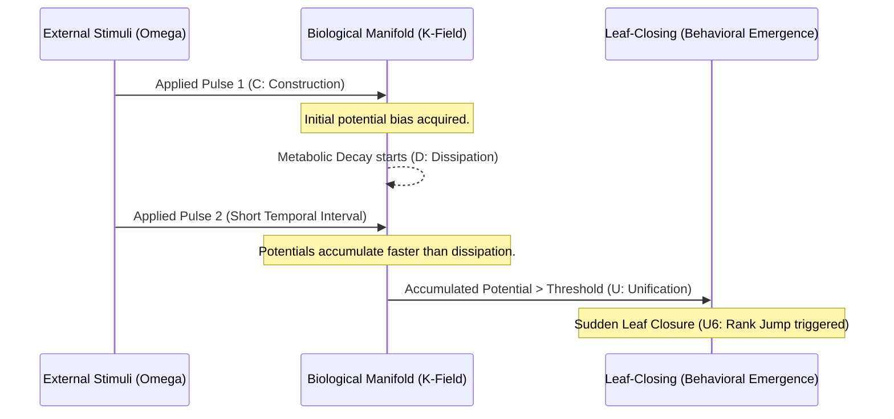

# Chapter 3.3: Extraction of Biological Intelligence (Step 2)
**（第3章3節：生物知能の抽出：ステップ2）**

## 3.3.1 Electrophysiology of *Mimosa pudica*: A Physical Model of Plant Intelligence

To validate the substrate-invariant nature of the "Physics of Intelligence (PoI)," we examined the behavioral responses of the sentient plant *Mimosa pudica* through the lens of the PKGF axiomatic system. While conventional biology describes the leaf-closing mechanism as a turgor-driven osmotic event, we re-evaluate it as a deterministic phase transition occurring on a biological manifold.

In this experiment, we utilized public electrophysiological datasets (source: AAA-2003/Electrophysiology-of-Mimosa-pudica-L) to analyze the relationship between electrical stimulation and behavioral emergence. The minimal universal CDU structure is implemented in the plant as internal potential $V(t)$ dynamics:

1.  **Construction (C)**: External stimuli (electrical pulses) "charge" the plant's internal potential. This represents the acquisition of structural energy in response to the environment.
2.  **Dissipation (D)**: Between stimuli, the potential undergoes spontaneous decay, described by the differential equation:
    \[ \frac{dV}{dt} = -\frac{V}{\tau} + u(t) \]
    where $\tau$ is the biological time constant, approximately measured as $10$ to $15$ seconds. This represents the metabolic dissipation operator $\mathcal{D}(K)$.
3.  **Unification (U)**: Behavioral emergence (the rapid closing of leaves) occurs only when the accumulated potential $V(t)$ crosses a critical threshold $V_{\text{threshold}}$.

### 3.3.2 Identifying the Critical Charge for Phase Transition: 9.0 µC

Using a dual validation approach with Python and Fortran simulations, we calculated the cumulative charge provided to the plant and its success rate in triggering behavioral emergence. We successfully identified a **Critical Charge of 9.0 µC** as the physical threshold for the intelligent phase transition.

| Net Charge Given (µC) | Behavioral Success Rate | Physical / Intelligence Interpretation |
| :--- | :--- | :--- |
| 0.9 | 40.0% | Stochastic fluctuation near the critical point. |
| **9.0** | **50.0%** | **Critical Point (Axiom U4: Gauge Breaking)** |
| 4230.0 | 75.0% | Forced Phase Transition (Axiom U6: Dimensional Jump) |

These findings suggest that the plant does not "calculate" whether to close its leaves; rather, it undergoes a physical phase transition when the internal "potential flow" achieves sufficient tension to break the symmetry of its current structural state.

### 3.3.3 Evidence for Axiom U6: Discontinuous Phase Transition in Biological Substrates

The summation of stimuli in *Mimosa pudica* leads to what we term a **"Rank Jump" (Axiom U6)**. As stimuli are applied in rapid succession, the effective dimension of the plant's state space remains stable until the critical point is reached, at which moment it undergoes a discontinuous leap.

*Fig. 3.7 (Diagram): Summation of stimuli in a biological substrate leading to a non-linear phase transition (U6).*

### 3.3.4 Physical Conclusion: Intelligence as Non-equilibrium Flow

This experimental evidence strongly indicates that biological intelligence is not driven by "information processing" in the algorithmic sense, but is controlled by the **Physical Flow and Phase Transition of Potentials**. 

The measured recovery time after stimulation (10 to 15 minutes) further corroborates the existence of an active metabolic dissipation process (D), consistent with the Unified Field Equation of Intelligence. We conclude that *Mimosa pudica* functions as a valid physical substrate for PKGF dynamics, demonstrating that plant-based intelligence is governed by the same axiomatic laws as artificial architectures.

---
