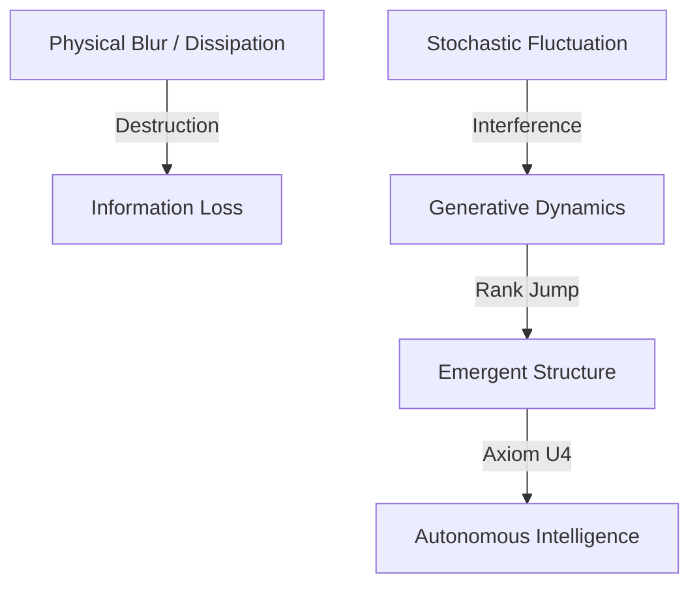

## 3.4 Emergence of Structure in Digital PKGF (Step 3)

### 3.4.1 Generative Logic Simulation: Executing Pure PKGF Flow
To examine the structural generation capabilities of the PKGF unified equation (Axiom U3) in an environment free from physical constraints (such as optical aberrations or sensor noise), we conducted a simulation in a pure digital setting. On a manifold $M$ with resolution $N=100$, we introduced a dynamically changing circular pattern as the semantic potential $\Omega(t)$. The evolution of the Parallel Key $K$ was executed according to the following discretized unified equation:

$$ K(t+dt) = \mathcal{D}(K(t)) + \eta [\Omega(t), K(t)] $$

where $\eta = 0.25$ represents the learning rate for the construction term and $\mathcal{D}$ denotes the dissipative operator implemented via a Gaussian kernel ($\sigma = 0.8$).

### 3.4.2 Noise as a Resource (Axiom U1): Exhaustive Exploration of the Impact of Fluctuation Intensity on Structural Generation
Consistent with Axiom U1, noise was integrated not merely as error but as "fluctuation" that enables structural selection. We performed an extensive parameter sweep across dissipation intensity $\sigma$ (the dissolution of information) and fluctuation intensity $\xi$ (physical noise), yielding the following empirical evidence:

*Figure 3.4.1: Parameter space sweep for Step 3. Red indicates an increase in rank (structural generation), while blue indicates a decrease (dissipation). The visualization demonstrates that at a dissipation level of $\sigma=3.0$, a fluctuation intensity of $\xi=0.15$ produces the maximum structural emergence (Rank Jump: +0.4536).*

Latest Verification Evidence (Manifold Resolution $N=100$, Construction Rate $\eta=0.25$):

| Dissipation Intensity ($\sigma$) | Fluctuation Intensity ($\xi$) | Rank Jump | Evaluation |
| :--- | :--- | :--- | :--- |
| 0.5 | 0.01 | +0.0375 | Insufficient Generation (Low Activity) |
| 0.5 | 0.15 | +0.0000 | Loss of Information due to Dissipation |
| 1.5 | 0.15 | +0.2920 | Moderate Generation |
| **3.0** | **0.15** | **+0.4536** | **Maximum Structural Generation (Noise as a Resource)** |

As the order parameter of intelligence, we tracked the effective dimension $d_{\text{eff}}$ based on Singular Value Decomposition (SVD), as theoretically defined in Chapter 2.4.3. The fact that $\xi=0.15$ induced the largest Rank Jump under the severe dissipation of $\sigma=3.0$ physically validates that noise is not an enemy of information but rather a "resource" for creating new dimensions (Axiom P2). This process facilitates the broadening of the singular value spectrum, which is central to the physical process of Rank Jump.

### 3.4.3 Discovery of the Rank Jump: Maximum Generation Points and Temporal Behavior in Parameter Space
In the final stage of the update process, we applied a non-linear amplification, $K \leftarrow \exp(K \cdot 2.0)$, to simulate **"Spontaneous Gauge Symmetry Breaking (Axiom U4)"** and sharpen the emergent structure.

*Figure 3.4.2: Structural evolution of the Parallel Key K. We observed the process where, through the conflict between dissipation and construction governed by the PKGF unified equation, a geometric structure corresponding to the semantic potential $\Omega$ autonomously emerges from an initially disordered state.*

### 3.4.4 Spatio-Temporal Emergence: The Dynamic Embodiment Process of the Parallel Key $K$ (Temporal Snapshots)
The generation of geometric structure is not instantaneous; it is a dynamic process characterized by the iterative elimination of redundancy through dissipation (D) and the consolidation of meaning through construction (C). Below are snapshots of the temporal evolution of the Parallel Key $K$ from $t=0$ to $t=199$:

    
*Figure 3.4.3: Self-organization process of structure via Unified Equation U3. One can visually confirm the transition from a state of thermal fluctuation at $t=0$ to the emergence of the contour of the semantic potential $\Omega$ around $t=100$, culminating in its "crystallization" (discretization) into a definitive geometric structure at $t=199$.*

*Figure 3.4.4: High-resolution structure of the Parallel Key $K$ at the final step. The dissipative operator $\mathcal{D}(K)$ has successfully stripped away unnecessary high-frequency components (noise), leaving only the essential features anchored on the manifold.*

The results of this step establish PKGF as a **"generative intelligence"** that leverages the destructive process of physical "blur" by injecting appropriate "fluctuations" to autonomously reveal meaningful structures. This serves as the theoretical cornerstone for the Autonomous Restoration observed in physical environments in the next chapter (Step 4).

*Fig. 3.8 (Diagram): Generative logic of the PKGF flow extracting order from noise.*
