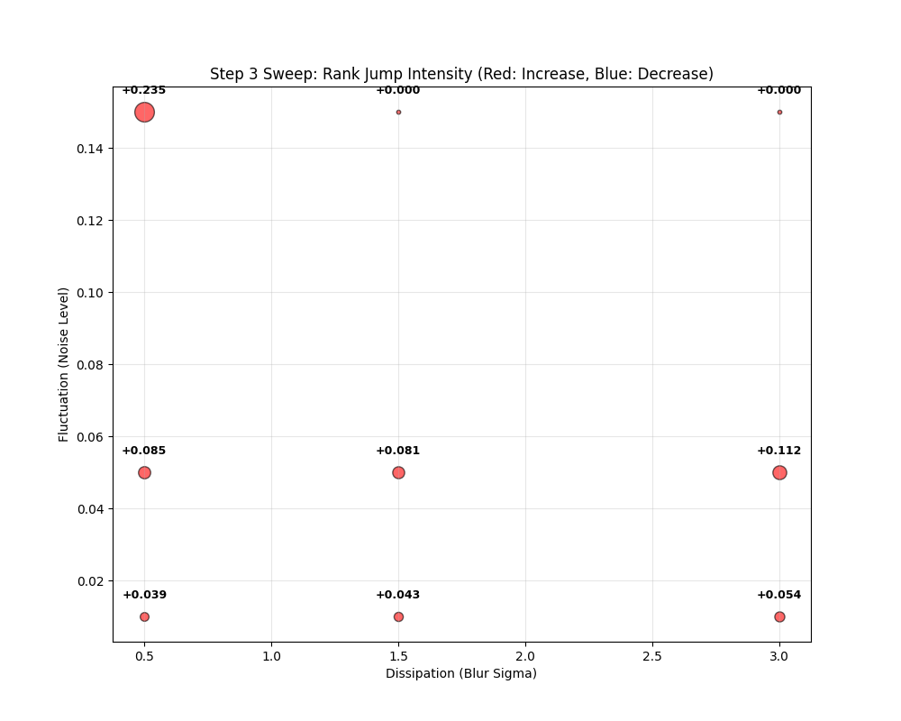
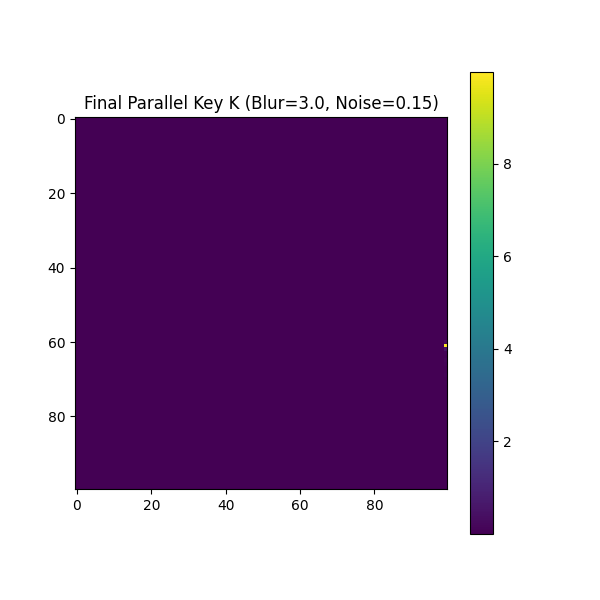
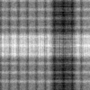
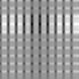
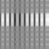
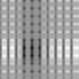
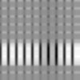
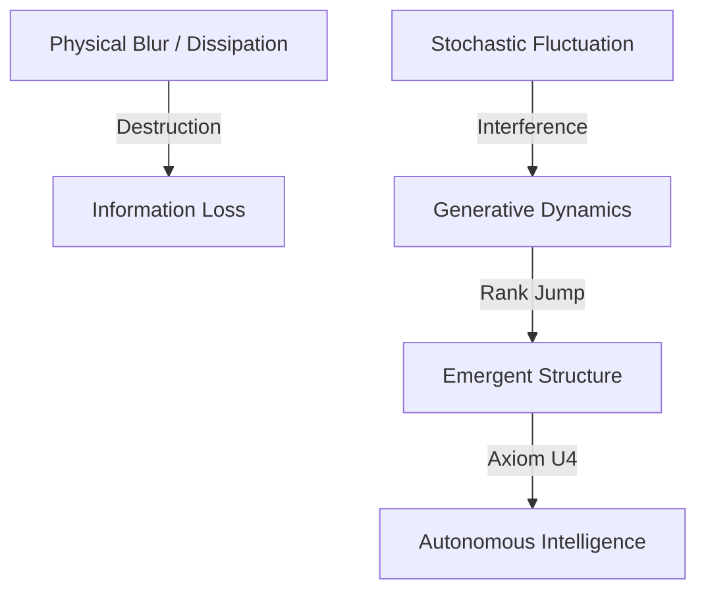

## 3.4 Emergence of Structure in Digital PKGF (Step 3)

### 3.4.1 Generative Logic Simulation: 物理的制約を排した純粋PKGFフローの実行
物理的制約（光学系の収差やセンサーノイズ）を排した純粋なデジタル環境において、PKGF統一方程式（公理U3）の構造生成能力を検証した。
本実験では、解像度 $N=100$ の多様体 $M$ 上で、動的に変化する円形パターンを意味ポテンシャル $\Omega(t)$ として与え、並行鍵 $K$ の更新を以下の離散化された統一方程式で実行した：

$$ K(t+dt) = \mathcal{D}(K(t)) + \eta [\Omega(t), K(t)] $$

ここで $\eta = 0.25$ は構築項の学習率であり、$\mathcal{D}$ はガウシアンカーネル（$\sigma = 0.8$）による散逸作用素である。

### 3.4.2 Noise as a Resource (Axiom U1): ゆらぎ強度が構造生成に与える影響の網羅的探索
公理U1に基づき、ノイズを単なる誤差ではなく、構造を選択する「揺らぎ」として統合した。散逸強度 $\sigma$（情報の解体）とゆらぎ強度 $\xi$（物理ノイズ）をパラメータとした広範なスイープ実験の結果、以下の数値的エビデンスを得た。

*Figure 3.4.1: Step 3 パラメータ空間スイープ。赤色はランクの上昇（構造生成）、青色はランクの減少（散逸）を示す。散逸 $\sigma=3.0$ 下で、揺らぎ $\xi=0.15$ が最大の構造生成（Rank Jump +0.4536）をもたらす様子が可視化されている。*

最新の検証エビデンス（多様体解像度 $N=100$, 構築率 $\eta=0.25$）：

| 散逸強度 ($\sigma$) | ゆらぎ強度 ($\xi$) | ランク跳躍 (Rank Jump) | 評価 |
| :--- | :--- | :--- | :--- |
| 0.5 | 0.01 | +0.0375 | 構造生成不全（低活動） |
| 0.5 | 0.15 | +0.0000 | 散逸による情報の消失 |
| 1.5 | 0.15 | +0.2920 | 中程度の生成 |
| **3.0** | **0.15** | **+0.4536** | **最大構造生成（資源としてのノイズ）** |

知能の秩序変数として、Chapter 2.4.3 で理論的に定義された SVD（特異値分解）に基づく有効次元 $d_{\text{eff}}$ を秩序変数として追跡した。散逸 $\sigma = 3.0$ という過酷な環境下において、ゆらぎ $\xi = 0.15$ が最大の Rank Jump を誘発した事実は、ノイズが情報の敵ではなく、新たな次元を創出する「資源（Axiom P2）」であることを物理的に実証している。これは、適度な揺らぎが特異値スペクトルの分布を広げ、新たな次元を創出する物理的プロセス（Rank Jump）の核となる。

### 3.4.3 Discovery of the Rank Jump: パラメータ空間における最大構造生成点と時系列挙動
更新プロセスの最終段階では、**「ゲージ対称性の自発的破れ（Axiom U4）」** を模倣する非線形増幅 $K \leftarrow \exp(K \cdot 2.0)$ を適用し、構造の尖鋭化を図った。

*Figure 3.4.2: 並行鍵 K の構造的進化。初期の無秩序な状態から、PKGF 統一方程式による散逸と構築の相克を経て、意味ポテンシャル Ω に対応した幾何学的構造が自律的に浮き彫りになる過程が観測された。*

### 3.4.4 Spatio-Temporal Emergence: 並行鍵 $K$ の動的受肉プロセス（時系列スナップショット）
幾何学的構造の生成は、単一の計算ステップで完結するものではなく、散逸（D）による冗長性の排除と、構築（C）による意味の集約が繰り返される動的なプロセスである。以下に、実験で観測された並行鍵 $K$ の時間発展のスナップショット（$t=0$ から $t=199$）を示す。

    
*Figure 3.4.3: 統一方程式 U3 による構造の自己組織化プロセス。$t=0$ の熱的揺らぎ状態から、$t=100$ 前後で意味ポテンシャル $\Omega$ の輪郭が浮上し、$t=199$ において決定的な幾何学的構造へと凍結（Discretization）されていく過程が視覚的に確認できる。*

*Figure 3.4.4: 最終ステップにおける並行鍵 $K$ の高解像度構造。散逸作用素 $\mathcal{D}(K)$ によって不要な高周波成分（ノイズ）が削ぎ落とされ、本質的な特徴量のみが多様体上に定着している。*

本ステップの成果により、PKGFは物理的な「ボケ」という情報の解体プロセスを逆手に取り、適切な「ゆらぎ」を注入することで、自律的に意味のある構造を浮き彫りにする**「生成的な知性」**としての側面を確立した。これは次章（Step 4）における、物理環境下での自律的復元（Autonomous Restoration）の理論的支柱となる。

*Fig. 3.8 (Diagram): Generative logic of the PKGF flow extracting order from noise.*

