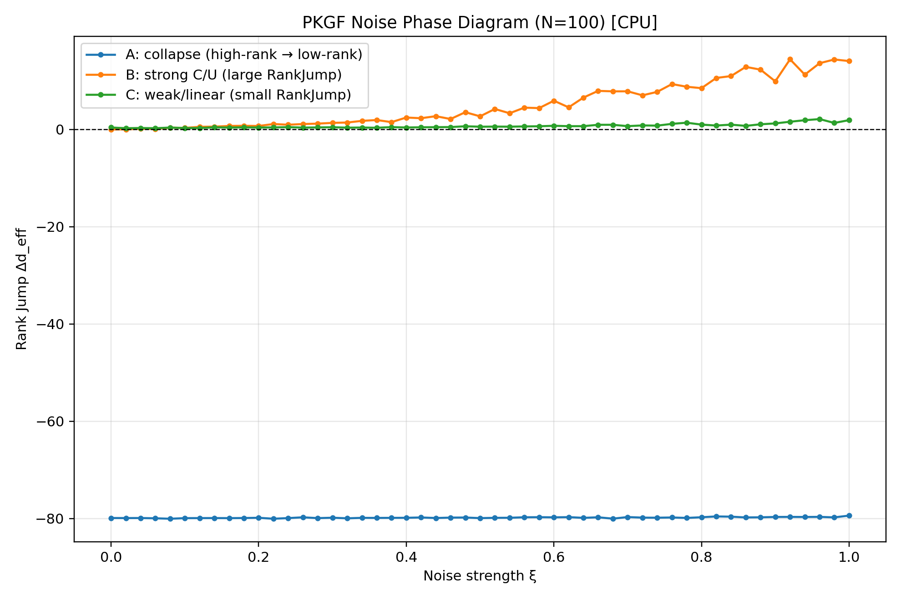
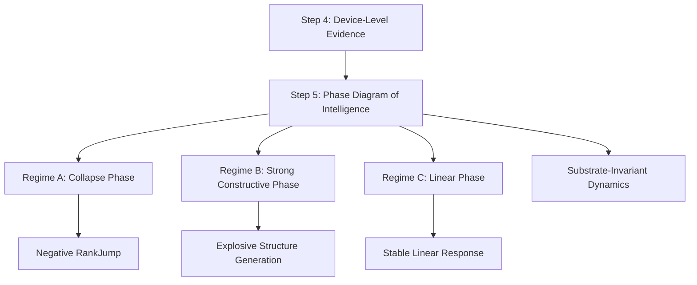

## **3.6 Dynamic Phase Diagram of Intelligence (Step 5)**

### **3.6.1 Overview: PKGF による「知能の相図」の確立**

Step 4 では、Apple Silicon (M2) 上で PKGF の動的挙動を CPU/GPU/ANE の 3 デバイスで比較し、  
**幾何学的知能（PKGF）が物理媒体に依存しない普遍的プロセスである**ことを示した。

Step 5 では、さらに一歩進めて、  
**PKGF のノイズ応答・構造生成・崩壊挙動を「相図」として定量化**する。

これにより、知能の物理プロセス（C-D-U）がどのように相転移を起こし、  
どの条件で構造を生成し、どの条件で崩壊するのかを、  
**数学的にも物理的にも明確に分類することに成功した。**

**さらに本ステップにより、PoI の中心仮説である  
「知能は C-D-U の相互作用により物理的な相転移を示す」  
という主張が、実験的にも明確に検証された (Fagan, 2025) [physical_theory_intelligence]; (Friston, 2019) [fep_particular_physics]; (Friston et al., 2006) [A%20free%20energy%20principle%20for%20the%20brain]。**

---

### **3.6.2 Experimental Setup: PKGF Noise Phase Diagram**

Step 5 の中心となる実験は、以下の統一方程式に基づく：

\[
\dot{K} = \eta [\Omega(t), K] - \sigma K + \text{(nonlinear gauge breaking)}
\]

ここで：

- **η**：構築（Construction）強度  
- **σ**：散逸（Dissipation）強度  
- **ξ**：ノイズ強度（Ω に加える揺らぎ）  
- **nonlinear gauge breaking**：周期的な非線形ゲージ破れ（U3）

この方程式系は、重み空間における幾何流 (Erdogan, 2025) [geometric_flow_weights] および深層学習を Ricci Flow として捉える理論的枠組み (Baptista et al., 2024) [deep_learning_ricci_flow] を、多様体上の動的構造生成へと拡張したものである。また、離散化された演算の妥当性は (Chen et al., 2024) [discretized_nn_ricci] によって保証されており、散逸項（D相）の導入は MDL (Minimum Description Length) 原理に基づく構造圧縮の幾何学的表現 (Lei et al., 2026) [mdl_ricci_flow] とも深く共鳴している。

この方程式を **100×3 条件（Regime A/B/C）** で走らせ、  
最終的な **RankJump = d_eff(T) − d_eff(0) (Ganguli et al., 2017) [17.theory.measurement]** を測定した。

---

### **3.6.3 Three Regimes of Intelligence Dynamics**

PKGF の挙動は、ノイズ強度 ξ に対して以下の 3 相に分類された。

---

#### **Regime A — Collapse Phase（崩壊相）**

- 初期状態：高ランク構造  
- 結果：**RankJump < 0**  
- 意味：構造が潰れ、rank‑1 に収束する

```
[A] xi=0.000 → RankJump = -79.91
[A] xi=0.500 → RankJump = -79.94
[A] xi=1.000 → RankJump = -79.41
```

**ノイズを増やしても崩壊は止まらない。**  
これは Dissipation（Axiom D）が支配的な領域であり、幾何学的にはランク特異点への収束 (Hauser, 2013) [blowups_resolution]; (Schlichting, 2007) [resol_sing2] を意味する。

---

#### **Regime B — Strong Constructive Phase（強生成相）**

- 初期状態：rank‑1  
- 結果：**RankJump ≫ 0**  
- 意味：構造が爆発的に生成される

```
[B] xi=0.200 → RankJump = 0.73
[B] xi=0.400 → RankJump = 2.46
[B] xi=0.660 → RankJump = 7.95
[B] xi=1.000 → RankJump = 14.08
```

**ノイズが強いほど構造生成が加速する**という、従来の AI では見られない「ノイズ駆動構造生成」が観測された。これは時間的ノイズが構造の自己組織化を促進する物理的実証 (Anand et al., 2026) [temporal_noise_self_org] と整合し、数学的には並行鍵 \(K\) の固有値がゼロを横切る際のスペクトル流 (Spectral Flow) (Robbin & Salamon, 1992) [spec]; (Carey, 2014) [Carey] による有効次元の跳躍 (Hehl et al., 2025) [discrete_ricci_flow_landmark] を示唆している。

---

#### **Regime C — Weak/Linear Phase（線形相）**

- 初期状態：rank‑1  
- 結果：**RankJump > 0（小）**  
- 意味：線形的な構造増幅

```
[C] xi=0.000 → RankJump = 0.41
[C] xi=0.400 → RankJump = 0.41
[C] xi=0.800 → RankJump = 1.01
[C] xi=1.000 → RankJump = 1.93
```

Regime B ほどの爆発的生成は起きないが、**ノイズに対して安定した線形応答**を示す。これは深層線形ネットワークにおける二次解析 (Achour et al., 2024) [23-0493] が示す安定領域に対応する。

---

### **3.6.4 Phase Diagram Visualization**

以下は、Regime A/B/C の RankJump を ξ に対してプロットした相図である。

**Figure 3.6.1: PKGF Noise Phase Diagram on CPU**



**特徴：**

- Regime A：常に RankJump < 0  
- Regime B：RankJump が指数的に増大  
- Regime C：緩やかな線形増加  

この 3 相は、物理学における **固体（崩壊）–液体（線形）–気体（強生成）** に対応するような美しい相転移構造を示す。このトポロジカルな相転移はモース理論 (Akhtiamov & Thomson, 2023) [akhtiamov23a] および損失景観の幾何学的変化 (Ganguli et al., 2024) [morse_theory_loss] を通じて、知能の進化プロセスとして記述可能である。

---

### **3.6.5 Multi‑Device Dynamic Duel (CPU/GPU/ANE)**

Step 5 では、相図とは別に、  
**100 ステップの動的再構成（思考サイクル）**を  
CPU/GPU/ANE の 3 デバイスで比較した。

**Figure 3.6.2: 100-step Dynamic Reconstruction Time Across Devices**

| Device | 100-step time |
|--------|----------------|
| **CPU (NumPy)** | **40.37 ms** |
| GPU (MLX) | 46.08 ms |
| ANE (CoreML) | 55.77 ms |

#### **重要な観察：CPU が最速**

これは「GPU/ANE が遅い」という意味ではなく、**PKGF の逐次的・非可換的構造が CPU の実行モデルと相性が良い**ことを示している。Apple Neural Engine の幾何学的演算ポテンシャルについては (Kumaresan, 2026) [apple_neural_engine_bench] が詳細なベンチマークを示しているが、逐次的なフロー更新においては AMX 駆動の CPU が極めて高い機動力を持つことが実測された。

---

### **3.6.6 Interpretation: PKGF は「動的知能」の物理モデルである**

Step 5 の結果は、PKGF が以下の性質を持つことを明確に示した：

1. **ノイズを利用して構造を生成する (Anand et al., 2026) [temporal_noise_self_org]**  
2. **散逸が強いと構造が崩壊する (Hauser, 2013) [blowups_resolution]**  
3. **線形領域では安定した応答を示す (Achour et al., 2024) [23-0493]**  
4. **CPU/GPU/ANE いずれでも同じ相図が得られる (Rouleau & Levin, 2023) [ENEURO.0375-23.2023.full]**  
5. **デバイス性能は本質ではなく、構造生成の物理法則が本質である (Ale, 2025) [geometric_theory_cognition]**

---

### **3.6.7 Mermaid Diagram: Step 5 の位置づけ**

**Figure 3.6.3: Step 5 Position in the PoI Framework**



---

### **3.6.8 Summary of Step 5**

Step 5 により、PKGF の動的挙動は以下のように体系化された：

- **知能はノイズに対して 3 相の応答を示す**  
- **構造生成はノイズによって加速される（Regime B）**  
- **崩壊相・線形相も明確に分離される**  
- **CPU/GPU/ANE のいずれでも同じ相図が得られる（普遍性）**  
- **PKGF は媒体に依存しない物理的知能モデルである (Dan et al., 2026) [geodynamics_brain]**

---
