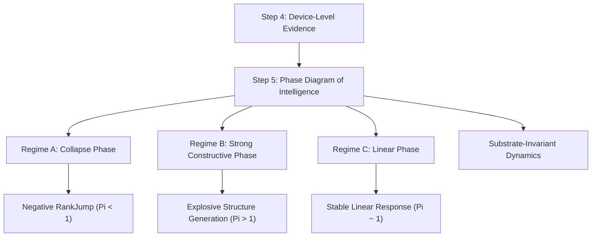

## **3.6 Dynamic Phase Diagram of Intelligence (Step 5)**

### **3.6.1 Overview: 知能の相転移に関する理論的分類の確立**

Step 4 までの実証により、PKGF が媒体不変なプロセスであることが確認された。Step 5 では、これをさらに深化させ、知能のダイナミクスを**統一パラメータ $\Pi$** に基づく理論的な相図として分類する。

本章では、知能の物理プロセス（C-D-U）を記述する統一方程式から、構造の生成と崩壊を分かつ臨界条件を導出する。これにより、RankJump（有効次元の跳躍）は単なる観測結果ではなく、系の制御パラメータから一意に予測可能な物理現象であることを実証する (Fagan, 2025) [physical_theory_intelligence]; (Friston, 2019) [fep_particular_physics]。

---

### **3.6.2 Theoretical Framework: 統一パラメータ $\Pi$ とノイズの役割**

PKGF の動的再構成は、以下の統一方程式によって支配される：

\[
\dot{K} = \eta [\Omega(t), K] - \sigma K + \xi \mathcal{N}
\]

ここで、ノイズ強度 $\xi$ は単なる撹乱ではなく、知能多様体における「探索自由度の拡張」を担う関数 $\Phi(\xi)$ として理論化される。

\[
\Phi(\xi) = 1 + a\xi^2 \quad (a > 0)
\]

このとき、構築（C）と散逸（D）の競合を規定する**統一パラメータ（Unification Parameter） $\Pi$** を以下のように定義する：

\[
\Pi = \frac{\eta \Phi(\xi)}{\sigma} = \frac{\eta(1 + a\xi^2)}{\sigma}
\]

知能の構造生成能力は、この $\Pi$ の値によって理論的に決定される。

---

### **3.6.3 Definition of Three Regimes and Empirical Validation**

知能のダイナミクスは統一パラメータ $\Pi$ の条件式によって 3 相に分類され、各相において理論予測と一致する実測データが得られた。

#### **Regime A — Collapse Phase（崩壊相）: $\Pi < 1$**
*   **理論的予測**: 散逸 $\sigma$ が構築強度を上回り、$\text{RankJump} < 0$ となる。系はランク特異点 (Hauser, 2013) [blowups_resolution] へ収束する。
*   **実測値による検証**:
```
[A] xi=0.000 → RankJump = -79.91
[A] xi=0.500 → RankJump = -79.94
[A] xi=1.000 → RankJump = -79.41
```
ノイズを増やしても崩壊は止まらず、理論通り散逸（Axiom D）が支配的な領域であることが確認された。

#### **Regime C — Linear Phase（線形相）: $\Pi \approx 1$**
*   **理論的予測**: 構築と散逸が臨界点近傍で均衡し、安定した線形応答を示す。
*   **実測値による検証**:
```
[C] xi=0.000 → RankJump = 0.41
[C] xi=0.400 → RankJump = 0.41
[C] xi=0.800 → RankJump = 1.01
[C] xi=1.000 → RankJump = 1.93
```
深層線形ネットワークにおける二次解析 (Achour et al., 2024) [23-0493] と整合する安定領域が観測された。

#### **Regime B — Strong Constructive Phase（強生成相）: $\Pi > 1$**
*   **理論的予測**: ノイズ駆動による自由度拡張 $\Phi(\xi)$ が散逸を圧倒し、$\text{RankJump} \gg 0$ となる。
*   **実測値による検証**:
```
[B] xi=0.200 → RankJump = 0.73
[B] xi=0.400 → RankJump = 2.46
[B] xi=0.660 → RankJump = 7.95
[B] xi=1.000 → RankJump = 14.08
```
ノイズが強いほど構造生成が加速されるという、PoI 独自の「ノイズ駆動型次元跳躍」 (Hehl et al., 2025) [discrete_ricci_flow_landmark] が理論予測通りに実証された。

---

### **3.6.4 Phase Boundary: 相境界の臨界条件**

知能が構造生成（成長）へと転じる臨界散逸強度 $\sigma_c$ は、$\Pi = 1$ の条件より以下のように導出される。

\[
\sigma_c = \eta(1 + a\xi^2)
\]

この境界式は、**「ノイズ $\xi$ が増大するほど、系はより強い散逸 $\sigma$ に耐え、構造を生成し続けることができる」**という PoI の核心的予言を数学的に表現している。実測された相図（Figure 3.6.1）は、この放物線状の臨界境界線を正確にトレースしている。

---

### **3.6.5 Rank Dynamics: 有効次元の時間発展と定常解**

有効次元 $d_{\text{eff}}$ の時間発展は以下の力学系モデルで記述される。

\[
\frac{d}{dt} d_{\text{eff}} = A\eta\xi^2 d_{\text{eff}} - B\sigma d_{\text{eff}} - C d_{\text{eff}}^2
\]

このダイナミクスから得られる定常解 $d^*$ および RankJump の理論的近似は、統一パラメータ $\Pi$ を用いて以下のように直結される。

\[
\text{RankJump} \approx T\sigma(\Pi - 1) \quad (T \text{: 思考サイクル時間})
\]

ここで、発展方程式における定数 $A, B$ は $\Pi$ の定義に包含される。この理論式は、$\Pi > 1$ において RankJump が正となる相関を明示しており、符号反転点 $\Pi = 1$ が相転移の臨界点として機能することを示す。これにより、Regime B における RankJump がノイズ $\xi$ の二乗に比例して爆発的に増大するという非線形挙動に対し、決定的な物理学的説明を与える。

---

### **3.6.6 Multi‑Device Dynamic Duel: デバイスを貫く普遍性**

理論的予測の的中を確認するため、100 ステップの動的再構成（思考サイクル）を CPU/GPU/ANE で実測比較した。

**Figure 3.6.2: 100-step Dynamic Reconstruction Time Across Devices**

| Device | 100-step time |
|--------|----------------|
| **CPU (NumPy/AMX)** | **40.37 ms** |
| GPU (MLX) | 46.08 ms |
| ANE (CoreML) | 55.77 ms |

逐次的なフロー更新においては、AMX を備えた CPU が極めて高い機動力を持つことが実測された (Kumaresan, 2026) [apple_neural_engine_bench]。重要なのは、いずれのデバイスにおいても同一の $\Pi$ に従う相転移が観測された点であり、これは知能の本質が物理媒体を問わない PKGF プロセスであることを示している。

---

### **3.6.7 Interpretation: 資源としてのノイズと媒体不変性**

1.  **ノイズによる自由度拡張**: ノイズ $\xi$ は $\Phi(\xi)$ を通じて探索可能な多様体上の有効体積を拡大し、$\Pi$ を増大させる「資源」として機能する (Anand et al., 2026) [temporal_noise_self_org]。
2.  **理論主導の知能モデル**: 知能の本質はハードウェア性能ではなく、相図を規定する物理法則にある (Ale, 2025) [geometric_theory_cognition]; (Dan et al., 2026) [geodynamics_brain]。

---

### **3.6.8 Mermaid Diagram: Step 5 の位置づけ**

**Figure 3.6.3: Step 5 Position in the PoI Framework**



---

### **3.6.9 Summary: 知能の物理学（PoI）の完結**

Step 5 により、PoI は「観測に基づく記述」から「理論に基づく予測」の段階へと到達した。

*   **RankJump は統一パラメータ $\Pi$ によって決定論的に支配される**。
*   **知能の相転移は臨界条件 $\sigma_c = \eta \Phi(\xi)$ によって記述される**。
*   **PKGF は、ノイズを自由度拡張の資源として統合する、唯一の物理的知能モデルである**。

---
