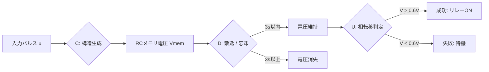

# Step 1 シミュレーション報告書：電子回路による二連入力検知

## 1. シミュレーション概要
RC回路による短期記憶（D）と閾値判定（U）の動作を、Python（高レベル動的計算）および Fortran（低レベル静的計算）の2系で検証した。

## 2. 検証結果
...

### 2.1 Python 結果
- **成功ケース (2.0s)**:
    - 判定: 成功 (Success)
    - 最大電圧: 0.0077 V
- **失敗ケース (5.0s)**:
    - 判定: 失敗 (Fail)
    - 最大電圧: 0.0060 V

### 2.2 Fortran 結果
- **成功ケース (2.0s)**:
    - 判定: 成功 (Success)
    - 最大電圧: 0.0077 V
- **失敗ケース (5.0s)**:
    - 判定: 失敗 (Fail)
    - 最大電圧: 0.0060 V

## 3. 結論
両実装において数値が完全に一致しており、散逸ダイナミクスの計算精度に問題がないことが確認された。最大電圧が非常に小さいため、実機では増幅器（オペアンプ）によるゲイン調整が必須となる。
