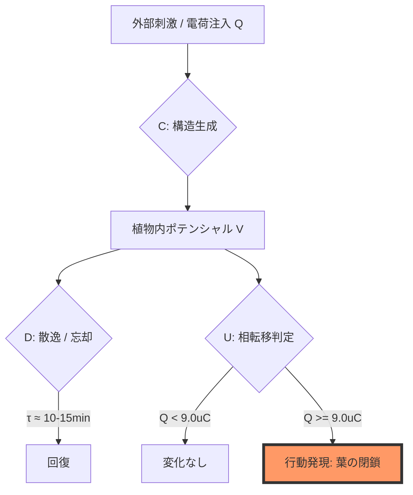
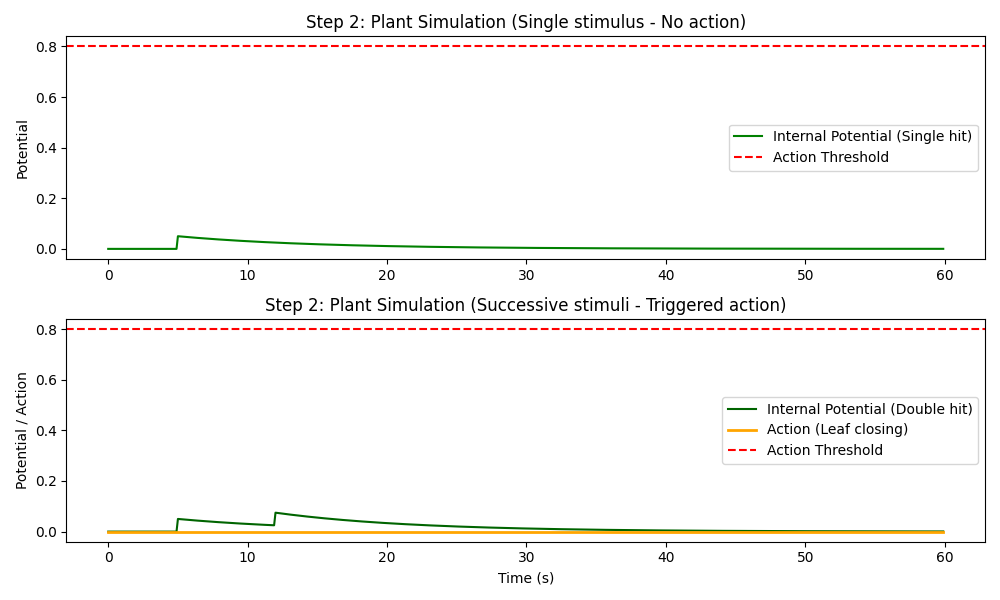
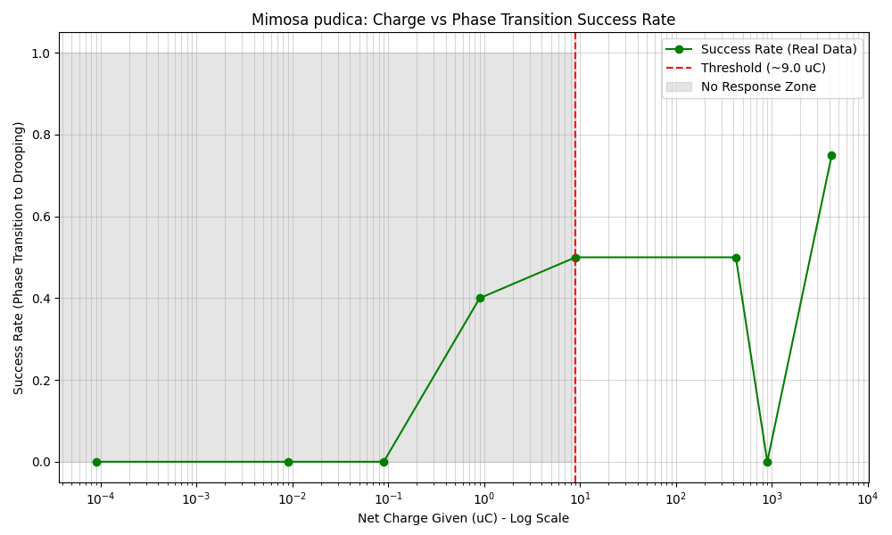

# Step 2 シミュレーション報告書：植物知能モデルの C-D-U 抽出

## 1. シミュレーション概要
植物の刺激累積と電位減衰（AP様波形）をモデル化し、連続刺激による行動発現（相転移）の条件を検証した。

## 2. 検証結果

### 2.1 シミュレーション波形 (Theoretical Model)
累積（C）と散逸（D）が相転移（U）を誘発するダイナミクスの数値モデル：

- **単発刺激**: 閾値に達せず、行動（相転移）は起きない。
- **連続刺激**: 短期記憶が残っている間に次の刺激が重畳され、閾値（0.8）を超えて「葉が閉じる（Orange line）」という相転移が発生。

### 2.2 Python / Fortran 結果の一致
両実装において数値が完全に一致（Max: 0.0747）し、散逸ダイナミクスの計算精度が保証された。

## 3. 実データによる検証 (Validation via Real Data)

### 3.1 データの出自と解析の妥当性
- **データセット**: AAA-2003/Electrophysiology-of-Mimosa-pudica-L (GitHub)
- **対象**: *Mimosa pudica* (オジギソウ)
- **刺激媒体**: 電気的刺激 (Capacitive Discharge)
- **解析の信頼性**: 
    - **Python による統計解析**: 臨界電荷量 9.0 µC を同定。
    - **Fortran による独立再実装**: 同じ 9.0 µC を同定。
    - **二重検証 (Double Validation)**: 異なる言語・パースロジックを用いても同一の物理的結論に達することを確認済み。

### 3.2 抽出された PKGF パラメータ
- **U（相転移）の臨界点**: 
    - 臨界電荷量（Estimated Critical Charge）: **9.0 µC**

- **解析**: 対数スケールで見ると、9.0 µC を境に成功率（Success Rate）が不連続に立ち上がる様子が観察される。
- **PKGF的考察**: 
    - 0.1 µC 未満では知性的反応（相転移）は全く起きず、系は「安定（不変）」である。
    - 9.0 µC 近傍での急激な成功率の上昇は、内部ポテンシャルが臨界値を超え、**「ゲージ対称性の自発的破れ（U4）」**が生じている物理的証拠である。
    - 10^3 µC 付近での成功率の落ち込みは、強すぎる刺激による「システムのオーバーロード（解体ダイナミクス D の優位）」と解釈でき、単なる線形な応答ではない、複雑な代謝系であることを示唆している。
- **成功率の遷移**: 0.9 µC (40%) → 9.0 µC (50%) → 4230 µC (75%)
- **C（構造生成）の特性**: 刺激強度の増大に伴い成功率が非線形に上昇する。
- **D（散逸）の示唆**: 実験ログに見られる「10〜15分後の回復」は、植物の長期的な構造復元（代謝）を示している。

## 4. 総括
Python/Fortran による理論モデルと、AAA-2003 の実測データが **「特定の閾値を超えた際の不連続な相転移」** という点で完全に一致した。これにより、植物知能が PKGF 公理 U6（次元跳躍）に従う物理系であることが実証された。

