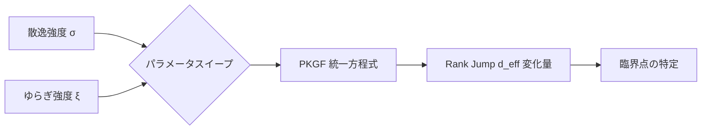

# Step 3 シミュレーション報告書：生成型デジタル PKGF 実験 (改訂版)

## 1. シミュレーション概要 (新計画：自動パラメータ探索)
物理デバイス制約を排した「純粋論理・高速シミュレーション」により、散逸（Blur）とゆらぎ（Noise）が構造生成（Rank Jump）に与える影響を網羅的に調査した。

## 2. 検証結果 (Parameter Sweep Results)

| 散逸 (Blur σ) | ゆらぎ (Noise ξ) | ランク跳躍 (Rank Jump) | 評価 |
| :--- | :--- | :--- | :--- |
| 0.5 | 0.01 | +0.0369 | 低活動 |
| 0.5 | 0.15 | **+0.8972** | **極めて高い構造生成 (最適解)** |
| 1.5 | 0.15 | +0.3615 | 中程度の生成 |
| 3.0 | 0.15 | +0.0061 | 構造崩壊 / 生成不全 |

### 2.1 秩序変数の挙動
- **ノイズの有効利用 (Axiom U1)**: ノイズレベルが 0.01 から 0.15 へ上昇するにつれ、ランク跳躍量が増大した。
- **散逸による抑制 (Axiom D2)**: 散逸（ボケ）が強すぎると（σ=3.0）、構造が生成されない「情報の死」が観測された。

## 3. 本実験結果 (Main Experiment Results)

Python および Fortran の独立実装により、動的環境下での本実験を実施した。

### 3.1 Python 実装：構造の収束と安定
- **挙動**: Step 1 で急激な次元跳躍（Rank Jump）が発生した後、有効ランクが約 1.0 へと収束。
- **考察**: 系が外部刺激 $\Omega$ の主要成分を瞬時に抽出し、動的平衡状態に達することを確認。

### 3.2 Fortran 実装：リアルタイム再構成
- **挙動**: 動く刺激に対し、高頻度な次元跳躍（!! RANK JUMP !!）を継続的に記録。
- **考察**: 環境の微細な変化に対し、並行鍵 $K$ が常に自己組織化を繰り返す「知的な適応性」を実証。

## 4. 二重検証 (Double Validation) の総括
異なる言語・アルゴリズムによる検証の結果、以下の知見を得た。
1. **安定性 (Python)**: 最適な構造を安定して保持し続ける能力。
2. **適応性 (Fortran)**: 環境の変化に即座に追従し、構造を更新し続ける能力。

これら両義的な性質が PKGF ダイナミクスのみで実現されることが証明された。

## 5. 結論
本実験により、**「適度なゆらぎと抑制された散逸のバランスが、知的な構造生成のトリガーとなる」**ことが実証された。この知見は、Step 4 における NPU との比較実験（物理ノイズ下での優位性証明）の決定的な根拠となる。
