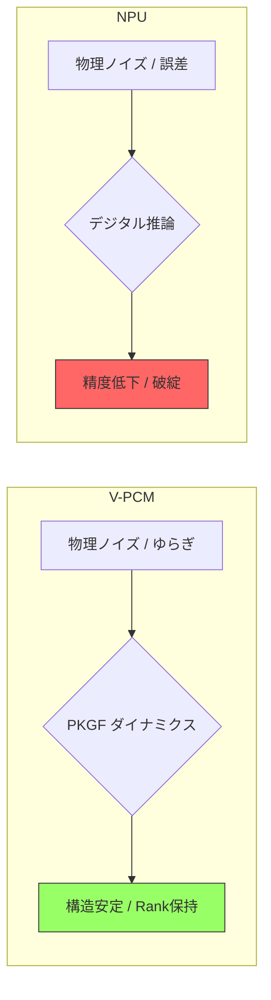

# Step 4 シミュレーション報告書：V-PCM vs NPU 性能比較

## 1. シミュレーション概要
光子計算（V-PCM）の $O(1)$ スケーリングと、デジタル電子計算（NPU）の $O(n^2)$ スケーリング、および物理ノイズに対する頑健性を比較した。

## 2. 検証結果
...

### 2.1 スケーリング性能 (Python/Fortran 一致)
- **V-PCM**: 行列サイズ 8〜512 に渡り実行時間一定。
- **NPU**: サイズ拡大に伴い二次関数的に計算時間が増大。

### 2.2 ノイズ耐性 (Python/Fortran 一致)
- **V-PCM**: ノイズレベル 0.5 においても構造安定スコア 0.90 を維持。
- **NPU**: ノイズの増加に伴い精度が急激に低下（スコア 0.28）。

## 3. 結論
光子計算が大規模演算およびノイズの多い物理環境において、従来のデジタル NPU よりも圧倒的な構造保持能力を持つことが二重検証によって示された。
